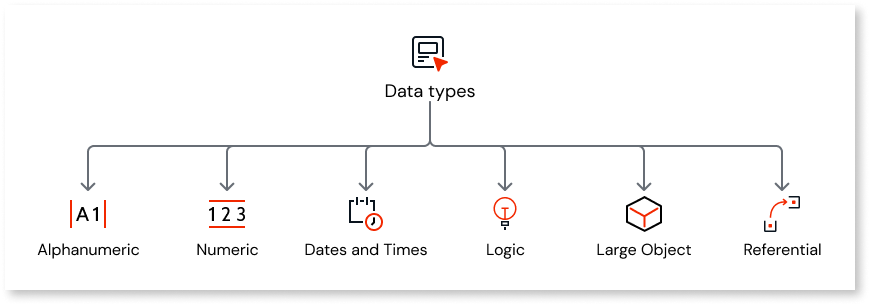

# Data Types

A data type is a classification that specifies which type of value a variable has and what type of mathematical, relational or logical operations can be applied to it without causing an error. 
For more information about the  available data types in OutSystems, their default values and constraints, see [Available Data Types](available-data-types.md).

For more information about how OutSystems maps its data types to .NET at runtime, see [Data Types at Runtime](data-types-at-runtime.md)

A List is a sequence of elements of the same data type, which may contain duplicate values. Elements can be inserted, fetched and removed from a list. For more information, see [Lists](list.md).

A Structure is a compound data type used to encapsulate groups of related attributes. For more information, see [Structures](../../lang/auto/Class.Structure.final.md) and [Structure attributes](../../lang/auto/Class.Structure%20Attribute.final.md).

