# List

A List is a sequence of elements of the same data type, which may contain duplicate values. Elements can be inserted, fetched and removed from a list.

By default a list is empty, meaning that it has no elements. However, you can use the system actions to manipulate an empty list.

On the server side, variables of List data type have a reference to the values and don't contain a copy of the elements. For example, if you have two lists List A and List B and you assign List A to the List B, you will have two variables pointing to the same list instead of two independent copies. When changing values in one variable, the other is also changed.

## How to create a variable with List data type { #createvariable }

This example uses a Local Variable in a Screen. To create a Local Variable with **List** data type, follow these steps:

1. In the **Interface** tab, right-click a screen and select **Add Local Variable**.

    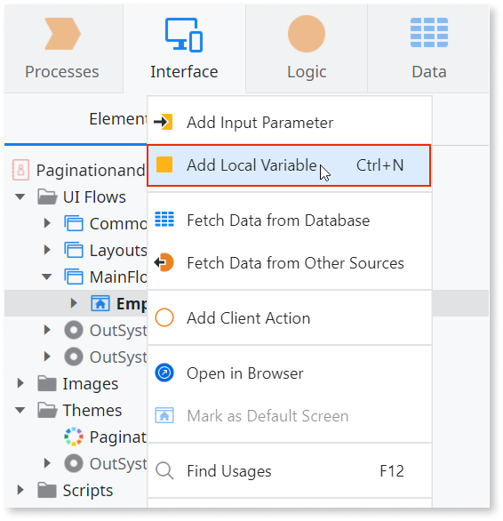

1. Enter a name for the variable, for example, `Projects`.

1. In the **Data Type** property, select **List...** from the dropdown.

    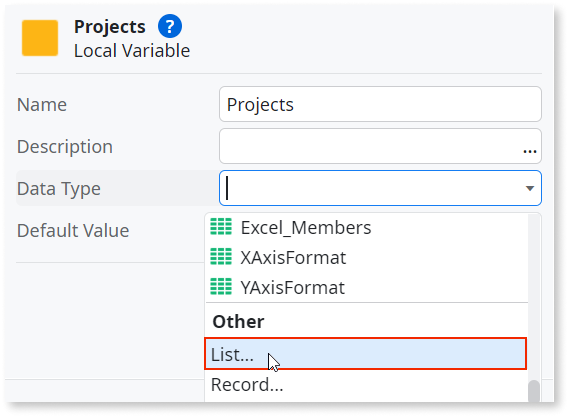

1. In **'Projects' List Element Type**, select the Data Type for your list's elements, for example, **Record**.

1. On the Elements tree, note that a Text attribute is automatically created under the Projects local variable. Select this attribute and on the properties section, change its **Name** to, for example, `Name`.

    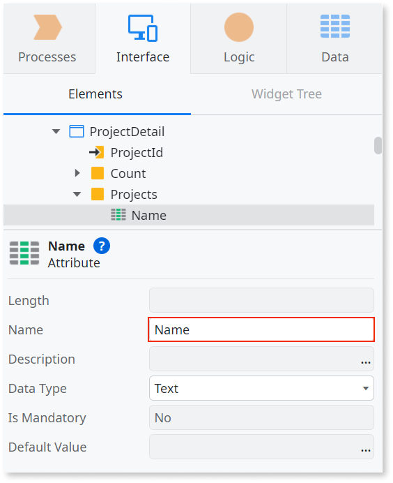

1. To add a new attribute, right-click the Projects local variable and select **Add Attribute**.

    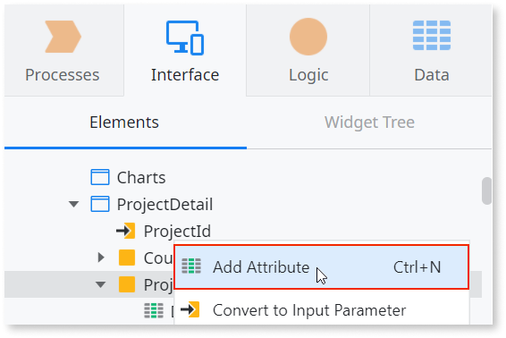

1. Enter a name for the attribute, for example, `Description`.

## How to map a list to another list

This guide shows how to map another list to the Projects local variable created in the previous section. The mapping is created using a Client Action and is made from an Aggregate named GetProjectById. Follow these steps:

1. Right-click your screen and select **Add Client Action**.

    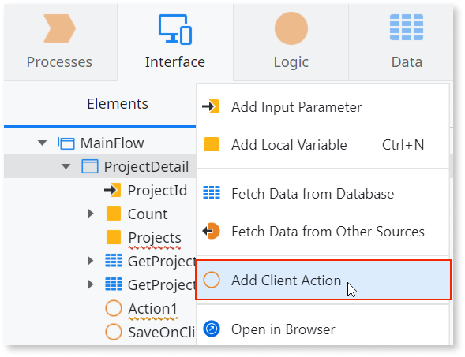

1. Enter a name for the Client Action, for example, `MapProjects`.

1. From the Toolbox, drag an **Assign** node to the action flow and drop it between the **Start** and **End** nodes.

1. In the **Assignments** section, select the Projects local variable from the dropdown.

1. For the **Value**, enter `GetProjectById.List`.

1. A new section **Mapping from Project** appears. Make sure the mapping between attributes is correct.

    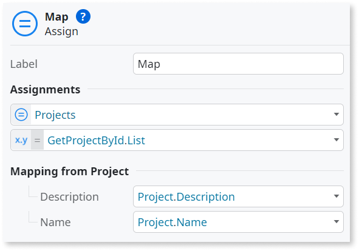

## How to add an element to a list

To add an element to a list, use the [ListAppend](<../../apis/auto/system-actions.final.md#ListAppend>) system action. This action is available both as a Client Action and a Server Action.

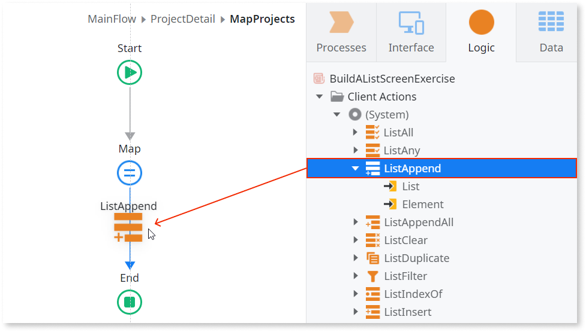

## How to iterate a list

To iterate a list, use a For Each. Check [this guide](../../../develop/logic/list-iterate.md) on how to do it. 

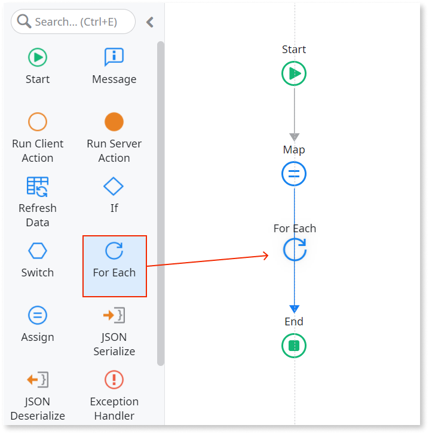

## Lists in input parameters

The following procedures are examples of how  you can use lists in input parameters. 

### How to map a list to another list in an input

In this example, there is a CombineProjects action that calls the FilterProjects action in its flow. The FilterProjects action has an input parameter named NamesList of data type **Text List**. 

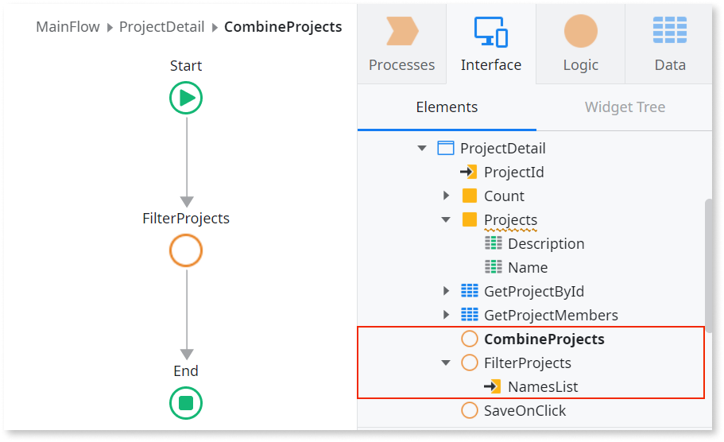

When the FilterProjects action is called, you have to define which list to set as input parameter. In this example, the mapping is made from the Projects local variable created in the [example above](#createvariable). The Projects local variable has two attributes and the NamesList input parameter only has one, so only the Name attribute of the Projects local variable will be mapped to the input parameter. Follow these steps:

1. Select the FilterProjects action in the flow.

1. Set the NamesList field to the `Projects` local variable.

1. In the **Mapping to Text** section, you have to define which attribute to map. Select the **Name** attribute from the dropdown.

    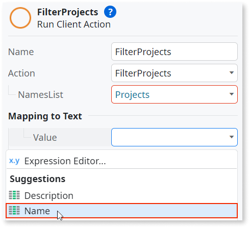

### How to add an element to a list input parameter

Instead of mapping from another list, you can add elements manually. Follow these steps:

1. Click **+** to the left of **NamesList** to create a list with one element.

    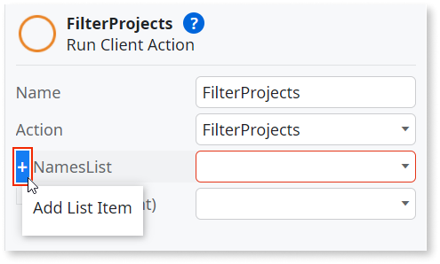

1. In the element field, enter the value for the first element of the list.

    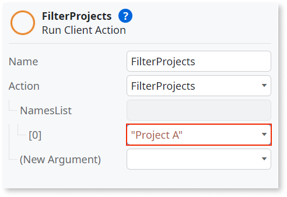

1. To add more elements, repeat steps 1 and 2.

## Runtime Properties

OutSystems provides the following runtime properties for lists:

Property | Type | Access type | Comment  
---|---|---|---  
Current | List element type | Read/write | Allows direct access to the current element.  
EOF | Boolean | Read only | Indicates whether the end of the list was exceeded. When you are iterating the last element, this property is still FALSE.  
BOF | Boolean | Read only | Indicates whether you are at the beginning of the list. When you are iterating the first element, this property is True.  
CurrentRowNumber | Integer | Read only | The index of the current element in the list, starting with 0.  If the list is empty, this property is 0.  
Length | Integer | Read only | The number of elements currently in the list.  
Empty | Boolean | Read only | Indicates whether the list is empty.  

## List System Actions

The following System Actions are available to manipulate a List:

System Action | Description
---|---  
[ListAll](<../../apis/auto/system-actions.final.md#ListAll>) | Determines if all the elements in the list satisfy the given condition.
[ListAny](<../../apis/auto/system-actions.final.md#ListAny>) | Determines if any of the elements in the list satisfies the given condition.
[ListAppend](<../../apis/auto/system-actions.final.md#ListAppend>) | Adds an element to the end of a list.
[ListAppendAll](<../../apis/auto/system-actions.final.md#ListAppendAll>) | Adds the elements of the source list to the end of the destination list.
[ListClear](<../../apis/auto/system-actions.final.md#ListClear>) | Removes all elements from a list.
[ListDuplicate](<../../apis/auto/system-actions.final.md#ListDuplicate>) | Duplicates the elements of a list into another list.
[ListFilter](<../../apis/auto/system-actions.final.md#ListFilter>) | Produces a new list with the elements of the source list that satisfy the given condition.
[ListIndexOf](<../../apis/auto/system-actions.final.md#ListIndexOf>) | Returns the position of the first element that satisfies the given condition, or -1 if no element was found.
[ListInsert](<../../apis/auto/system-actions.final.md#ListInsert>) | Inserts an element in a specific position of a list.
[ListRemove](<../../apis/auto/system-actions.final.md#ListRemove>) | Removes an element from a specific position of a list.
[ListSort](<../../apis/auto/system-actions.final.md#ListSort>) | Sorts the elements in the list by the given criteria.
