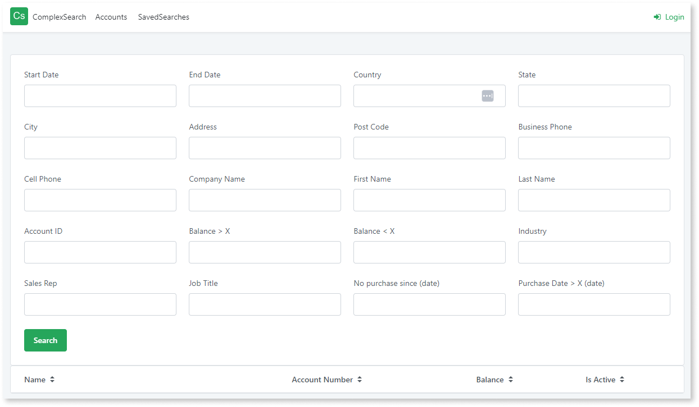
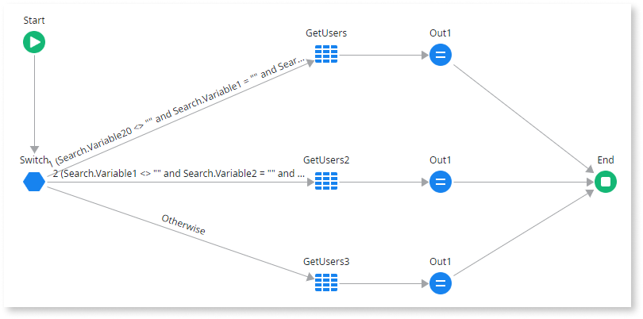
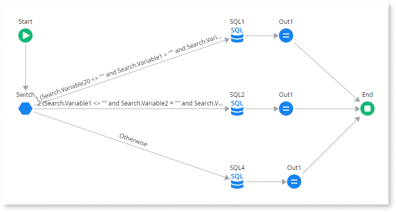

---
tags:
summary: Learn how to handle complicated search pages with multiple search fields using advanced SQL. 
guid: 1AF1558A-82D8-4081-B31C-1136215B4A2D
locale: en-us
app_type: traditional web apps, mobile apps, reactive web apps
platform-version: o11
figma: https://www.figma.com/file/eFWRZ0nZhm5J5ibmKMak49/Reference?type=design&node-id=2755%3A3078&mode=design&t=Ix2yojgoXorQvo4C-1
---

# How to handle complicated search pages with multiple search fields

Handling complex search pages with multiple search fields where most of them are not used can be highly challenging. Aggregates can handle the complexity of complex search pages but at the cost of performance. This article explains the use of Advanced SQL and server actions for handling complex search pages.

## Steps to handle complicated search pages

1. You must aim to return the fewest number of records possible. Always set the **Max Records value**.

1. Handle the nulls in the search fields before optimizing the query. For example, if you have a search page with more than 20 search fields and most users enter a value only for one or few search fields, then first handle the null values.The goal is to eliminate this pattern:

`(@StartDate = NullDate() or SomeDate >= @StartDate) AND (@EndDate = NullDate() or SomeDate <= @EndDate)`

Since `NullDate() = Jan 1, 1900`, you can ignore that. If `@EndDate` is Null, you can set it to the greatest possible date for the field, for example, `Dec 31, 3000`.

Then this filter becomes:
`(SomeDate BETWEEN @StartDate AND @EndDate)`

You can make these changes and see if the impact is acceptable. If not, you must use Advanced SQL.

## OutSystems Recommendations

OutSystems recommends that you use a Server Action instead of an Aggregate. Either build a SQL statement with a dynamic WHERE clause, based on whether or not a search field is used, or build multiple statements with a combination of search fields and choose the right one based on the search fields used. For more information, see [tuning dynamic SQL](https://www.brentozar.com/archive/2019/01/tuning-dynamic-sql-by-hand-with-short-circuits/).

You can use Server Action to write queries based on the search fields. 

The input for the server action is a structure containing all the search fields. The output is a  list of a structure designed for your purpose, such as the columns of a grid.

The switch would be something like `IF @Search1 = Null and @Search2 = Null and ... and @Search20 <> Null`

Using server action is the best option for improved performance, but this approach requires additional work and experimentation. You can add common search combinations as you find them, and the otherwise value would be the big complex query that handles all possibilities.

If you use Advanced SQL, then you must handle paging manually. Manual-coded paging improves performance, but it is slightly more complicated. 

For more information, you may refer to this [OutSystems community forum discussion](https://www.outsystems.com/forums/discussion/56770/sql-offset-and-os-pagination/).
