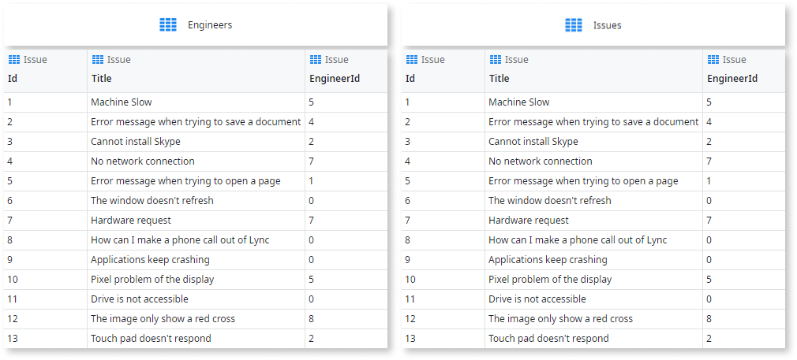

# Supported Join Types

Usually your data is not stored in a single Entity. So, when performing queries on the data, you need to combine the records that is stored in multiple Entities. This is also known as joining records from multiple Entities.

To do this, just drag the entities into your aggregate. They are automatically joined together, but you can always customize how they are combined in the **Sources** tab. There are four ways to join records from two entities:

* Only fetch records that have a match in both entities.
* Fetch all rows from the first entity, even if there are no matches on the second entity.
* Fetch rows from both entities.
* For each record in the first entity, match it with a record from the second entity.

In the examples below we will combine the following two entities:

## Only fetch records with a match

To only retrieve Issues that have an Engineer assigned, use **Only With**.

Notice how Issues that have no Engineer assigned yet are not returned.

## Fetch all records from an entity, even if they don’t have a match

To retrieve all Issues regardless of whether they have an Engineer assigned to them, use **With or Without**.

In this join type the order of the Entities in the join condition makes a difference in the returned rows. The idea is to retrieve all records from the first entity, and combine the rows of the second entity to them. So if you swap the order of the Entities, you will get a different result.

Notice that for the Issues that have no Engineer assigned, the columns with the Engineer information contain the default values.

## Fetch rows from both entities

To fetch all Issues and all Engineers, even if there is no match between them, use **With**.

Notice that for Issues without an engineer assigned, the columns with the engineer information contain the default values.

For engineers that don’t have an issue assigned to them, the issue information contains the default values.

This option is specially useful for exporting data into third-party systems.

## Combine all records, ignore relationship

To combine each record from an entity with all records of a second entity (for example: to create a list that pairs each team with every adversary team), just make sure that there is no Join defined in the Sources tab.

To pair each team with their adversaries, add the Team entity twice to your aggregate.

Then filter the aggregate to ensure that a team is not paired up with itself.
