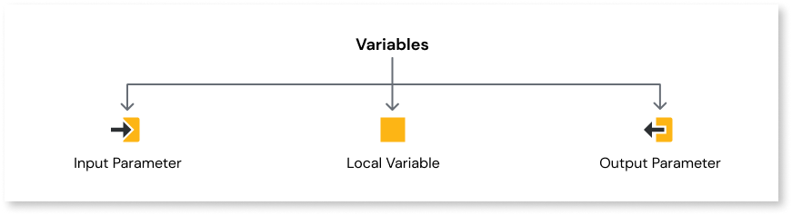

# Variables

When developing your app, you can use variables to store different types of values, for example, numbers, phrases, or the results of a calculation. These values can be used anywhere within the app or in a specific page.

For more information about the different types of variables, see [Input Parameters](../../../lang/auto/class-input-parameter.md), [Local Variables](../../../lang/auto/class-local-variable.md) and [Output Parameters](../../../lang/auto/class-output-parameter.md).
