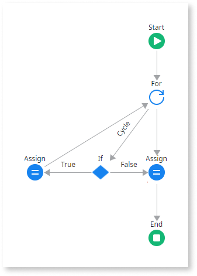

# Invalid Action Flow Error

The Invalid Action Flow Error is issued, for example, when you create logic flows for Screen Actions, Client Actions, Server Actions, or Data Actions. 

Double-click on the error line in TrueChange to take you directly to the Action that is issuing the error.

## 'Cycle' path must return to the 'For Each' element in &lt;action>

**Cause**

You have a For Each element with a Cycle loop path that does not return to the For Each element.

**Recommended action**

Update the Cycle loop to return to the [For Each](../../../ref/lang/auto/Class.For%20Each.final.md) element in your Action. 

For example, for a [list](../../../develop/logic/list-iterate.md), you need to create a connection from the last step in your logic to the For Each node to close the cycle.

**More info**

For information about creating [Screen](../../../ref/lang/auto/Class.Screen%20Action.final.md), [Client](../../../ref/lang/auto/Class.Client%20Action.final.md), [Server](../../../ref/lang/auto/Class.Server%20Action.final.md), and [Data](../../../ref/lang/auto/Class.Data%20Action.final.md) Actions, see [Actions in Reactive Web and Mobile Apps](../../../develop/logic/actions.md).

## Ambiguous paths to &lt;element> in &lt;action>

**Cause**

You have an element that belongs simultaneously to different Start, Exception Handler, or For Each paths.

**Examples**  

| Flow        | Description  |
|:-----------:|:-------------|
|  | In this situation, the Assign element belongs to the Action flow and also to the Exception flow, therefore the Error Handler flow is crossing the regular execution of the Action. |
|  | In this situation, the Assign element belongs to the Action flow and also to the For Each flow. |

Alternatively, there are missing paths in a node of your Action. For example, you have a For Each node with no Cycle loop path.

**Recommended action**

Edit the Action flow and update the ambiguous paths. Add any paths that are missing, for example, from a [For Each](../../../ref/lang/auto/Class.For%20Each.final.md) node. 

Check [Exception Handler](../../../ref/lang/auto/Class.Exception%20Handler.final.md) for information about how to add an Exception Handler element and its logic in your Action flow. 

**More info**

For information about creating [Screen](../../../ref/lang/auto/Class.Screen%20Action.final.md), [Client](../../../ref/lang/auto/Class.Client%20Action.final.md), [Server](../../../ref/lang/auto/Class.Server%20Action.final.md), and [Data](../../../ref/lang/auto/Class.Data%20Action.final.md) Actions, see [Actions in Reactive Web and Mobile Apps](../../../develop/logic/actions.md).

Check [Exception Handling Mechanism](../../../develop/logic/exceptions/handling-mechanism.md) for additional information about Exception Handler flows.

## If must have one (T)rue and one F(alse) link
  
**Cause**

You have an If element in your Action that does not have a True link and a False link.

**Recommended action**

Update the [If](../../../ref/lang/auto/Class.If.final.md) element in the Action to have True and False branches.

**More info**

For information about creating [Screen](../../../ref/lang/auto/Class.Screen%20Action.final.md), [Client](../../../ref/lang/auto/Class.Client%20Action.final.md), [Server](../../../ref/lang/auto/Class.Server%20Action.final.md), and [Data](../../../ref/lang/auto/Class.Data%20Action.final.md) Actions, see [Actions in Reactive Web and Mobile Apps](../../../develop/logic/actions.md) and [Actions in Web Applications](../../../develop/logic/action-web.md).

## Switch condition for &lt;path> connector must return a 'Boolean' value
  
**Cause**

You have a condition in your Switch element that does not return a Boolean value.

**Recommended action**

Update the [Switch](../../../ref/lang/auto/Class.Switch.final.md) element in the Action to have the condition return a Boolean value.

**More info**

For information about creating [Screen](../../../ref/lang/auto/Class.Screen%20Action.final.md), [Client](../../../ref/lang/auto/Class.Client%20Action.final.md), [Server](../../../ref/lang/auto/Class.Server%20Action.final.md), and [Data](../../../ref/lang/auto/Class.Data%20Action.final.md) Actions, see [Actions in Reactive Web and Mobile Apps](../../../develop/logic/actions.md) and [Actions in Web Applications](../../../develop/logic/action-web.md).

## &lt;switch> must have an otherwise optional connector in &lt;action>
  
**Cause**

You have a Switch element in your Action that does not have the Otherwise path.

**Recommended action**

Update the [Switch](../../../ref/lang/auto/Class.Switch.final.md) element in the Action and add an Otherwise path.

**More info**

For information about creating [Screen](../../../ref/lang/auto/Class.Screen%20Action.final.md), [Client](../../../ref/lang/auto/Class.Client%20Action.final.md), [Server](../../../ref/lang/auto/Class.Server%20Action.final.md), and [Data](../../../ref/lang/auto/Class.Data%20Action.final.md) Actions, see [Actions in Reactive Web and Mobile Apps](../../../develop/logic/actions.md) and [Actions in Web Applications](../../../develop/logic/action-web.md).

## Start is required in &lt;action>

**Cause**

You have an Action flow that does not have the Start element.

**Recommended action**

Edit the Action and add a Start element. An Action flow must have only one Start element.

**More info**

For information about creating [Screen](../../../ref/lang/auto/Class.Screen%20Action.final.md), [Client](../../../ref/lang/auto/Class.Client%20Action.final.md), [Server](../../../ref/lang/auto/Class.Server%20Action.final.md), and [Data](../../../ref/lang/auto/Class.Data%20Action.final.md) Actions, see [Actions in Reactive Web and Mobile Apps](../../../develop/logic/actions.md) and [Actions in Web Applications](../../../develop/logic/action-web.md).

## More than one Start found in &lt;action>

**Cause**

You have more than one Start element in your Action.

**Recommended action**

Edit the Action and remove the additional Start elements.

**More info**

For information about creating [Screen](../../../ref/lang/auto/Class.Screen%20Action.final.md), [Client](../../../ref/lang/auto/Class.Client%20Action.final.md), [Server](../../../ref/lang/auto/Class.Server%20Action.final.md), and [Data](../../../ref/lang/auto/Class.Data%20Action.final.md) Actions, see [Actions in Reactive Web and Mobile Apps](../../../develop/logic/actions.md) and [Actions in Web Applications](../../../develop/logic/action-web.md).
