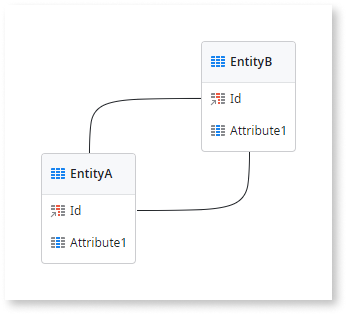

# Invalid Entity Error

The `Invalid Entity` error is issued in the following situations:

* `<entity> must have at least one attribute`
  
    You have an Entity with no attributes.

    You must add more Attributes to the Entity.

* `<entity> can only have one attribute with 'Is Autonumber' set to 'Yes'`
  
    You have an Entity with more than one sequential attribute and you can have only one on each Entity.

    Check your Entity and choose which Attribute must be sequential. In the other Attribute, you have to set the Is AutoNumber property to No.

* `<entity> can only have one attribute of 'Binary Data' data type`
  
    Your entity has more than one Binary Data attribute and this situation is not supported by the database.

    Depending on your requirements do one of the following:
    
    * Change the data type of one of these attributes;
    
    * Create a new Entity and move one of these attributes to that new Entity.

* `The only attribute of entity '<entity>' cannot be AutoNumber. Add more attributes to the entity or set  to 'No' the attribute's property 'Is AutoNumber'`
  
    You have an Entity with only one Attribute and it is set as sequential (AutoNumber). This situation is not allowed by some of databases supported by OutSystems. This has probably happened because new Entities in OutSystems are created with a default Identifier (which is an AutoNumber attribute), and you still have not added more attributes to your entity.

    Depending on your requirements, do one of the following:
    
    * Add more Attributes to your Entity.
    * Change the Is AutoNumber property of the attribute to No.

* `<entity> identifier attribute data type must be set to 'Integer', 'Long Integer', or 'Text'`
  
    You have an Entity whose Identifier is not of type Integer, Long Integer, or Text.

    Select the identifier attribute and change its data type to Integer, Long Integer, or Text.

* `Circular dependency in <entity> identifier`
  
    You have a circular dependency between this entity and another entity in your module. A circular dependency exists when the data type of an Identifier is another Identifier and vice-versa.

    Examples of circular dependencies:

    * You have EntityA and EntityB. There is a circular dependency if the Identifier of EntityA is of type EntityB Identifier and the Identifier of EntityB is of type EntityA Identifier.

          

    * You have an Entity whose Identifier is of type Entity Identifier.

        

    Change the data types of the entity Identifiers.

* `<entity> identifier must be of 'Integer' data type with 'Is Autonumber' set to 'Yes' due to multi-tenancy`
  
    You have a multi-tenant entity with an identifier of Integer data type but its value is not defined to be sequential. When defining multi-tenant entities, OutSystems requires that Integer identifiers must be defined as sequential.

    In your multi-tenant Entity, set the Is AutoNumber property of the identifier to Yes.

* `<entity> must have an identifier attribute due to multi-tenancy`
  
    You have a multi-tenant Entity with no Identifiers. When defining multi-tenant Entities, OutSystems requires that each Entity has an Identifier.

    In your multi-tenant Entity, choose an Long Integer, Integer, or Text attribute to be the Entity Identifier.

* `<entity> must be a static entity because it is being used in a Web Service`
  
    The static entity was created when consuming a Web Service, so it can't be converted to an Entity, or the web service will no longer work.

    Convert the Entity back to a Static Entity.

* `<entity> must have an identifier of type Text because it is being used in a Web Service`
  
    The static entity was created when consuming a Web Service and for the web service to work, the static entity identifier needs to have a Text data type.

    Change the data type of the static entity identifier back to Text.

Double-click on the error line to take you directly to the entity in the Module Tree.
