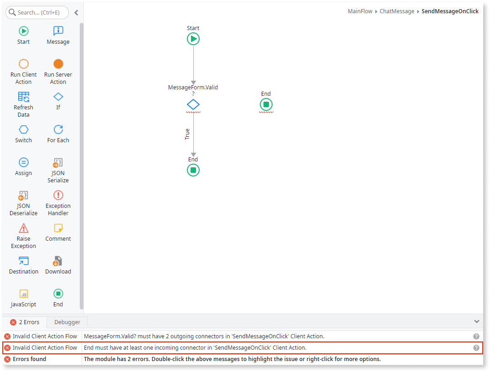
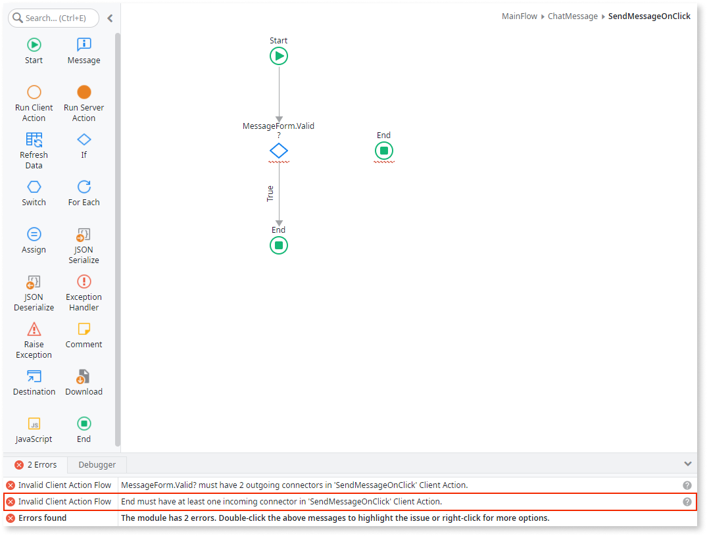

# Invalid Flow Error

Message
:   `<element> must have at least one incoming connector in <action-flow>`

  
     
Cause
:   You have an element in your flow that's not connected to any other element. For example, you have an End element in an action that doesn't have an incoming connector.

Recommendation
:       Edit your flow and connect the element to one of the existing elements, otherwise that element won't be executed.

 

---

Message
:   `<element> must have <number> outgoing connector(s) in <action-flow>`

 

Cause
:   You have an element in your flow that doesn't contain the required outgoing connectors. For example, you have an If element with only one outgoing connector.

Recommendation
:        Edit your flow and add the necessary outgoing connectors from the element.

 