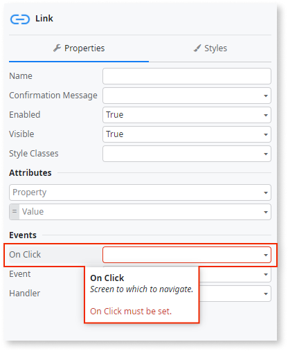

# Invalid Property Value Error

The `Invalid Property Value` error is issued in the following situations:

Message
:   `<property> must be set in <element>`
  
Cause
:   There's a mandatory property in `<element>` that you haven't set. For example, the **Destination** property in a Link widget.

    

Recommendation
:   Set a value in the mandatory property.

---

Message
:   `'Default Value' must be set to a <literal> literal`

Cause
:   The **Default Value** property must be a literal. You can't set the property with an expression as, for example: `1 + 1`.

    

Recommendation
:   Edit the **Default Value** property of the element and set a literal value.

    In all the elements (except Session Variables and Site Properties), you can use one of the following built-in functions as default value: `NullDate()`, `NullIdentifier`, `NullObject()`, `NullTextIdentifier()`, `CurrDate()`, `CurrTime()`, `CurrDateTime()`, and `NewLine()`.

---

Message
:   `'<property>' cannot be set to the content of a widget`
  
Cause
:   You have a Record widget that is populated with the content of another widget or the widget itself. For example a Show Record widget whose **Source Record** is `TableRecords1.List.Current`.

    

Recommendation
:   Edit the **Source Record** or **Source Record Lis**t (depending on the widget), and use a variable that's not a runtime property of any of the widgets available on the screen. You must use local variables, queries, or lists evaluated in the Screen Preparation.
