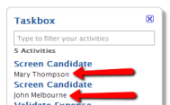

# Missing Process Detail Warning

Message
:   `Please set the '<process>' Process Detail property to display in Taskbox.`

Cause
:   The text displayed under the link of an activity in the Taskbox is obtained from the Detail property of a Human Activity of that activity.

    
  
    However, if a Human Activity as no detail specified, OutSystems tries to obtain it from the Process, as follows:

    1. If the process has the Detail property specified, this is the value that is used.
    1. If the process has the Launch On property specified, it refers an entity, and the value of the attribute specified in the Label Attribute of that Entity is used.
    1. No detail is specified by the process.

Recommendation
:   Check the process and define a value for the detail text, in the following way:

    1. If the process has the Launch On specified:  
    Set an attribute in the Label Attribute of the entity so that a meaningful text is displayed as detail text of the activity. For example, in a process that is launched on the CreateCandidate event, go to the Candidate entity, set the Name attribute set as Label Attribute. This way, human activities without Detail show the candidate name under them the Taskbox.

    1. If a text related with the process is to be displayed:  
    Set an expression for process-related text it in the Detail property of the process. For example, show the identification of the process as detail text of activities in the Taskbox. This way, human activities without Detail show a process identification under them, thus allowing the identification of which activities belong to which processes.
    
    Pay attention when setting the Detail property of the process because it also is used to identify processes in the Service Center.
