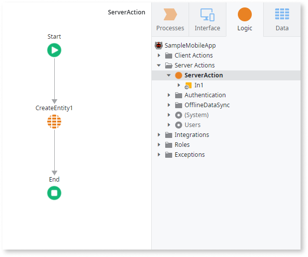
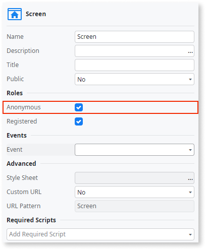

# Security Warning

Message
:   `You're exposing a database operation in the client side. Validate the data in a Server Action before changing the database.`

Cause
:   There's client-side logic in your app that can access and write changes to the server database. 

Recommendation
:   You need to validate the data on the server before you perform a database operation that can modify data or change the permissions. From the security and data integrity point of view, you must implement this validation on the server. A client-side validation isn't enough, as its purpose is to provide fast feedback to the users.

To resolve the warning, create a Server Action that calls the Entity Action, and then use this Server Action on the Client Actions. Keep in mind that you still need to create the server logic to ensure that your data is valid before saving. Here's an example of a Server Action calling the Entity Action:

---

Message
:   `You're exposing a generic Server Action for public access and without authentication. Consider removing the Anonymous Role from this Screen.`

Cause
:    Reserve calling Server Actions without first authenticating the request for special use cases only, such as authentication operations, where a request can't initially have the authentication info.

Recommendation
:   Review how and where you use Server Action and ensure the logic isn't compromising security. For example, you may be allowing all visitors that aren't signed in to change the employee information. To fix such an issue, you must limit the access to the screen, and later validate the data on the server side.

To resolve the warning, remove the Anonymous role by unchecking the **Anonymous** checkbox in the screen properties area.

