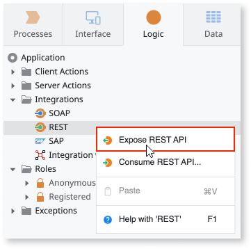

# Exposed REST API

OutSystems allows you to expose methods using a REST API. This section contains reference information on exposed REST APIs.

To learn more about exposing REST APIs, check the [Expose REST APIs](../../../../extensibility-and-integration/rest/expose-rest-apis/intro.md) section.

