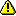

# Action Parameters Editor

The Action Parameter Editor allows you to edit the [properties](<../element-property/action-parameter.md>) of the action parameter that belongs to your extension.

This editor is displayed together with the [Action Editor](<action.md>).

## Add and Remove Parameters

To **add** a parameter, simply type a new row in this editor or press the  button in the editor or in the right menu.

To **remove** a parameter, select the parameter row and press the  button in the editor or in the right menu.

 Since actions set as functions (property Function equal to `Yes`) must have exactly one output parameter, the remove operation could cause a violation of this rule. Integration Studio prevents it but allows you to automatically change the action to meet the requirements to be a function by setting property Function to No, if you're deleting a single output parameter of a function action.

## Input and Output Parameters

By default, the parameter is an input parameter. To define an Output parameter, simply click on the Input icon  and Integration Studio switches to an Output parameter. In fact, both the Input  and Output  icons have a toggle behavior, allowing you to easily change the type of the parameter.

 Since actions set as functions (property Function equal to `Yes`) must have exactly one output parameter, this "toggle" operation could cause a violation of this rule. Integration Studio prevents it but allows you to automatically change the action to meet the requirements to be a function:

* By setting the property Function to `No`, if you're adding another output parameter to a function action. 

* By setting the property Function to `No`, if you're deleting a single output parameter of a function action.

## Change the Parameters Order

The order of the parameters must be the same in both the extension action and in the corresponding C# method. The Action Parameter Editor contains the necessary buttons to define the order of the parameters:

Button | Description
:-----:|:-----------
 | Move the selected parameter down.
 | Move the selected parameter to the bottom of the list.
 | Move the selected parameter up.
 | Move the selected parameter to the top of the list.

## Change the Parameter Properties

You can change the properties of the parameter, at any time. Simply double-click in the action in the [Multi-tree navigator](<../workspace.md>) or select the action in the [Multi-tab editor](<../workspace.md>) and change the parameter properties.
