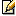

# Imported Actions Properties

The Import Actions from .NET Assembly wizard allows you to import action definitions from a .NET assembly. Using introspection of a .NET assembly, this wizard will create an action for each method, property and public field you checked in step 3 of the [Import Actions from .NET Assembly](<../../../integration-with-systems/integration-studio/managing-extensions/net-assembly-import-action.md>) wizard. The properties of the imported actions depend on the type of the assembly item you select, as explained below.

 All actions created with this mechanism are created with the Function property set to its default, that is, `No`.

## Constructors as Actions

For each .NET constructor selected in the wizard, a new action is created with the following properties:

Name
:   `<.NET_class_name>Create`

Parameters
:   One output parameter is added, besides the ones natively declared in the Constructor. This new parameter represents the created object and has the following properties:

    * Name: `New_<.NET_class_name_of_the_Object_created>`

    * Type: Object. For more information about this data type, see [Data Types](<../../data/data-types/available-data-types.md>).

## Methods as Actions

For each .NET method selected in the wizard, a new action is created with the following properties:

Name
:   `<.NET_class_name><.NET_method_name>`

Parameters
:   For each input or output parameter declared in this method, an input or output parameter is created as follows:

    * Name: Name of the .NET parameter.

    * Data type: OutSystems' data type that corresponds to the .NET data type. For more information, see [Data Types at Runtime](<../../data/data-types/data-types-at-runtime.md>).

    In the following situations, Integration Studio creates more parameters than the method defines, in order to correctly map the method signature into the action definition.

    * If the method is **non-static**, then an extra input parameter is created as follows: 
    Name: `This_<.NET_class_name>` 
    Data type: Object. For more information about this data type, see [Data Types](<../../data/data-types/available-data-types.md>). 
     This parameter holds the object where this non-static method will be invoked.

    * If the method has a **return value**, then an extra output parameter is created as follows: 
    Name: `Return_<.NET_class_name_of_the_method_return>` 
    Data type: OutSystems' data type that corresponds to the .NET data type. For more information, see [Data Types at Runtime](<../../data/data-types/data-types-at-runtime.md>). 
     This parameter holds the result of this method.

    * If the method has a **reference parameter**, then two input and output parameters are created as follows: 
    Name: `In_<.NET_parameter_name>` 
    Type: Input parameter 
    Data type: OutSystems' data type that corresponds to the .NET data type. For more information, see [Data Types at Runtime](<../../data/data-types/data-types-at-runtime.md>).

    * Name: `Out_<.NET_parameter_name>` 
    Type: Output parameter 
    Data type: OutSystems' data type that corresponds to the .NET data type. For more information, see [Data Types at Runtime](<../../data/data-types/data-types-at-runtime.md>).

## Properties as Actions

For each .NET property selected in the wizard, two new actions might be created with the following properties:

Name
:   `<.NET_class_name><.NET_property_name>Get`

     This action is created only if the property is readable.

Parameters
:   The following parameters are created:

    * Name: `This_<.NET_class_name>` +
    Type: Input parameter 
    Data type: Object. For more information about this data type, see [Data Types](<../../data/data-types/available-data-types.md>). 
     This parameter should hold the object where the property will be invoked.

    * Name: `<property_name>` 
    Type: Output parameter 
    Data type: OutSystems' data type that corresponds to the .NET data type. For more information, see [Data Types at Runtime](<../../data/data-types/data-types-at-runtime.md>).

Name
:   `<.NET_class_name><.NET_property_name>Set`

     This action is created only if the property is writable.

Parameters
:   The following parameters are created:

    * Name: `This_<.NET_class_name>` 
    Type: Input parameter 
    Data type: Object. For more information about this data type, see [Data Types](<../../data/data-types/available-data-types.md>). 
     This parameter should hold the object where the property will be invoked.

    * Name: `<property_name>` 
    Type: Output parameter 
    Data type: OutSystems' data type that corresponds to the .NET data type. For more information, see [Data Types at Runtime](<../../data/data-types/data-types-at-runtime.md>).

## Public Fields as Actions

For each .NET public field selected in the wizard, two new actions are created with the following properties:

Name
:   `<.NET_class_name><.NET_field_name>Get`

Parameters
:   The following parameters are created:

    * Name: `This_<.NET_class_name>` 
    Type: Input Parameter 
    Data type: Object. For more information about this data type, see [Data Types](<../../data/data-types/available-data-types.md>). 
     This parameter should hold the object from which the field will be obtained.

    * Name: `<property_name>` 
    Type: Output Parameter 
    Data type: OutSystems' data type that corresponds to the .NET data type. For more information, see [Data Types at Runtime](<../../data/data-types/data-types-at-runtime.md>).

Name
:   `<.NET_class_name><.NET_field_name>Set`

Parameters
:   The following parameters are created:

    * Name: `This_<.NET_class_name>` 
    Type: Input Parameter 
    Data type: Object. For more information about this data type, see [Data Types](<../../data/data-types/available-data-types.md>). 
     This parameter should hold the object from which the field will be obtained.

    * Name: `<property_name>` 
    Type: Output Parameter 
    Data type: OutSystems' data type that corresponds to the .NET data type. For more information, see [Data Types at Runtime](<../../data/data-types/data-types-at-runtime.md>).

 The "Import Actions from .NET Assembly" wizard has the necessary mechanisms to avoid name clashing. Also, by default, the icon associated with actions imported from a .NET assembly is .

 In the [Action editor](<../editor/action.md#import-details>) you can see the details about the Import Operation.
