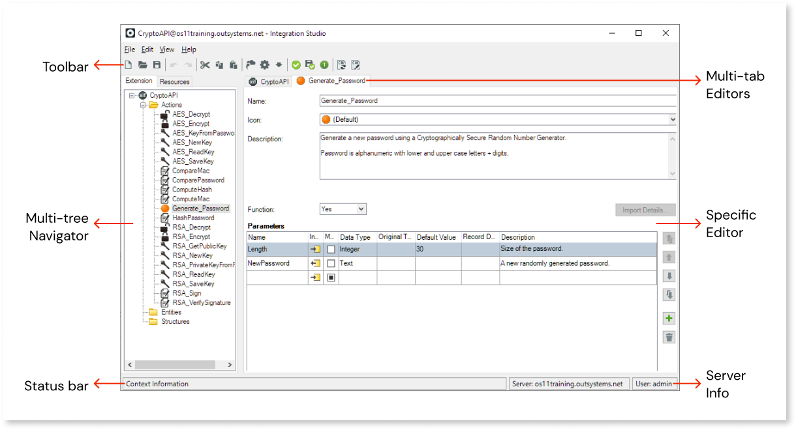

# Integration Studio

Integration Studio is a desktop tool that allows you to create and manage your [extensions](<../../extensibility-and-integration/integration-studio/getting-started/extension.md>). To install Integration Studio, use the installer on the [Software Downloads](https://www.outsystems.com/Downloads/) page. 

From version 11.14.17, Integration Studio is distributed independently from Service Studio.

The next screenshot presents the workspace for this tool:

The workspace is divided into the following areas:

[Toolbar](<toolbar.md>)
:   Where you can create new extensions, verify and publish an extension, connect to the Platform Server, etc.

[Multi-tree Navigator](<multi-tree-navigator.md>)
:   Where you can add and select your Actions, Structures and Entities, in the **Extension** tree; add and select your Resources, in the **Resources** tree.

Status bar
:   Contains information about the extension, like the folder where the XIF (Extension and Integration Framework) is being saved.

[Multi-tab editors](<multi-tab-editors.md>)
:   Contains all the elements (extension, actions, structures, entities and resources) that you have selected in the Multi-tree Navigator.

Specific Editor
:   Where you can edit the [extension](<editor/extension.md>) and its elements: [actions](<editor/action.md>), [structures](<editor/structure.md>), [entities](<editor/entity.md>), or [resources](<editor/resource.md>).

Server Info
:   Where you can find information on which Platform Server you are connected to and which user has established this connection.
