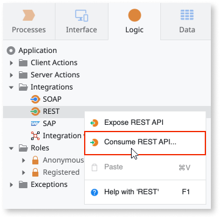

---
tags:
locale: en-us
guid: 4e615b2f-6864-4b64-8d9f-d786e046eed2
app_type: traditional web apps, mobile apps, reactive web apps
platform-version: o11
figma: https://www.figma.com/file/eFWRZ0nZhm5J5ibmKMak49/Reference?node-id=2146:3572
summary: OutSystems enables applications to interact with external systems through consumed REST APIs
---
# Consumed REST API

OutSystems allows you to retrieve or manipulate information from another system by consuming a REST API in your application. This section contains reference information on consumed REST APIs.

To learn more about consuming REST APIs, check the [Consume REST APIs](../../../../integration-with-systems/rest/consume-rest-apis/intro.md) section.

