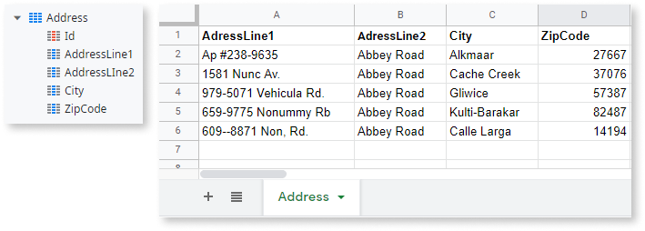

Converts an Excel object to a Record List. Use this logic tool when you need to import Excel files at **runtime**.

If you need to import data from an Excel file at **design time** (when developing your application), consider the following alternatives:

* If you don't have an Entity to hold the imported Excel data yet, check how to [create an Entity from an Excel file and import data](../../../getting-started/create-reactive-web.md#create-entity-from-excel).

* If you want to import the Excel data to an existing Entity, check [Bootstrap an Entity Using an Excel File](../../../develop/data/excel-bootstrap.md).

To use Excel To Record List you need an Entity or Structure that matches the content of the Excel file you want to import. OutSystems matches the attributes of the Entity/Structure specified in the **Record Definition** property with the column headings in the Excel file.

Check the following example of an Entity named Address and a valid Excel file containing data to import:

Provide the content of the Excel file to import in the **File Content** property as binary data. To import data from a specific sheet in the Excel file, specify the sheet name in the **Sheet Name** property. OutSystems imports data from the first sheet, by default.

To iterate over the records that were successfully imported, use a [For Each](<Class.For Each.final.md>) and set the **Record List** property of the For Each to the name of the Excel to Record List element in the flow.
