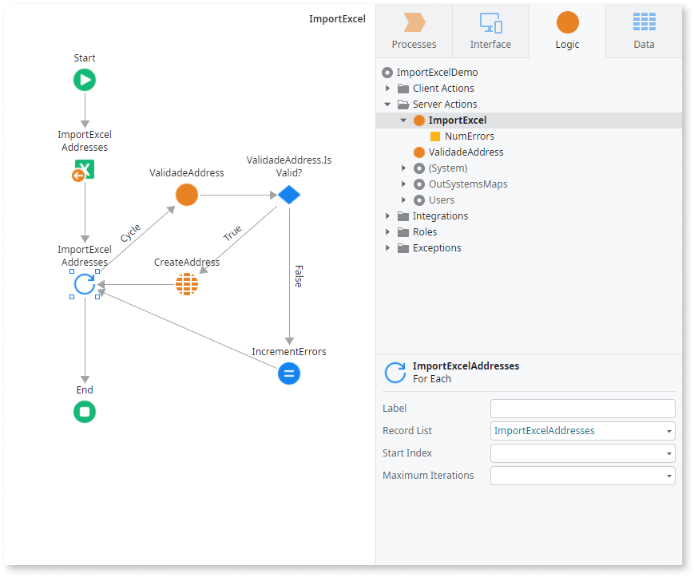

Converts an Excel object to a Record List. Use this logic tool when you need to load data from an Excel file in your app at runtime.

Tip: If you need to import data from an Excel file at **design time**, when developing your application, check the following topics:

* [Create an Entity from an Excel file and import data](../../../getting-started/create-reactive-web.md#create-entity-from-excel), if you don't have an Entity to hold the imported Excel data yet
* [Bootstrap an Entity Using an Excel File](../../../develop/data/excel-bootstrap.md), if you want to import data to an existing Entity

To use Excel To Record List you need an Entity or Structure that matches the content of the Excel file you want to import. OutSystems matches the attributes of the Entity/Structure specified in the **Record Definition** property with column headings in the Excel file.

Check the following example of an Entity named Address and a valid Excel file containing data to import:

Entity attributes without a corresponding column in the Excel file get the default value of their data type (for example, `""` for a Text attribute).

To use the tool, provide the content of the Excel file to import in the **File Content** property as binary data. To import data from a specific sheet in the Excel file, specify the sheet name in the **Sheet Name** property. OutSystems imports data from the first sheet, by default.

To iterate over the records that were successfully imported, use a For Each and set the **Record List** property of the For Each to the name of the Excel to Record List element.

Here's an example flow for handling the data you're importing using Excel to Record List:

Excel To Record List doesn't validate if imported data filled in all the mandatory attributes of the Entity. You can use a Server Action (in this example, ValidateAddress) to check if the imported data complies with business rules like mandatory attributes, or handle the exception thrown by the CreateAddress entity action.

**Note:** Excel To Record List is only available in **Server Actions**. In Reactive Web and Mobile apps you must send the uploaded file to the server and then process that file in a Server Action. Check [Enable End Users to Upload Files](../../../develop/ui/inputs/upload.md) for more information.

