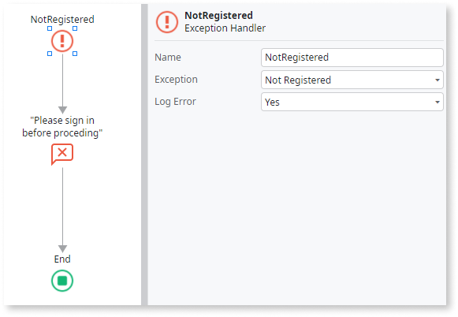

# Exception Handler

The Exception Handler element starts an action flow for handling all exceptions or exceptions of a certain type. You can define logic to handle exceptions pre-defined exceptions (like Database Exceptions), or custom exceptions (called User Exceptions) raised by your application logic.

Set the Exception Handler's **Exception** property to the exception type you want to handle in the flow of the Exception Handler. To handle all types of exceptions, set the **Exception** property to `All Exceptions`.

For example, the following flow handles the **Not Registered** exception:

There's a hierarchy of exception types in OutSystems. If you define an Exception Handler that handles a "parent" exception type, this Exception Handler can also handle any "children" exception type. Check [Handle Exceptions](../../../develop/logic/exceptions/intro.md) for more information.

In the exception-handling flow started by an Exception Handler element you can perform tasks like displaying a feedback message, logging exception details, and even raising a different type of exception.

Check [Exception Handling Mechanism](../../../develop/logic/exceptions/handling-mechanism.md) to learn more about the chain of Exception Handlers that the platform searches for when an exception occurs.

## Logging exceptions { #logging }

If you set the **Log Error** property to **Yes**, the platform creates a log for the exception type configured in the **Exception** property, when such an exception occurs. You can check for logged exceptions in Service Center under **Monitoring** > **Errors**.

## Aborting database transactions { #aborting }

When you handle an exception in an [action running on server side](../../../develop/logic/actions.md), you can choose what happens to the database transaction by setting the **Abort Transaction** property of the Exception Handler:

* Set the **Abort Transaction** property to **Yes** if you want that all the database transactions that weren't committed are aborted and changes rolled back in the database.

* Set the **Abort Transaction** property to **No** if you want that the database transaction to continue as if no exception had occurred. This transaction is committed by the next [CommitTransaction](../../data/database/handling-transactions.md) Server Action or implicitly by OutSystems, typically at the end of request execution.

In Reactive Web and Mobile apps, the **Abort Transaction** property isn't available when you are handling exceptions in client side.

## Properties

<table markdown="1">
<thead>
<tr>
<th>Name</th>
<th>Description</th>
<th>Mandatory</th>
<th>Default value</th>
<th>Observations</th>
</tr>
</thead>
<tbody>
<tr>
<td title="Name">Name</td>
<td>Identifies an element in the scope where it is defined, like a screen, action, or module.</td>
<td>Yes</td>
<td></td>
<td></td>
</tr>
<tr>
<td title="Exception">Exception</td>
<td>Type of exception to handle.</td>
<td>Yes</td>
<td></td>
<td>There is a call hierarchy for exceptions that determines the error handler behavior. For more info see [Exception Handling Mechanism](../../../develop/logic/exceptions/handling-mechanism.md).</td>
</tr>
<tr>
<td title="Abort Transaction">Abort Transaction</td>
<td>Set to Yes to abort the transaction and rollback changes.</td>
<td>Yes</td>
<td>Yes</td>
<td>This property is only available in Traditional Web Apps or in a server-side context (for all apps).</td>
</tr>
<tr>
<td title="Log Error">Log Error</td>
<td>Set to Yes to log an error when the exception occurs.</td>
<td>Yes</td>
<td>Yes</td>
<td></td>
</tr>
</tbody>
</table>

## Runtime Properties

<table markdown="1">
<thead>
<tr>
<th>Name</th>
<th>Description</th>
<th>Read Only</th>
<th>Type</th>
<th>Observations</th>
</tr>
</thead>
<tbody>
<tr>
<td>ExceptionMessage</td>
<td>Text that explains the reason for the last error.</td>
<td>Yes</td>
<td>Text</td>
<td></td>
</tr>
</tbody>
</table>

