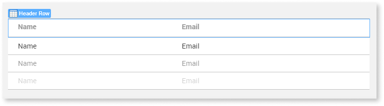
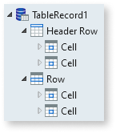

# Header Row Widget

Applies only to Traditional Web Apps.

Widget containing the cells that are part of the header row of a [Table Records Widget](<Class.Table Records Widget.final.md>).

When you add a Table Records Widget to a screen, the table gets a Header Row Widget automatically. To hide the header row of the table, set the **Show Header** property of the Table Records Widget to `No`.

Each time you add or remove a new attribute to the Table Records Widget, Service Studio adds or removes a table [Cell](<Class.Cell Widget.final.md>) to/from both the Header Row and the regular table [Rows](<Class.Row Widget.final.md>) used to display data.

For example, in a Table Records Widget where you added two attributes, this is the result in the widget tree, with one Header Row and one Row (at design time), each containing two Cells:

**Tip:** If you want to have a fixed table header and keep a scrollable list of table rows for the data, check [How to scroll records in a table with a fixed header](https://success.outsystems.com/Documentation/How-to_Guides/Front-End/How_to_scroll_records_in_a_table_with_a_fixed_header).

## Properties

<table markdown="1">
<thead>
<tr>
<th>Name</th>
<th>Description</th>
<th>Mandatory</th>
<th>Default value</th>
<th>Observations</th>
</tr>
</thead>
<tbody>
<tr >
<th colspan="5">Extended Properties</th>
</tr>
<tr>
<td title="Property">Property</td>
<td>Name of an attribute to add to the HTML translation for this element.</td>
<td></td>
<td></td>
<td>You can pick a property from the drop-down list or type a free text. The name of the property will not be validated by the platform.  Duplicated properties are not allowed. Spaces, " or ' are also not allowed.</td>
</tr>
<tr>
<td title="Value">Value</td>
<td>Value of the attribute.</td>
<td></td>
<td></td>
<td>You can type the value directly or write expressions using the Expression Editor.  If the Value is empty, the corresponding HTML tag is created as property="property". For example, the nowrap property does not require a value, therefore nowrap="nowrap" is added.</td>
</tr>
</tbody>
</table>

