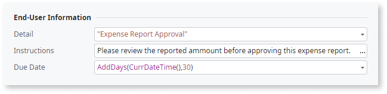
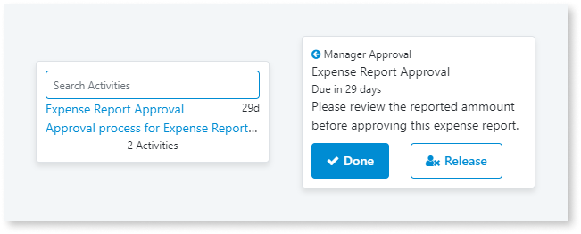

# Human Activity

When designing the process flow of your process, you can add work to be carried out by the end user. This behavior is implemented through the **Human Activity** process activity, which you can drag onto your canvas from the [Process Flow Toolbox](<../../../develop/processes/process-flow/process-flow-toolbox.md>).

The Human Activity allows you to specify and assign a work to be carried out by the end users in your application. Once the process flow execution reaches a Human Activity the end user or end users are informed (in their [Taskbox](<../../../develop/processes/intro.md#using-the-taskbox>)) of the work that has to be carried out. Then, one of them executes the activity and signals in the Taskbox that the activity has been done, and the Human Activity execution finishes. The process flow execution continues to the next process activity in the flow path.

A Human Activity can have input parameters, output parameters and [callback actions](<../../../develop/processes/actions-callback/actions-activities-callback.md>).

Human Activity is not available in Service Modules because this activity requires user interface.

## Assigning a Human Activity to end users

If no configuration is done, the Human Activity is assigned to all end users, that is, it is displayed in the [Taskbox](<../../../develop/processes/intro.md#using-the-taskbox>) of each end user until it's executed by one of them. However, to force the assignment of a Human Activity to a specific end user, set the `User` property to the desired end user. For advanced cases, you may set an expression that returns the user that handles the activity, using the expression editor.

To improve the end users experience while executing these activities, you can provide the details of the Human Activity and the instructions on how to execute it. For this, select the Human Activity instance in the flow path, and set the `Detail` and `Instructions` properties under **End-User Information**:

This information will be available in the activities list and the activity details of the end users' Taskbox:

## End the Activity on Entity Events

If the execution of the human activity is to be automatically ended after an event occurs over an entity, the kind of event must be set in the `Close On` property with one of the following entity actions: **Create&lt;Entity&gt;** or **Update&lt;Entity&gt;**.

Once you select the kind of event in the On Close property, a list of entity attributes is displayed for you to set the condition to automatically end the human activity: a primary key for a specific record and/or reference attributes for a specific value on an attribute.

For example, if the human activity is designed for a user to carry on an interview but interviews can be canceled, then the `Close On` property must be set with the **UpdateInterview** entity action and the interview status attribute with the canceled code.

## Adding security

You may add security to your Human Activities to be sure that only authorized end users can execute the activity, which is especially useful for critical or high responsibility activities. For this, simply check the roles allowed to execute the Human Activity.

## Using Human Activity references

Service Studio provides you with mechanisms to access Human Activity process activities among modules. You can expose your Human Activity process activities to other modules or use Human Activity process activities defined in another module. This activity cannot be exposed if its Process is not exposed or the module is Multi-tenant.

## Remarks

Changing the `Close On` property to listen to events from another entity only has effect on Human Activity instances that are created after the change. All instances that were already executing will continue listening to events from the previous entity. Therefore, you should only make this change when there are no more Human Activity instances listening to the previous entity.

## Properties

<table markdown="1">
<thead>
<tr>
<th>Name</th>
<th>Description</th>
<th>Mandatory</th>
<th>Default value</th>
<th>Observations</th>
</tr>
</thead>
<tbody>
<tr>
<td title="Name">Name</td>
<td>Identifies an element in the scope where it is defined, like a screen, action, or module.</td>
<td>Yes</td>
<td></td>
<td></td>
</tr>
<tr>
<td title="Description">Description</td>
<td>Text that documents the element.</td>
<td></td>
<td></td>
<td>Useful for documentation purpose. The maximum size of this property is 2000 characters.</td>
</tr>
<tr>
<td title="Label">Label</td>
<td>Text displayed to the end user in the Taskbox and in the back-office when an instance of this Human Activity is executed.</td>
<td></td>
<td></td>
<td>If not defined, the displayed text will be the Human Activity name.</td>
</tr>
<tr>
<td title="Public">Public</td>
<td>Indicates whether this process activity can be used by other modules.</td>
<td>Yes</td>
<td>No</td>
<td>This property is only available for process activities that were created in the current module. When a process activity is public its process must also be public.</td>
</tr>
<tr>
<td title="User">User</td>
<td>Defines the user that is going to complete the activity. Can be an expression.</td>
<td></td>
<td></td>
<td></td>
</tr>
<tr>
<td title="Close On">Close On</td>
<td>Entity action that automatically ends the Human Activity execution.</td>
<td></td>
<td></td>
<td>The event that automatically closes (ends) the process activity execution:  
        <strong>Create &lt;entity&gt;:</strong> the Human Activity is closed when a record is created for the specified entity;  
        <strong>Update &lt;entity&gt;:</strong> the Human Activity is closed when a record is updated for the specified entity.</td>
</tr>
<tr>
<td title="Destination">Destination</td>
<td>Screen where the user will complete the Human Activity work after opening this activity in the Taskbox.</td>
<td></td>
<td></td>
<td>Available in Reactive Web and Traditional apps.</td>
</tr>
<tr>
<td title="Original Name">Original Name</td>
<td>Name of the element as defined in the module which implements it (producer module). This property is read-only.</td>
<td>Yes</td>
<td></td>
<td>This property is only visible for referenced elements.</td>
</tr>
<tr >
<th colspan="5">End-User Information</th>
</tr>
<tr>
<td title="Detail">Detail</td>
<td>Description of the Human Activity to be displayed to the end user in the Taskbox. Can be an expression. Overrides the Detail value defined on the Process. Changing this value will not affect existing Human Activity instances.</td>
<td></td>
<td></td>
<td></td>
</tr>
<tr>
<td title="Instructions">Instructions</td>
<td>Instructions on how to complete the Human Activity work to be displayed to the end user in the Taskbox.</td>
<td></td>
<td></td>
<td></td>
</tr>
<tr>
<td title="Due Date">Due Date</td>
<td>Optional date to inform the end user when is the due date of the activity. Can be an expression.</td>
<td></td>
<td></td>
<td></td>
</tr>
<tr >
<th colspan="5">Advanced</th>
</tr>
<tr>
<td title="Allow Skip">Allow Skip</td>
<td>If set to True, the execution of a failed activity may be skipped.</td>
<td>Yes</td>
<td>No</td>
<td>If skip is allowed, the end user's Taskbox displays an option to skip a failed activity. This option cannot skip a wait activity, use the system action ActivitySkip instead.</td>
</tr>
<tr>
<td title="Start Date">Start Date</td>
<td>Optional date that defines when the activity is scheduled to become available to be handled. Can be an expression.</td>
<td></td>
<td></td>
<td></td>
</tr>
<tr >
<th colspan="5">Roles</th>
</tr>
<tr>
<td title="Roles">Roles</td>
<td>List of the Roles available in your module. Allows selection of the roles that have grants to carry out the Human Activity work.</td>
<td></td>
<td>Registered ApplicationUser</td>
<td></td>
</tr>
</tbody>
</table>

## Runtime Properties

<table markdown="1">
<thead>
<tr>
<th>Name</th>
<th>Description</th>
<th>Read Only</th>
<th>Type</th>
<th>Observations</th>
</tr>
</thead>
<tbody>
<tr>
<td>ClosedBy</td>
<td>Identifier of the end user that closed the process activity instance.</td>
<td>Yes</td>
<td></td>
<td></td>
</tr>
<tr>
<td>ClosedInstant</td>
<td>Date and time when the process activity instance was closed.</td>
<td>Yes</td>
<td>Date Time</td>
<td></td>
</tr>
<tr>
<td>Skipped</td>
<td>True if the process activity instance ended because it was skipped.</td>
<td>Yes</td>
<td>Boolean</td>
<td></td>
</tr>
<tr>
<td>ActivityId</td>
<td>Identifier of the process activity instance at runtime.</td>
<td>Yes</td>
<td></td>
<td></td>
</tr>
</tbody>
</table>

