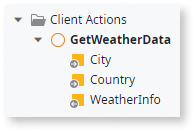

# Input Parameter

An Input Parameter allows you to provide data to an element for further use. The Input Parameter becomes available in that element's scope.

For example, if you add an Input Parameter to a Client Action you can:

* Provide a value for that Input Parameter when calling the Client Action.

* Use the value in the logic flow of the Client Action, for example in expressions or as a part of Input Parameter values of other calls.

In the following example, the `GetWeatherData` Client Action has two Input Parameters (`City` and `Country`) and one Output Parameter (`WeatherInfo`):

Input Parameters can be mandatory or optional, according to their **Is Mandatory** property.

If you call other Actions from the Client Action you can no longer access the Input Parameter because it's not longer in the Client Action scope. To make the Input Parameter value accessible to other calls, include the Input Parameter in the arguments of the Action Call.

## How to use

When invoking an element with Input Parameters, like a Client Action, you must specify the **values** for all the mandatory Input Parameters sent to the Client Action as part of the invocation, optionally specifying values for Input Parameters that are optional. Input Parameter values are also known as input **arguments**.

For example, considering the same `GetWeatherData` Client Action presented before, you could invoke this Client Action setting the values for the `City` and `Country` Input Parameters in the following manner:

You define the Input Parameter values in the properties of the Run Client Action element. These arguments appear indented from the remaining properties.

To set an Input Parameter value, enter an expression in the corresponding property.

## Input Parameters availability

The following elements displayed in the element tree can have Input Parameters:

* Server Actions and Client Actions
* Screens and Blocks
* Processes
* Exposed/Consumed REST Methods
* Exposed/Consumed SOAP Web Service Methods
* SAP Remote Functions
* Callback and Authentication actions for REST, SOAP, and SAP integrations (although you can't modify the default Input Parameters of these actions)
* Emails
* External Sites
* JavaScript elements (available on Client Actions)

The Input Parameters of the following elements have additional properties:

* [Input Parameter](ServiceStudio.Plugin.SOAP.SOAPActionInput.final.md) of a consumed SOAP Web Service Method
* [Input Parameter](ServiceStudio.Plugin.RESTService.RestServiceActionInput.final.md) of an exposed REST API Method
* [Input Parameter](ServiceStudio.Plugin.SAP.SapActionInput.final.md) of a SAP Remote Function
* [Query Parameter](<Class.Query Parameter.final.md>) of a SQL element

Check their reference topics for more information.

## Properties

<table markdown="1">
<thead>
<tr>
<th>Name</th>
<th>Description</th>
<th>Mandatory</th>
<th>Default value</th>
<th>Observations</th>
</tr>
</thead>
<tbody>
<tr>
<td title="Name">Name</td>
<td>Identifies an element in the scope where it is defined, like a screen, action, or module.</td>
<td>Yes</td>
<td></td>
<td></td>
</tr>
<tr>
<td title="Default Value">Default Value</td>
<td>Initial value of this element. If undefined, the default value of the data type is used.</td>
<td></td>
<td></td>
<td></td>
</tr>
<tr>
<td title="Is Mandatory">Is Mandatory</td>
<td>Set to Yes to require for a value to be set.</td>
<td>Yes</td>
<td>Yes</td>
<td></td>
</tr>
<tr>
<td title="Description">Description</td>
<td>Text that documents the element.</td>
<td></td>
<td></td>
<td>Useful for documentation purpose. The maximum size of this property is 2000 characters.</td>
</tr>
<tr>
<td title="Data Type">Data Type</td>
<td>The data type of the input parameter.</td>
<td>Yes</td>
<td></td>
<td></td>
</tr>
</tbody>
</table>

