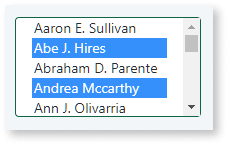
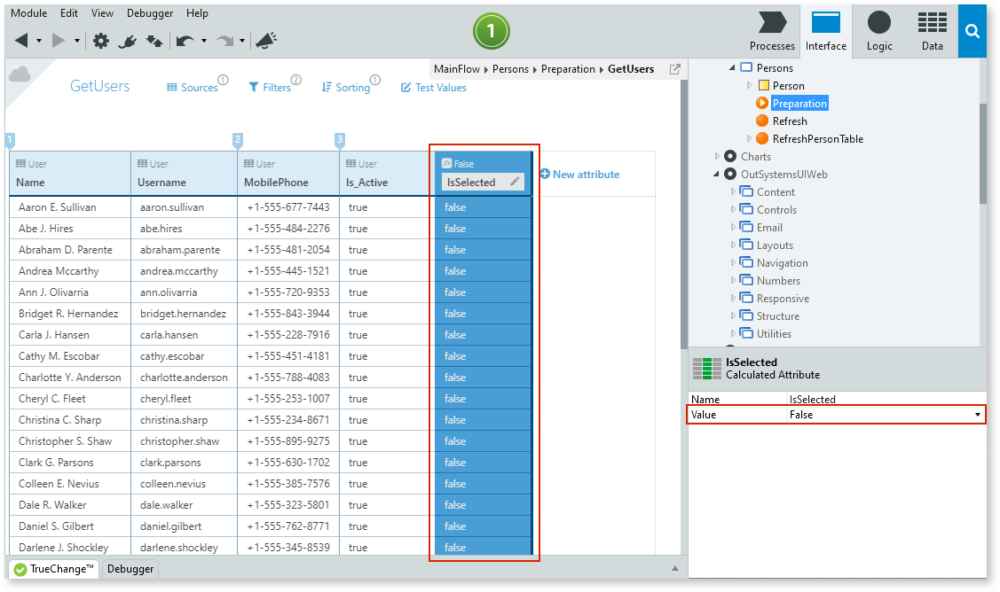
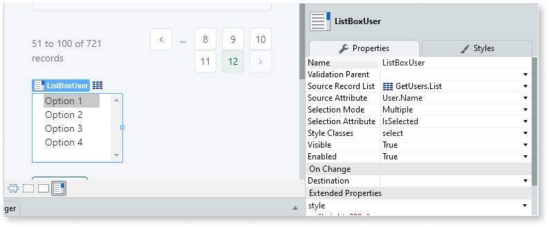
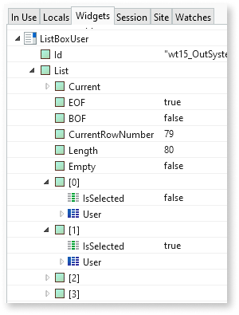
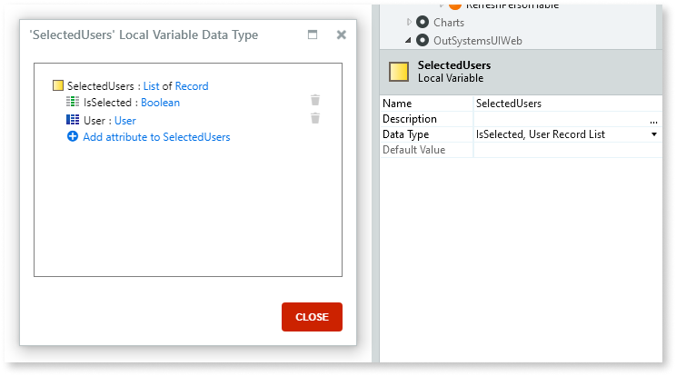
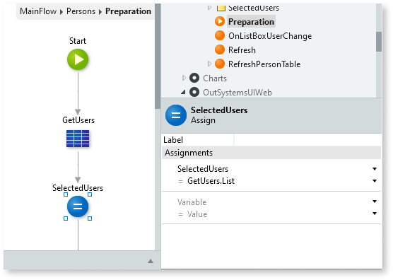
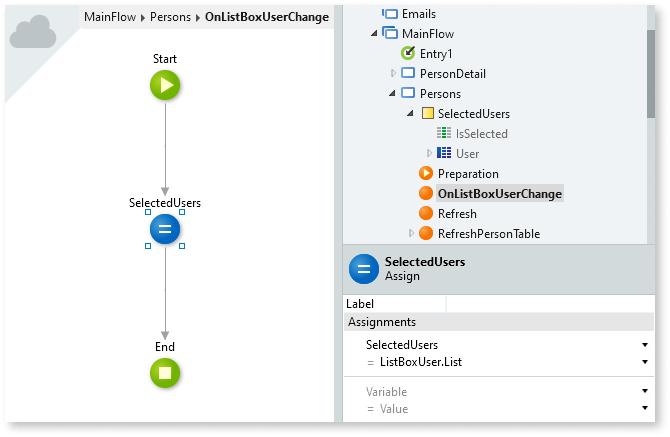

# List Box Widget

Applies only to Traditional Web Apps.

Allows the user to select one or more values from a list of possible values.

Consider the following alternatives if your users need to select only **one value** from a list:

* [Combo Box Widget](<Class.Combo Box Widget.final.md>)
* [Dropdown](../../../develop/ui/patterns/web/controls/dropdown.md) UI Pattern

The **Source Record List** property defines the source of the list of possible values. You can get the list of values from an Aggregate or SQL element, or you can build your own list of Records.

The text for each value displayed in the List Box comes from the attribute set in the **Source Attribute** property.

The List Box widget allows users to select multiple values by default. You can configure the List Box widget to only allow users select one value from the list. Configure this behavior by setting the **Selection Mode** property to `Multiple` or `Single`, respectively.

Users can select multiple values from the list by pressing the `Ctrl` key while simultaneously selecting the values.

## Obtaining the values that the user selected

The Record definition must include a Boolean attribute to hold the user selection. One way of achieving this when you're using an Aggregate as the record source list is to an extra calculated attribute to the Aggregate with Boolean data type.

For example, the following Aggregate from a screen Preparation contains a calculated attribute named **IsSelected**. The List Box widget uses this attribute to store the information about the selected records. In the Aggregate definition, the value of this calculated attribute is `False`, meaning that every row in the result list has this value, and that the List Box selection is empty by default.

After defining the source Aggregate with an additional calculated attribute for keeping the selection status of each Record, set the properties of the List Box widget.

In the example above, the List Box displays the names of users as selectable values. It uses the IsSelected attribute to store the information about the current selection. At runtime, each selected value from the list has the IsSelected attribute set to `True`.

When there's a Submit operation, you can access the list of Records through the **List** runtime property of the widget. This property includes updated values in the IsSelected attribute according to the items the user selected.

In the following example, the user selects the second value from a list (item `[1]` from the **List** runtime property has its IsSelected attribute set to `True`):

## Keeping the selection when refreshing the widget

You must take care when using Ajax refresh operations to refresh the List Box widget. Doing a refresh clears the currently selected values.

Executing any action that performs a Submit operation (for example, clicking on a button or link with the *Method* property set to `Submit`) also clears the current selection of the List Box widget.

To maintain the selection when there's an Ajax refresh, you can follow an approach similar to the following:

1. Instead of using Aggregate results directly, define a local variable to use as the source list. For example, if your original Aggregate had the User entity as a source, define a local variable with data type "IsSelected, User Record List", where IsSelected is a Boolean attribute.

    

    This allows each record to hold both the attributes of a User record and also the selection state.

1. In the Preparation, set this local variable to the **List** runtime property of the Aggregate.

    

1. In the List Box widget properties, set the **Source Record List** property to your local variable.

1. Create a new action that handles the **On Change** event of the List Box. To maintain the selection information, in the action flow, assign the value of the **List** runtime property of the List Box to the local variable, so that you keep the selection information.

    

## Combining with other widgets and UI Patterns

If you're allowing users to select multiple values in a List Box widget, consider using the [Dropdown Select](../../../develop/ui/patterns/web/controls/dropdownselect.md) UI Pattern together with the List Box. The Dropdown Select UI Pattern makes it easier for an end user to check the list items they already selected.

## Properties

<table markdown="1">
<thead>
<tr>
<th>Name</th>
<th>Description</th>
<th>Mandatory</th>
<th>Default value</th>
<th>Observations</th>
</tr>
</thead>
<tbody>
<tr>
<td title="Name">Name</td>
<td>Identifies an element in the scope where it is defined, like a screen, action, or module.</td>
<td>Yes</td>
<td></td>
<td></td>
</tr>
<tr>
<td title="Validation Parent">Validation Parent</td>
<td>Specifies an Edit Record widget. Widgets with the same Validation Parent are validated as a group.</td>
<td></td>
<td></td>
<td></td>
</tr>
<tr>
<td title="Source Record List">Source Record List</td>
<td>Current list of records displayed by the widget.</td>
<td>Yes</td>
<td></td>
<td></td>
</tr>
<tr>
<td title="Source Attribute">Source Attribute</td>
<td>Specifies the attribute of the records in the list to populate the widget.</td>
<td>Yes</td>
<td></td>
<td></td>
</tr>
<tr>
<td title="Selection Mode">Selection Mode</td>
<td>Specifies if the user can select only a single item or multiple items from the list.</td>
<td>Yes</td>
<td>Multiple</td>
<td>The possible values are: Multiple and Single.</td>
</tr>
<tr>
<td title="Selection Attribute">Selection Attribute</td>
<td>Boolean attribute of the records in the list that holds if a value is selected or not. If using a list from an Aggregate, you can add a new Boolean attribute in the Aggregate.</td>
<td>Yes</td>
<td></td>
<td></td>
</tr>
<tr>
<td title="Style Classes">Style Classes</td>
<td>Specifies one or more style classes to apply to the widget. Separate multiple values with spaces.</td>
<td></td>
<td></td>
<td></td>
</tr>
<tr>
<td title="Visible">Visible</td>
<td>Boolean literal or expression that defines if the widget is displayed.</td>
<td></td>
<td>Yes</td>
<td></td>
</tr>
<tr>
<td title="Enabled">Enabled</td>
<td>Boolean literal or expression that defines if the widget is editable.</td>
<td></td>
<td>Yes</td>
<td></td>
</tr>
<tr >
<th colspan="5">Extended Properties</th>
</tr>
<tr>
<td title="Property">Property</td>
<td>Name of an attribute to add to the HTML translation for this element.</td>
<td></td>
<td></td>
<td>You can pick a property from the drop-down list or type a free text. The name of the property will not be validated by the platform.  Duplicated properties are not allowed. Spaces, " or ' are also not allowed.</td>
</tr>
<tr>
<td title="Value">Value</td>
<td>Value of the attribute.</td>
<td></td>
<td></td>
<td>You can type the value directly or write expressions using the Expression Editor.  If the Value is empty, the corresponding HTML tag is created as property="property". For example, the nowrap property does not require a value, therefore nowrap="nowrap" is added.</td>
</tr>
<tr >
<th colspan="5">On Change</th>
</tr>
<tr>
<td title="Destination">Destination</td>
<td>Screen action to be executed or a screen to navigate to when the value of the element changes.</td>
<td></td>
<td></td>
<td>It might be necessary to specify additional input arguments.</td>
</tr>
</tbody>
</table>

## Runtime Properties

<table markdown="1">
<thead>
<tr>
<th>Name</th>
<th>Description</th>
<th>Read Only</th>
<th>Type</th>
<th>Observations</th>
</tr>
</thead>
<tbody>
<tr>
<td>List</td>
<td>Collection of records returned by the performed query.</td>
<td></td>
<td>Record List</td>
<td></td>
</tr>
<tr>
<td>Valid</td>
<td>Always True for List Boxes. You can override this property value when performing custom validation.</td>
<td></td>
<td>Boolean</td>
<td></td>
</tr>
<tr>
<td>ValidationMessage</td>
<td>Message describing the built-in validation constraints not satisfied when 'Valid' is False. You can override this property value when performing custom validations.</td>
<td></td>
<td>Text</td>
<td></td>
</tr>
<tr>
<td>Id</td>
<td>Identifies the widget instance at runtime (HTML 'id' attribute). You can use it in JavaScript and Extended Properties.</td>
<td>Yes</td>
<td>Text</td>
<td></td>
</tr>
</tbody>
</table>

