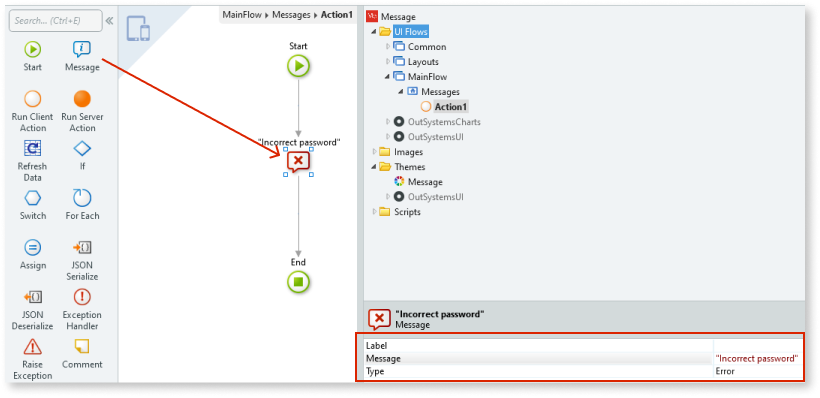

You can provide a feedback message to the user by using the Message logic tool within a Client Action flow.

## Using the Message logic tool

1. Drag the Message logic tool onto the Client Action flow.
1. Set the relevant properties, for example, the message type.

The available predefined Message types are as follows:
<ul>
<li>Info</li>
<li>Warning</li>
<li>Success</li>
<li>Warning</li>
<li>Error</li>
</ul>
