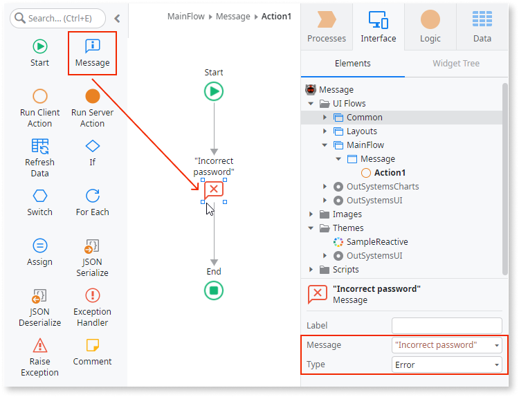

You can provide a feedback message to the end user by using the Message logic tool within a Client Action flow.

## Using the Message logic tool

1. Drag the Message logic tool onto the Client Action flow.
1. Set the message **Label**, **Message**, and **Type** properties.

    In this example, we enter ``Invalid password`` in the **Message** property (the message displayed to the user) and select **Error** as the message type.  

    

    

The available predefined message types are as follows:

* Info

    

* Success

    

* Warning

    

* Error

    

