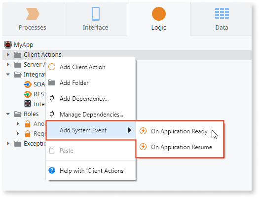

# On Application Ready

You app runs the **On Application Ready** during the loading of the home module. Use **On Application Ready** to set up the app, for example, to initialize variables and mobile plugins.

The **On Application Ready** action runs asynchronously, and doesn't block the render of the screens.

Note again that **On Application Ready** by design runs only during the loading of the home module. This means that the app ignores this action in the non-home modules.

To add the **On Application Ready** action to a Mobile or Reactive Web App do the following in Service Studio:

1. In the home module of your app, open the **Logic** tab.

1. Right-click the **Client Actions** node in the tree and select **Add System Event** > **On Application Ready**.

    

## Properties

<table markdown="1">
<thead>
<tr>
<th>Name</th>
<th>Description</th>
<th>Mandatory</th>
<th>Default value</th>
<th>Observations</th>
</tr>
</thead>
<tbody>
<tr>
<td title="Description">Description</td>
<td>Text that documents the element.</td>
<td></td>
<td></td>
<td>Useful for documentation purpose. The maximum size of this property is 2000 characters.</td>
</tr>
</tbody>
</table>

