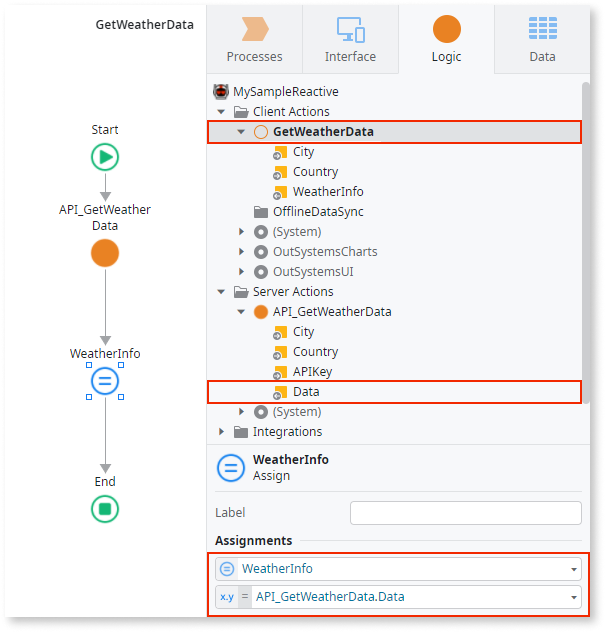

An Output Parameter allows you to return computed values from an action, process, or process flow element.

In the following example, the `GetWeatherData` Client Action has two Input Parameters (`City` and `Country`) and one Output Parameter (`WeatherInfo`):

## How to use

To return a value from inside an action flow or from a Process, you can use an [Assign](Class.Assign.final.md) element to set the Output Parameter to the value you wish to return.

For example, consider the `GetWeatherData` Client Action presented previously. You can use an Assign to set the value of the `WeatherInfo` Output Parameter to the `Data` Output Parameter value returned by the `API_GetWeatherData` Server Action:

You can access the value of an Output Parameter of an invoked action (in this case, the `API_GetWeatherData` Server Action) later in the flow using an expression with the following format:

`<flow_element_name>.<output_parameter_name>`

In the example presented above, the expression becomes the following:

`API_GetWeatherData.Data`

## Output Parameters availability

The following elements displayed in the element tree can have Output Parameters:

* Server Actions and Client Actions
* Processes, Process Activities, and Wait elements
* Exposed/Consumed REST Methods
* Exposed/Consumed SOAP Web Service Methods
* SAP Remote Functions

Additionally, JavaScript elements (available on Client Actions) also have Output Parameters.

External integrations like consumed REST APIs, consumed SOAP Web Services, and SAP Remote Functions have their logic defined in an external system. In this case, OutSystems fills the Output Parameter values from the values returned by the external system. You can then use the Output Parameter values in your business logic.

The Output Parameters of the following elements have additional properties:

* [Output Parameter](ServiceStudio.Plugin.SOAP.SOAPActionOutput.final.md) of a consumed SOAP Web Service Method
* [Output Parameter](ServiceStudio.Plugin.RESTService.RestServiceActionOutput.final.md) of an exposed REST API Method
* [Output Parameter](ServiceStudio.Plugin.SAP.SapActionOutput.final.md) of a SAP Remote Function

Check their reference topics for more information.
