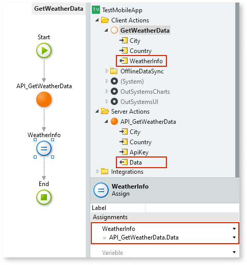

# Output Parameter

An Output Parameter allows you to return computed values from an action, process, or process flow element.

In the following example, the `GetWeatherData` Client Action has two Input Parameters (`City` and `Country`) and one Output Parameter (`WeatherInfo`):

## How to use

To return a value from inside an action flow or from a Process, you can use an [Assign](Class.Assign.final.md) element to set the Output Parameter to the value you wish to return.

For example, consider the `GetWeatherData` Client Action presented previously. You can use an Assign to set the value of the `WeatherInfo` Output Parameter to the `Data` Output Parameter value returned by the `API_GetWeatherData` Server Action:

You can access the value of an Output Parameter of an invoked action (in this case, the `API_GetWeatherData` Server Action) later in the flow using an expression with the following format:

`<flow_element_name>.<output_parameter_name>`

In the example presented above, the expression becomes the following:

`API_GetWeatherData.Data`

## Output Parameters availability

The following elements displayed in the element tree can have Output Parameters:

* Server Actions and Client Actions
* Processes, Process Activities, and Wait elements
* Exposed/Consumed REST Methods
* Exposed/Consumed SOAP Web Service Methods
* SAP Remote Functions

Additionally, JavaScript elements (available on Client Actions) also have Output Parameters.

External integrations like consumed REST APIs, consumed SOAP Web Services, and SAP Remote Functions have their logic defined in an external system. In this case, OutSystems fills the Output Parameter values from the values returned by the external system. You can then use the Output Parameter values in your business logic.

The Output Parameters of the following elements have additional properties:

* [Output Parameter](ServiceStudio.Plugin.SOAP.SOAPActionOutput.final.md) of a consumed SOAP Web Service Method
* [Output Parameter](ServiceStudio.Plugin.RESTService.RestServiceActionOutput.final.md) of an exposed REST API Method

Check their reference topics for more information.

## Properties

<table markdown="1">
<thead>
<tr>
<th>Name</th>
<th>Description</th>
<th>Mandatory</th>
<th>Default value</th>
<th>Observations</th>
</tr>
</thead>
<tbody>
<tr>
<td title="Name">Name</td>
<td>Identifies an element in the scope where it is defined, like a screen, action, or module.</td>
<td>Yes</td>
<td></td>
<td></td>
</tr>
<tr>
<td title="Default Value">Default Value</td>
<td>Initial value of this element. If undefined, the default value of the data type is used.</td>
<td></td>
<td></td>
<td></td>
</tr>
<tr>
<td title="Description">Description</td>
<td>Text that documents the element.</td>
<td></td>
<td></td>
<td>Useful for documentation purpose. The maximum size of this property is 2000 characters.</td>
</tr>
<tr>
<td title="Data Type">Data Type</td>
<td>The data type of the output parameter.</td>
<td>Yes</td>
<td></td>
<td></td>
</tr>
<tr>
<td title="Is Start Activity Input/ Is Close Activity Input">Is Start Activity Input/ Is Close Activity Input</td>
<td>Indicates if the output parameter is also used as an input parameter of the process activity's extended action.</td>
<td>Yes</td>
<td>Yes, Mandatory</td>
<td>The possible values are: 
        – "Yes, Mandatory": The output parameter is a mandatory input parameter of the Start&lt;Activity&gt;/Close&lt;Activity&gt; extended action; 
        – "Yes, Optional": The output parameter is an optional input parameter of the Start&lt;Activity&gt;/Close&lt;Activity&gt; extended action; 
        – "No": The output parameter is not an input parameter of the Start&lt;Activity&gt;/Close&lt;Activity&gt; extended action. 
        The property "Is Start Activity Input" is only available when specifying an output parameter for a Conditional Start process activity. 
        The property "Is Close Activity Input" is only available when specifying an output parameter for a Human Activity or a Wait process activities.</td>
</tr>
</tbody>
</table>

