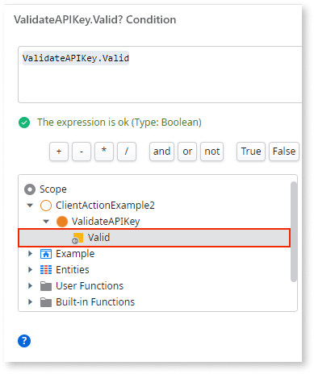
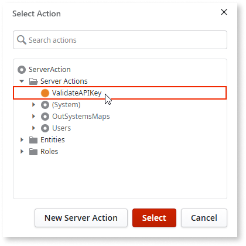

---
summary: Executes a Server Action, which contains logic that's executed on the server.
--- 

Executes a Server Action that runs logic on the server. Server Actions usually encapsulate logic that implements the business rules of your application.

You can use the Run Server Action element in the logic flow of actions such as:

* Client Actions
* Data Actions
* other Server Actions
* Automatic Activities
* methods of exposed REST APIs and SOAP Web Services
* Preparations and Screen Actions (only available in Traditional Web Apps)

When the Server Action you wish to run has input parameters, you provide their values in the properties of the Run Server Action element. This is also called **providing the arguments** for running the Server Action.

When the Server Action you wish to run has output parameters, you can use them in the logic that follows the Run Server Action element. There must be a logical path from the Run Server Action element to the place where the output parameter is used.

In the following example, we used the **Valid** output parameter of the **ValidateAPIKey** Server Action in an expression:

## How to use the Run Server Action tool

1. In the action flow where you want to run the Server Action, drag the **Run Server Action** tool and drop it in the action flow.

    

    Alternatively, open the **Logic** tab, expand the **Server Actions** folder, and drag the Server Action you want to run and drop it in the action flow.  
    In this case, skip the next step because you already selected the desired Server Action.

    

1. In the pop-up window, select the Server Action that you want to run from the **Server Actions** folder in the tree, and click **Select**.

    

1. Provide the arguments for the Run Server Action element by filling in the values in the properties editor. You must enter a value at least for the mandatory input parameters of the Server Action.

    

1. If the Server Action has output parameters, you can use them in the logic flow after the Run Server Action element.

    
