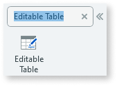
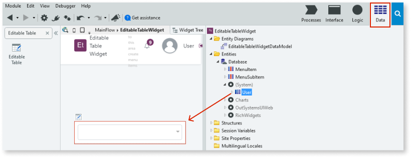

The Editable Table widget displays the records of an Entity or a Structure in a tabular layout and allows the user to create new records, update, or delete existing records.

# How to use the Editable Table widget

The following example demonstrates how you can display the registered users on your platform in an editable table.

1. In Service Studio, in the Toolbox, search for `Editable Table`.

    The **Editable Table** widget is displayed. 

    

1. From the Toolbox, drag the **Editable Table** widget into the **Main Content** area of your application's screen.

    

1. Select the **Data** tab, and from the Entities tree, navigate to the **User** entity and drag it into the Editable Table placeholder.

    

1. To return to your screen, select the **Interface** tab, and select the Editable Table widget. 

1. On the **Properties** tab, from the **Source Record List** dropdown, select the automatically created aggregate. In this example, we select **New Aggregate 'GetUsers'**. 

    

After following these steps, and publishing the module, you can test the widget in your app. 

**Result**

All of the registered users are displayed in an editable table. The Editable Table widget has the following built-in behaviors that provide an efficient way of adding and editing multiple records at once:

* Cycle through the inputs using the **TAB** key.
* Save the record in the current row using the **ENTER** key or by using **TAB** in the last column of the row.
* Add a new row and use the **ENTER** key to save that record and create a new one.
* Cancel the edit or creation of the record using the **ESC** key.

