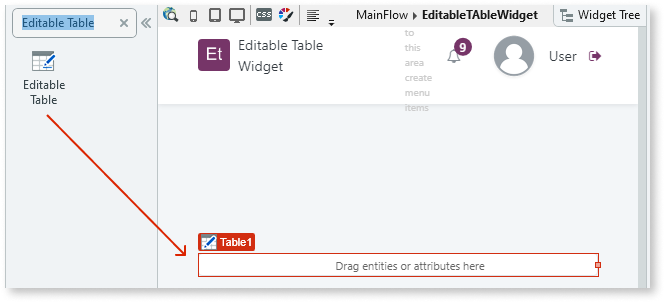
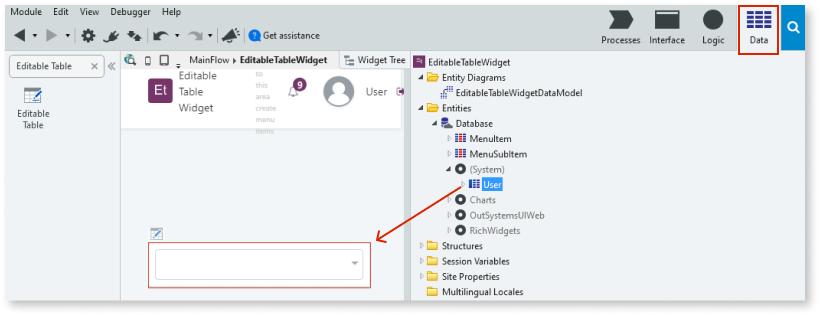

# Editable Table Widget

The Editable Table widget displays the records of an Entity or a Structure in a tabular layout and allows the user to create new records, update, or delete existing records.

# How to use the Editable Table widget

The following example demonstrates how you can display the registered users on your platform in an editable table.

1. In Service Studio, in the Toolbox, search for `Editable Table`.

    The **Editable Table** widget is displayed. 

    

1. From the Toolbox, drag the **Editable Table** widget into the **Main Content** area of your application's screen.

    

1. Select the **Data** tab, and from the Entities tree, navigate to the **User** entity and drag it into the Editable Table placeholder.

    

1. To return to your screen, select the **Interface** tab, and select the Editable Table widget. 

1. On the **Properties** tab, from the **Source Record List** dropdown, select the automatically created aggregate. In this example, we select **New Aggregate 'GetUsers'**. 

    

After following these steps, and publishing the module, you can test the widget in your app. 

**Result**

All of the registered users are displayed in an editable table. The Editable Table widget has the following built-in behaviors that provide an efficient way of adding and editing multiple records at once:

* Cycle through the inputs using the **TAB** key.
* Save the record in the current row using the **ENTER** key or by using **TAB** in the last column of the row.
* Add a new row and use the **ENTER** key to save that record and create a new one.
* Cancel the edit or creation of the record using the **ESC** key.

## Properties

<table markdown="1">
<thead>
<tr>
<th>Name</th>
<th>Description</th>
<th>Mandatory</th>
<th>Default value</th>
<th>Observations</th>
</tr>
</thead>
<tbody>
<tr>
<td title="Name">Name</td>
<td>Identifies an element in the scope where it is defined, such as a screen, action, or module.</td>
<td>Yes</td>
<td></td>
<td></td>
</tr>
<tr>
<td title="SourceRecordList">Source Record List</td>
<td>Specifies a list with records to populate the widget.</td>
<td>Yes</td>
<td></td>
<td></td>
</tr>
<tr>
<td title="Width">Width</td>
<td>Width of the widget in columns. Other accepted units are pixels(px), points(pt), or percentage(%). Overrides the style sheet definition.</td>
<td></td>
<td></td>
<td></td>
</tr>
<tr>
<td title="MarginLeft">Margin Left</td>
<td>Left margin of the widget in columns. Other accepted units are pixels(px), points(pt), or percentage(%). Overrides the style sheet definition.</td>
<td></td>
<td></td>
<td></td>
</tr>
<tr>
<td title="MarginTop">Margin Top</td>
<td>Top margin of the widget in pixels. Other accepted units are points(pt) or percentage(%). Overrides the style sheet definition.</td>
<td></td>
<td></td>
<td></td>
</tr>
<tr>
<td title="LineCount">Line Count</td>
<td>Maximum number of rows to display in the widget.</td>
<td>Yes</td>
<td>50</td>
<td></td>
</tr>
<tr>
<td title="ShowHeader">Show Header</td>
<td>Set to Yes to display the header row of the table.</td>
<td></td>
<td>Yes</td>
<td></td>
</tr>
<tr>
<td title="Style">Style Classes</td>
<td>Specifies one or more style classes to apply to the widget. Separate multiple values with spaces.</td>
<td></td>
<td>EditableTable</td>
<td></td>
</tr>
<tr>
<td title="IsEditable">Enabled</td>
<td>Boolean literal or expression that defines if the widget is editable.</td>
<td>Yes</td>
<td>True</td>
<td></td>
</tr>
<tr>
<td title="DeleteConfirmationMessage">Delete Confirmation Message</td>
<td>Text literal or expression that is displayed to users to confirm the delete record action.</td>
<td></td>
<td></td>
<td></td>
</tr>
<tr>
<td title="AddRecordMessage">Add Record Message</td>
<td>Text to display in the link to add a new record.</td>
<td></td>
<td></td>
<td></td>
</tr>
<tr >
<th colspan="5">Extended Properties</th>
</tr>
<tr>
<td title="Property">Property</td>
<td>Name of an attribute to add to the HTML translation for this element.</td>
<td></td>
<td></td>
<td>You can pick a property from the drop-down list or type a free text. The name of the property will not be validated by the platform.  Duplicated properties are not allowed. Spaces, " or ' are also not allowed.</td>
</tr>
<tr>
<td title="Value">Value</td>
<td>Value of the attribute.</td>
<td></td>
<td></td>
<td>You can type the value directly or enter expressions using the Expression Editor.  If the Value is empty, the corresponding HTML tag is created as property="property". For example, the nowrap property does not require a value, therefore nowrap="nowrap" is added.</td>
</tr>
</tbody>
</table>

## Events

<table markdown="1">
<thead>
<tr>
<th>Name</th>
<th>Description</th>
<th>Mandatory</th>
<th>Observations</th>
</tr>
</thead>
<tbody>
<tr>
<td title="OnTableRowSave">On Row Save</td>
<td>Screen action that is executed to persist new records or record updates.</td>
<td></td>
<td></td>
</tr>
<tr>
<td title="OnTableRowDelete">On Row Delete</td>
<td>Screen action that is executed when a record is removed.</td>
<td></td>
<td></td>
</tr>
</tbody>
</table>

## Runtime Properties

<table markdown="1">
<thead>
<tr>
<th>Name</th>
<th>Description</th>
<th>Read Only</th>
<th>Type</th>
<th>Observations</th>
</tr>
</thead>
<tbody>
<tr>
<td>Id</td>
<td>Identifies the widget instance at runtime (HTML 'ID' attribute). You can use it in JavaScript and Extended Properties.</td>
<td>Yes</td>
<td>Text</td>
<td></td>
</tr>
<tr>
<td>List</td>
<td>Collection of records returned by the performed query.</td>
<td>Yes</td>
<td>List</td>
<td></td>
</tr>
<tr>
<td>LineCount</td>
<td>Maximum number of rows displayed in the widget as defined in the Line Count property.</td>
<td>Yes</td>
<td>Integer</td>
<td></td>
</tr>
</tbody>
</table>

