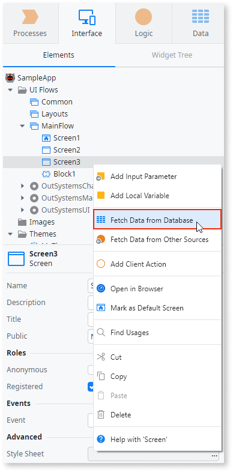
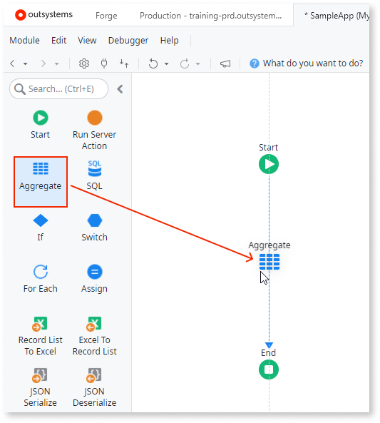
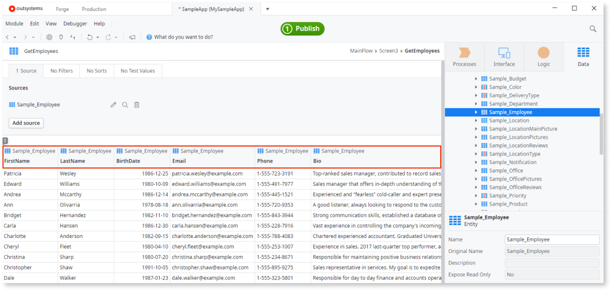
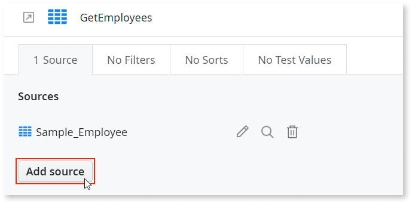
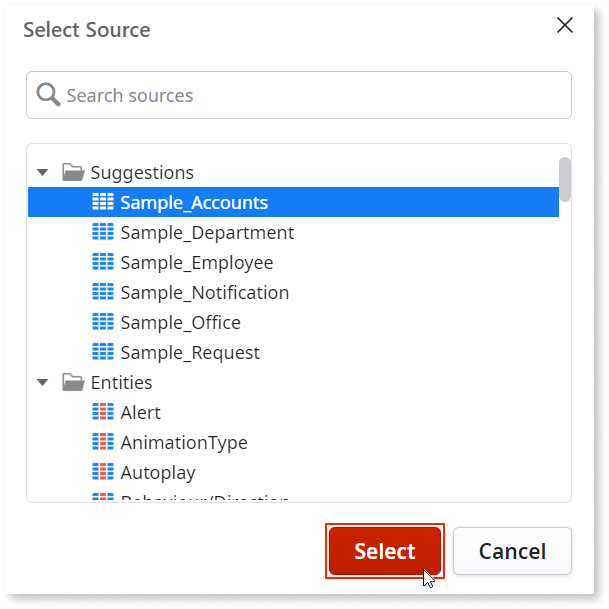
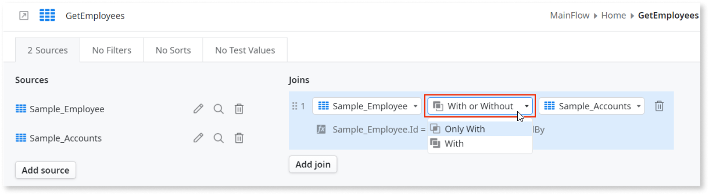

# Aggregate

Aggregates allow you to fetch data using an optimized query, tailored to your usage. Aggregates automatically absorb changes in the data model and can load the local database's data from the server. They support combining several entities and advanced filtering, and bring only the attributes that are used on the screen or action. Attributes also abstract the underlying model for the developer, allowing attribute renaming and changes to the data type.  

In Mobile and Reactive Web Apps, Aggregates can be client-side or server-side:

* Client-side Aggregates run in the client logic. You can use them to get data for your widgets when a Screen or a Block loads.
* Server-side Aggregates run in the server logic. You can use them in the logic flows.

In Traditional Web Apps, Aggregates can only be server-side. To load data on a screen, add an Aggregate to the **Preparation** action.

## How to create an Aggregate

You can create Aggregates in Screens, Blocks, or Action flows. 

### Create an Aggregate in a Screen or Block

To load data on a Screen or Block, right-click the Screen or Block and select **Fetch data from Database**.  
An empty Aggregate opens and Service Studio displays a message on the empty Aggregate that you need to add an Entity.

There are cases when you always need to fetch all records from the database, for example, to populate drop-down box lists. If you fetch all records using a Screen Aggregate, set the **Max. Records** higher than the maximum number of records you expect to fetch. Keep in mind that large amounts of data may slow down the user interface and degrade the responsiveness of the app.

### Create an Aggregate in an Action

To add an Aggregate to an Action, drag an **Aggregate** from the toolbox to the flow. 

There are cases when you always need to fetch all records from the database, for example, to populate drop-down box lists. If you fetch all records using a Data Action, leave the **Max. Records** field empty. In Data Actions, the **Max. Records** value is optional. If you don't provide a value, the Data Action fetches all records from the database. 

## How to add a data source to an Aggregate

1. With the Aggregate open, navigate to **Data** > **Entities** > **Database**.

1. Drag one of the Entities to the Aggregate window.  
Service Studio populates the Aggregate with columns that correspond to the attributes of the Entity. Note that, for example, if your Entity is called **MyEntity**, the Aggregate is automatically called **GetMyEntity**.

    

For more information, see the [How To Fetch Data in an Aggregate](https://www.outsystems.com/training/lesson/1943/demo-how-to-fetch-data-in-an-aggregate) demo.

## How to add more data sources to an Aggregate

To add more data sources to your Aggregate, follow these steps:

1. With the Aggregate open, in the **Sources** tab, click **Add source**.

    

1. Click the source you want to add and then click **Select**.

    

1. Select the join type between your sources.  
For more information, see [Supported Join Types](../../data/handling-data/queries/supported-join-types.md).

    

For more information, see the [How To Fetch Data from Multiple Sources in Aggregates](https://www.outsystems.com/training/lesson/1974/demo-how-to-fetch-data-from-multiple-sources-in-aggregates) demo.

## Filtering and sorting data

Once you have your Aggregate with its sources defined, you can filter and sort your results:

* To add filters to your Aggregate, follow the steps in [Filter Query Results](../../../building-apps/data/operations/filter-results.md).  
For more information, see the [How to Filter Data in an Aggregate](https://www.outsystems.com/training/lesson/1939/demo-how-to-filter-data-in-an-aggregate) demo.

* To sort the results of your Aggregate, follow the steps in [Sort Results in an Aggregate](../../../building-apps/data/operations/sort-aggregate.md).  
For more information, see the [How To Sort Data in an Aggregate](https://www.outsystems.com/training/lesson/1938/demo-how-to-sort-data-in-an-aggregate) demo.

## Advanced use cases

* If you don't want the columns of your Aggregate to include repeated values, follow the steps in [Get Distinct Values from the Database](../../../building-apps/data/operations/distinct.md).

* To calculate values based on groups of identical data using Aggregate functions, follow the steps in [Calculate Values from Grouped Data](../../../building-apps/data/operations/group-calculate.md).  
For more information, see the [How To Create Aggregation Functions in Aggregates](https://www.outsystems.com/training/lesson/1975/demo-how-to-create-aggregation-functions-in-aggregates) demo.

* To create a new attribute based on the value of other attributes, you can define your own expression to calculate the values. Follow the steps in [Create a Calculated Attribute in an Aggregate](../../../building-apps/data/operations/calculated-attribute-create.md).  
For more information, see the [How To Create Calculated Attributes in Aggregates](https://www.outsystems.com/training/lesson/1973/demo-how-to-create-calculated-attributes-in-aggregates) demo.

## Showing data

* To display an Aggregate's data, follow the steps in [Show data in a widget](../../../building-apps/data/operations/fetch-display.md#show-data-in-a-widget).

* If you don't want to load all data of a Screen at the same time, you can [implement asynchronous data fetching](../../../building-apps/data/operations/async-fetch-aggregates.md).

## Properties

<table markdown="1">
<thead>
<tr>
<th>Name</th>
<th>Description</th>
<th>Mandatory</th>
<th>Default value</th>
<th>Observations</th>
</tr>
</thead>
<tbody>
<tr>
<td title="Name">Name</td>
<td>Identifies an element in the scope where it is defined, like a screen, action, or module.</td>
<td>Yes</td>
<td></td>
<td></td>
</tr>
<tr>
<td title="Description">Description</td>
<td>Text that documents the element.</td>
<td></td>
<td></td>
<td>Useful for documentation purpose. The maximum size of this property is 2000 characters.</td>
</tr>
<tr>
<td title="Timeout">Timeout</td>
<td>Maximum time in seconds to wait for the Aggregate to return data before triggering a Communication Exception. Overrides the default timeout defined on the module.</td>
<td></td>
<td></td>
<td>If there is no value specified in this property, the timeout corresponds to the "Default query timeout" parameter specified in the Platform Server Configuration Tool. Property not available in client actions.</td>
</tr>
<tr>
<td title="Cache in Minutes">Cache in Minutes</td>
<td>Maximum time content or results are stored in memory. When undefined, nothing is cached.</td>
<td></td>
<td></td>
<td>Property not available in client actions.</td>
</tr>
<tr>
<td title="Max. Records">Max. Records</td>
<td>Maximum number of records read from the database.</td>
<td></td>
<td></td>
<td>In Traditional Web App only. If undefined, the default value is: 
        – In widgets: StartIndex + LineCount + 1; 
        – Exporting to Excel: No limit.</td>
</tr>
<tr>
<td title="Start Index">Start Index</td>
<td>Index of the first List item to iterate. Can be an expression.</td>
<td></td>
<td></td>
<td>The expression used in this property (if present) is evaluated before the web screen preparation.</td>
</tr>
<tr>
<td title="Fetch">Fetch</td>
<td></td>
<td>Yes</td>
<td>At start</td>
<td></td>
</tr>
<tr >
<th colspan="5">Events</th>
</tr>
<tr>
<td title="On After Fetch">On After Fetch</td>
<td>Action executed after the Aggregate fetches data from the data source.</td>
<td></td>
<td></td>
<td></td>
</tr>
</tbody>
</table>

## Runtime Properties

<table markdown="1">
<thead>
<tr>
<th>Name</th>
<th>Description</th>
<th>Read Only</th>
<th>Type</th>
<th>Observations</th>
</tr>
</thead>
<tbody>
<tr>
<td>List</td>
<td>Collection of records returned by the performed query.</td>
<td></td>
<td>Record List</td>
<td></td>
</tr>
<tr>
<td>Count</td>
<td>Number of records returned by the Count query.</td>
<td></td>
<td>Long Integer</td>
<td></td>
</tr>
<tr>
<td>IsDataFetched</td>
<td>True when data has been fetched from the database and is ready to be used.</td>
<td>Yes</td>
<td>Boolean</td>
<td></td>
</tr>
<tr>
<td>HasFetchError</td>
<td>True when there is an error during data fetch due to a server error or communication timeout.</td>
<td>Yes</td>
<td>Boolean</td>
<td></td>
</tr>
</tbody>
</table>

