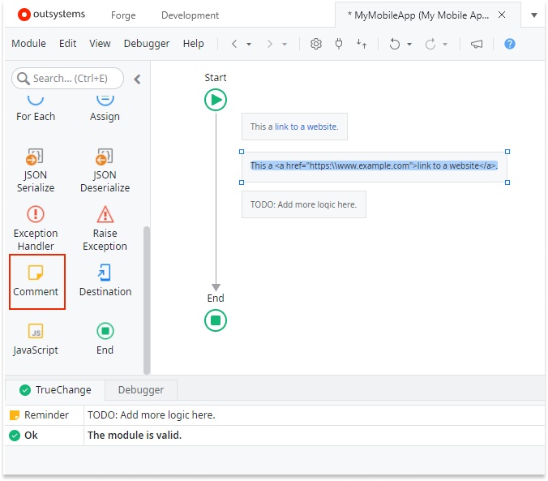

# Comment

Comment is a tool that lets you add a text box with code comments for developers. Comments are handy when you need to add remarks or reminders for yourself or team members.

If you write **TODO**, **TBD**, or **REMINDER** in uppercase, the comment shows in the TrueChange&#8482; tab. You can also set **Is Reminder** of any comment to **Yes** to make it visible in the tab. 

You can add links in comments by using the `a` HTML tag. For example: `This a <a href="https:\\www.example.com">link to a website</a>.`

## Properties

<table markdown="1">
<thead>
<tr>
<th>Name</th>
<th>Description</th>
<th>Mandatory</th>
<th>Default value</th>
<th>Observations</th>
</tr>
</thead>
<tbody>
<tr>
<td title="Text">Text</td>
<td>Text to display. The HTML <b>a</b> tag is allowed.</td>
<td></td>
<td>"Write your comment here"</td>
<td></td>
</tr>
<tr>
<td title="Is Reminder">Is Reminder</td>
<td>Set to Yes to have the comment displayed as a reminder in the TrueChange tab.</td>
<td>Yes</td>
<td>No</td>
<td>The upper-cased keywords TODO, TBD, and REMINDER automatically set the comment as a reminder. Removing those keywords won't set 'Is Reminder' to 'No'.</td>
</tr>
</tbody>
</table>

