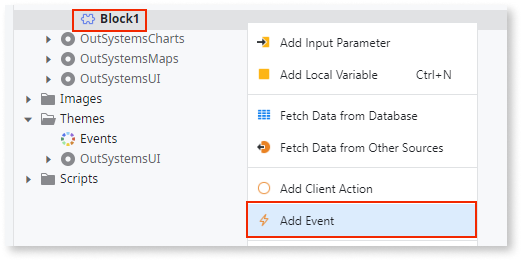
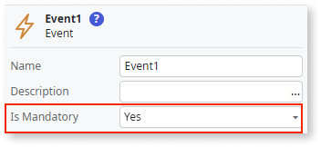

# Event

An event is an element that allows a block to interact with its parent element by notifying it that a particular event has occurred. Essentially, the block triggers an event and then the parent element handles it.

Events can only be defined inside blocks.

Input parameters can be added to events. This allows data to pass from the scope of a block to the outer scope of the parent element. This is necessary since the block and parent element have different scopes.

If the **Is Mandatory** property of an event is set to **Yes**, you must define an event handler in the parent element where the block with the event is used. 

## Trigger event

A trigger event defines what action in a block can trigger an event. To learn more about how trigger events work, refer to the [Demo: How To Trigger Block Events](https://learn.outsystems.com/training/journeys/blocks-and-events-635/demo-how-to-trigger-block-events/o11/90). 

## Related information
[Block events](https://learn.outsystems.com/training/journeys/blocks-and-events-635/block-events/o11/78)

## Properties

<table markdown="1">
<thead>
<tr>
<th>Name</th>
<th>Description</th>
<th>Mandatory</th>
<th>Default value</th>
<th>Observations</th>
</tr>
</thead>
<tbody>
<tr>
<td title="Name">Name</td>
<td>Identifies an element in the scope where it is defined, like a screen, action, or module.</td>
<td>Yes</td>
<td></td>
<td></td>
</tr>
<tr>
<td title="Description">Description</td>
<td>Text that documents the element.</td>
<td></td>
<td></td>
<td>Useful for documentation purpose. The maximum size of this property is 2000 characters.</td>
</tr>
<tr>
<td title="Is Mandatory">Is Mandatory</td>
<td>Set to Yes to require this event to be triggered in the logic of the element.</td>
<td>Yes</td>
<td>Yes</td>
<td></td>
</tr>
</tbody>
</table>

