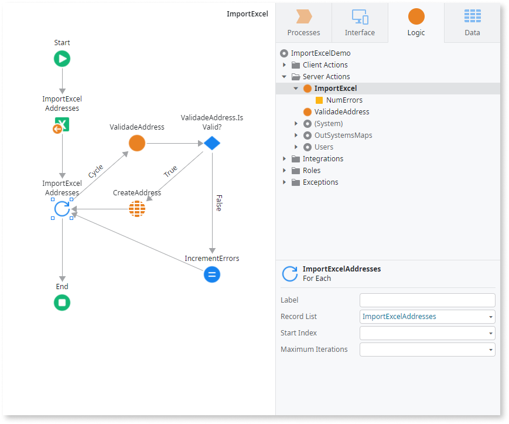

# Excel To Record List

Converts an Excel object to a Record List. Use this logic tool when you need to load data from an Excel file in your app at runtime.

To use Excel To Record List, you need an Entity or Structure that matches the Excel (xlsx) file content you want to import. OutSystems matches the Entity/Structure specified in the **Record Definition** property and the Excel file using one of the following methods:

*  **By Column name:** If the number of columns and record attributes differ, it matches column headers to attribute labels.
*  **By Position:** If the number of columns and record attributes are identical, it maps sequentially, matching the first attribute to the first column, the second attribute to the second column, and so on. As such, ensure that the order and data types of the columns in the Excel file match the order and data types of the attributes in your Entity or Structure.

Entities' identifier attributes are included in the attribute count.

Check the following example of an Entity named Address and a valid Excel file containing data to import:

Entity attributes without a corresponding column in the Excel file get the default value of their data type (for example, `""` for a Text attribute).

To use the tool, provide the content of the Excel file to import in the **File Content** property as binary data (xlsb). To import data from a specific sheet in the Excel file, specify the sheet name in the **Sheet Name** property. OutSystems imports data from the first sheet, by default.

To iterate over the successfully imported records, use a For Each and set the **Record List** property of the For Each to the name of the Excel to Record List element.

Here's an example flow for handling the data you're importing using Excel to Record List:

Excel To Record List doesn't validate if the Excel file data has values for all the mandatory attributes of the Entity. You can use a Server Action (in this example, ValidateAddress) to check if the imported data complies with business rules like mandatory attributes, or handle the exception thrown by the CreateAddress entity action.

Tip: If you need to import data from an Excel file at **design time**, when developing your application, check the following topics:

* [Create an Entity from an Excel file and import data](../../../getting-started/create-reactive-web.md#create-entity-from-excel), if you don't have an Entity to hold the imported Excel data yet
* [Bootstrap an Entity Using an Excel File](../../../building-apps/data/excel-bootstrap.md), if you want to import data to an existing Entity

## Availability

Excel To Record List is only available in **Server Actions**. In Reactive Web and Mobile apps you must send the uploaded file to the server and then process that file in a Server Action. Check [Enable End Users to Upload Files](../../../building-apps/ui/inputs/upload.md) for more information.

## Properties

<table markdown="1">
<thead>
<tr>
<th>Name</th>
<th>Description</th>
<th>Mandatory</th>
<th>Default value</th>
<th>Observations</th>
</tr>
</thead>
<tbody>
<tr>
<td title="Name">Name</td>
<td>Identifies an element in the scope where it is defined, like a screen, action, or module.</td>
<td>Yes</td>
<td></td>
<td></td>
</tr>
<tr>
<td title="Description">Description</td>
<td>Text that documents the element.</td>
<td></td>
<td></td>
<td>Useful for documentation purpose. The maximum size of this property is 2000 characters.</td>
</tr>
<tr>
<td title="Record Definition">Record Definition</td>
<td>Entity or structure that defines the structure of the data that you want to load.</td>
<td>Yes</td>
<td></td>
<td>The atribute labels should match the column header names in the imported Excel.</td>
</tr>
<tr>
<td title="File Content">File Content</td>
<td>Holds the Excel file.</td>
<td>Yes</td>
<td></td>
<td>The expected data type is Binary Data.</td>
</tr>
<tr>
<td title="Sheet Name">Sheet Name</td>
<td>Name of the Excel sheet to import. By default, the first sheet is imported, unless a sheet named 'Sheet1' exists in the file.</td>
<td></td>
<td></td>
<td></td>
</tr>
</tbody>
</table>

