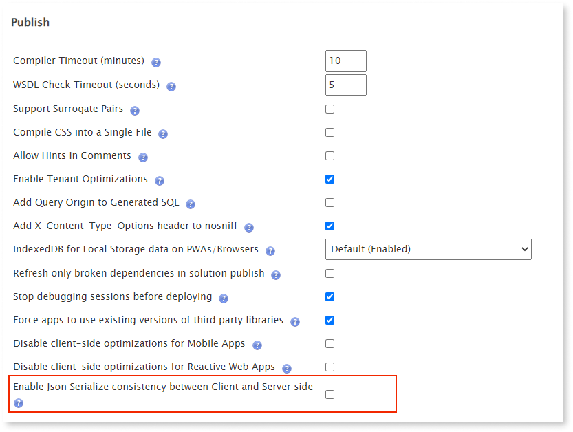

# JSON Serialize

JSON Serialize converts the following data types to JSON data-interchange format text:

* Record
* List of Records

## Properties

<table markdown="1">
<thead>
<tr>
<th>Name</th>
<th>Description</th>
<th>Mandatory</th>
<th>Default value</th>
<th>Observations</th>
</tr>
</thead>
<tbody>
<tr>
<td title="Name">Name</td>
<td>Identifies an element in the scope where it is defined, like a screen, action, or module.</td>
<td>Yes</td>
<td></td>
<td></td>
</tr>
<tr>
<td title="Description">Description</td>
<td>Text that documents the element.</td>
<td></td>
<td></td>
<td>Useful for documentation purpose.<br/>The maximum size of this property is 2000 characters.</td>
</tr>
<tr>
<td title="Data">Data</td>
<td>Record or List with the data to be serialized to a JSON string.</td>
<td>Yes</td>
<td></td>
<td></td>
</tr>
<tr>
<td title="Serialize Default Values">Serialize Default Values</td>
<td>Set to Yes to serialize non-mandatory JSON attributes with a default value set.</td>
<td>Yes</td>
<td>No</td>
<td></td>
</tr>
<tr>
<td title="Date Format">Date Format</td>
<td>Date format used in the JSON string.</td>
<td>Yes</td>
<td>2014-01-01T00:00:00Z (ISO)</td>
<td></td>
</tr>
</tbody>
</table>

## Runtime Properties

<table markdown="1">
<thead>
<tr>
<th>Name</th>
<th>Description</th>
<th>Read Only</th>
<th>Type</th>
<th>Observations</th>
</tr>
</thead>
<tbody>
<tr>
<td>JSON</td>
<td>String in JSON format.</td>
<td></td>
<td>Text</td>
<td></td>
</tr>
</tbody>
</table>

## Additional notes { #notes }

These are additional notes about JSON Serialize.

## Large numbers

You may run into issues when running JSON Serialize/Deserialize on the client side (for example, in a Client Action) involving large Long Integer or Decimal values, namely values larger than 9007199254740991.

When the serialization/deserialization operation occurs in the server context, the .NET limits apply. However, when running these operations in JavaScript on the client side, the JavaScript limits apply.

JavaScript has a limit when using a Long Integer or Decimal values defined as [`MAX_SAFE_INTEGER`](https://developer.mozilla.org/en-US/docs/Web/JavaScript/Reference/Global_Objects/Number/MAX_SAFE_INTEGER) with the value 9007199254740991. Performing a JSON serialization/deserialization operation involving Long Integer or Decimal values larger than `MAX_SAFE_INTEGER` issues an error.

To support higher numbers in JavaScript (for example, when using a variable of type Long Integer or Decimal), the platform converts the numbers to strings using a custom serialization method. This way, all the platform's internal communications between client and server use strings and not numbers.

You can use the same mechanism used by the platform to serialize/deserialize a number value exceeding `MAX_SAFE_INTEGER`. To do this, execute the JSON serialization/deserialization operation inside a Server Action and not in the client side.

## Serializing default values

If you set **Serialize Default Values** to **Yes**, and you leave the default values empty, the resulting JSON has the JSON equivalents of the [default platform values](../../data/database/default-values-on-database.md). For example:

* Empty Boolean converts to **false**
* Empty Integer converts to **0**
* Empty DateTime converts to **1900-01-01T00:00:00**


## JSON Serialize consistency opt-in { #json_serialize_opt-in }

With Platform Server 11.17.0, there is a configurable opt-in for Factory
Configuration.

Selecting **Enable Json Serialize consistency between Client and Server side**
ensures consistency between the client and server actions.

You may experience different behaviors between JSON Serialize actions on the
client and server sides. This discrepancy may have led you to adapt apps to
prevent the problem. The issue occurs when **Serialize Default Values** is set
as **No** in a JSON Serialize action node. In this scenario, there is an
inconsistency in the client and server-side specifically related to null and
default values. For example:

- Integer Array where 0 is the default value:

  - Server-side output after serialization: "BinaryArray":[0,1]

  - Client-side output after serialization: "BinaryArray":[null,1]

- Nested Structures with empty Objects:

  - Server-side output after serialization: "NestedStructure":{"textAttribute":"Test"}

  - Client-side output after serialization: "NestedStructure":{"textAttribute":"Test","object":{}}

- Empty Arrays:

  - The server-side doesn't serialize empty arrays, returning an empty string

  - Client-side output after serialization: "EmptyArray":[]

### Adapting existing workaround code

If you’ve already implemented a workaround for the JSON serialization issue in
your environment, enabling this opt-in feature risks causing problems. The
change would affect existing apps in your environment and is a breaking change.

Errors might occur when the serialized object is empty or only has default
values, and these elements are directly accessed, like in the following
JavaScript example.

This snippet would work before enabling JSON Serialize consistency but would
return an error after opting into the solution for an environment:

```javascript
var originalObject = $parameters.JsonObject.EmptyObject;
// originalObject is undefined due to the empty object

// deserialization behavior
var objectName = originalObject.name;
// TypeError: ‘undefined’ is not an object

```

The following would work before and after opt-in selection:

```javascript
var originalObject = $parameters.JsonObject.EmptyObject;
// originalObject is undefined due to the empty object
// deserialization behavior
if (originalObject) {
	var objectName = originalObject.name;
} else {
	var objectName = “ExampleName”;
}
```

### Enable JSON Serialize consistency between client and server

This option enables JSON Serialize consistency for an environment and applies
to all apps in that environment.

1. First, install or update the Factory Configuration tool, available through
Forge.

1. The workaround is to select the new opt-in solution in Service Center:
**Modules** > **Factory Configuration** > **Open in Browser** > **Platform
Configuration** and scroll down the page to the **Publish** section.

1. Select the box for **Enable Json Serialize** and click **Apply** at the
bottom of the screen.
    

1. You have to republish your apps to take advantage of the workaround.

<div class="info" markdown="1">

OutSystems recommends enabling this opt-in feature for new environments to
prevent any issues with new apps you develop for those environments.

</div>

### Requirements

Enabling this option requires Platform Server 11.17.0 and Factory Configuration
11.0.

<div class="info" markdown="1">

You must have an Administrator role to make this change.

</div>
