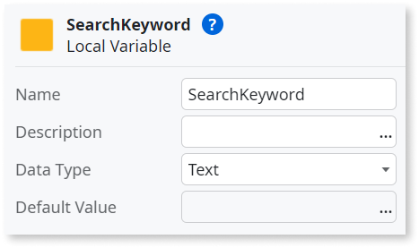

# Local Variable


A Local Variable exists only in the scope of its parent element, for example, a Screen, Action, Web Block, or Automatic Activity. A Local Variable can only be assigned and used locally inside that scope. Local variables are destroyed when execution leaves the scope of the parent element. The image below shows how to add a Local Variable inside a Screen.  


## How to use

This example shows how to use a Local Variable to keep the value of a Search widget. The value of the Local Variable is then used to filter an Aggregate. 

1. Select the Input widget.

1. On the **Properties** tab, select the **Variable** dropdown and select **New Local Variable**.

    

1. Enter a name for the variable, for example `SearchKeyword`. Make sure the **Data Type** is set to `Text`.

    

1. Double-click the aggregate on the Elements tree.

1. On the **Filter** tab, click **Add filter**.

1. Insert the filter condition. 

    ```
    Employee.FirstName like "%" + SearchKeyword + "%"
    ```


1. To save the filter, click **Close**. 

     

After you follow these steps and publish your module, you can test the functionality of the filter in your browser. The text inserted in the Input of the Search widget is stored in the defined Local Variable and is then used to filter the aggregate. When you change to another screen or close your browser, the Local Variable is destroyed and the filter no longer applies.   

Learn more in this [lesson about Variables](https://learn.outsystems.com/training/journeys/web-developer-662/variables/o11/316).  

To practice, check these exercises where you can see examples of Local Variables usage:  

* In Reactive Web development: [Using Local Variables for pagination and sorting](https://learn.outsystems.com/training/journeys/web-developer-662/pagination-and-sorting-exercise/o11/559)  
* In Traditional Web development: [Using Local Variables for data queries and widgets](https://learn.outsystems.com/training/journeys/traditional-web-developer-655/data-queries-and-widgets-ii-exercise/o11/1126)  

## Properties

<table markdown="1">
<thead>
<tr>
<th>Name</th>
<th>Description</th>
<th>Mandatory</th>
<th>Default value</th>
<th>Observations</th>
</tr>
</thead>
<tbody>
<tr>
<td title="Name">Name</td>
<td>Identifies an element in the scope where it is defined, like a screen, action, or module.</td>
<td>Yes</td>
<td></td>
<td></td>
</tr>
<tr>
<td title="Default Value">Default Value</td>
<td>Initial value of this element. If undefined, the default value of the data type is used.</td>
<td></td>
<td></td>
<td></td>
</tr>
<tr>
<td title="Description">Description</td>
<td>Text that documents the element.</td>
<td></td>
<td></td>
<td>Useful for documentation purpose.<br/>The maximum size of this property is 2000 characters.</td>
</tr>
<tr>
<td title="Data Type">Data Type</td>
<td>The variable data type.</td>
<td>Yes</td>
<td></td>
<td></td>
</tr>
</tbody>
</table>
