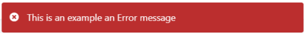

# Message

Applies to Mobile Apps and Reactive Web Apps only

You can provide a feedback message to the end user by using the Message logic tool within a Client Action flow.

## Using the Message logic tool

1. Drag the Message logic tool onto the Client Action flow.
1. Set the message **Label**, **Message**, and **Type** properties.

    In this example, we enter ``Invalid password`` in the **Message** property (the message displayed to the user) and select **Error** as the message type.  

    

    

The available predefined message types are as follows:

* Info

    

* Success

    

* Warning

    

* Error

    

## Properties

<table markdown="1">
<thead>
<tr>
<th>Name</th>
<th>Data Type</th>
<th>Description</th>
<th>Mandatory</th>
<th>Default value</th>
<th>Observations</th>
</tr>
</thead>
<tbody>
<tr>
<td title="Label">Label</td>
<td>Text</td>
<td>Identifies an element in the flow.</td>
<td></td>
<td></td>
<td></td>
</tr>
<tr>
<td title="Message">Message</td>
<td>Text</td>
<td>Message displayed to the user.</td>
<td>Yes</td>
<td></td>
<td></td>
</tr>
<tr>
<td title="Type">Type</td>
<td>Message type identifier</td>
<td>Specifies the UI look and feel of the displayed message.</td>
<td>Yes</td>
<td>Info</td>
<td>The possible values are: Info, Success, Warning, and Error.</td>
</tr>
</tbody>
</table>

