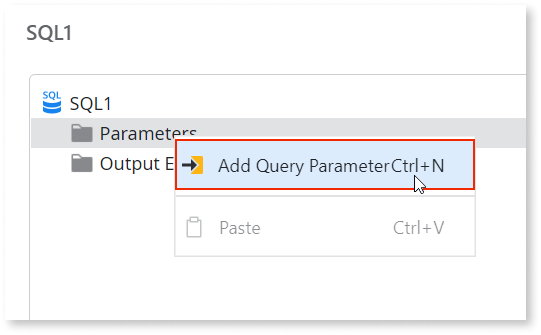
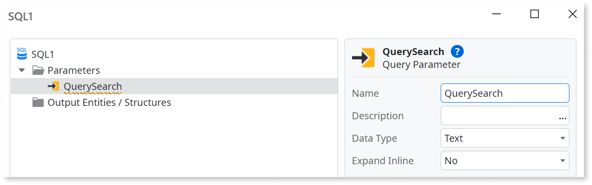

# Query Parameter

The SQL tool doesn't have direct access to variables or parameters defined outside its scope. To use input parameters or local variables in a SQL query, you need to define query parameters. Then, you need to map the input parameters or local variables to the query parameters. 

## How to use

In this example, there is a data model with an Entity named Employee. A screen fetches data using a SQL query that uses a search input as query parameter. Follow these steps:

1. From the toolbox, drag a **SQL** and drop it in the action flow between the **Start** and **End** nodes.

    

1. Double-click the newly created **SQL** to open the SQL Editor.

1. Right-click the **Parameters** folder, and select **Add Query Parameter**.

    

1. Set the **Name** of the Query Parameter to `QuerySearch`, and make sure its **Data Type** is set to `Text`.

    

1. In the **SQL** tab, enter the following query:

        SELECT
        {Employee}.[FirstName] + ' ' + {Employee}.[LastName],
        {Employee}.[Email],
        {Employee}.[Phone],
        {Employee}.[Salary]
        FROM
        {Employee}
        WHERE
        {Employee}.[FirstName] LIKE '%' + @QuerySearch + '%'
        OR
        {Employee}.[LastName] LIKE '%' + @QuerySearch + '%'

1. Double-click **Output Entities/Structures** to select the output structure of
the query. In this example, there is already a structure named EmployeeStructure with the attributes Name, Email, Phone and Salary. Select it, and click **Select**.

    

1. Click **Test** to test the query.

1. In the **Test Inputs** tab, set a value for the QuerySearch parameter, then click **Test** again to make sure the filter is working.

1. Click **Close** to return to the flow. 

1. Select the **SQL** node in the action flow, and in the properties, set the **QuerySearch** to the search input variable. In this example, there is a local variable named SearchFilter, which keeps the value entered by the user in a Search widget.

    

1. Publish the Module using the 1-Click Publish button, then test it in the browser.

## Properties

<table markdown="1">
<thead>
<tr>
<th>Name</th>
<th>Description</th>
<th>Mandatory</th>
<th>Default value</th>
<th>Observations</th>
</tr>
</thead>
<tbody>
<tr>
<td title="Name">Name</td>
<td>Identifies an element in the scope where it is defined, like a screen, action, or module.</td>
<td>Yes</td>
<td></td>
<td></td>
</tr>
<tr>
<td title="Description">Description</td>
<td>Text that documents the element.</td>
<td></td>
<td></td>
<td>Useful for documentation purpose. The maximum size of this property is 2000 characters.</td>
</tr>
<tr>
<td title="Data Type">Data Type</td>
<td>The parameter data type.</td>
<td>Yes</td>
<td>Text</td>
<td>The parameter data type must be a basic data type or an Entity Identifier.</td>
</tr>
<tr>
<td title="Expand Inline">Expand Inline</td>
<td>Set to Yes to use the query parameter to implement part or all of the SQL query at runtime.</td>
<td>Yes</td>
<td>No</td>
<td></td>
</tr>
</tbody>
</table>

