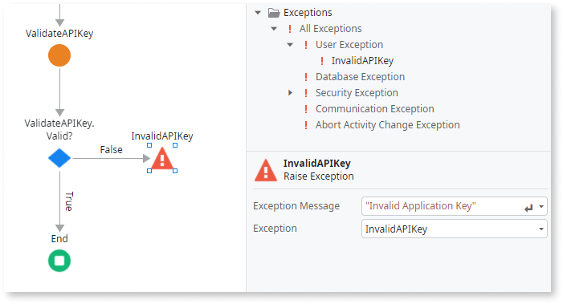

# Raise Exception

Use Raise Exception to throw an exception and stop the currently running action flow. Set the **Exception** property to the exception you want to raise. You can select an existing exception or create a new User Exception.

When raising a User Exception, you must define the message to send as part of the exception in the **Message** property. The message is useful for logging purposes and eventually to display in the UI, informing the end user of the exception that occurred.

Make sure that an exception message doesn't contain internal information before displaying it to end users.

The Raise Exception element ends an action flow. Therefore, it's not possible to include any elements in the flow after it. The execution continues from the [Exception Handler](<class-exception-handler.md>) that handles the exception raised by the Raise Exception element.

When you raise an exception, OutSystems follows an algorithm to determine what's the Exception Handler that it should execute. Check [Exception Handling Mechanism](../../../develop/logic/exceptions/handling-mechanism.md) to learn more about the chain of Exception Handlers that the platform looks for and executes when you raise an exception.

## Properties

<table markdown="1">
<thead>
<tr>
<th>Name</th>
<th>Description</th>
<th>Mandatory</th>
<th>Default value</th>
<th>Observations</th>
</tr>
</thead>
<tbody>
<tr>
<td title="Exception Message">Exception Message</td>
<td>Text literal or expression with the message to display.</td>
<td>Yes</td>
<td></td>
<td></td>
</tr>
<tr>
<td title="Exception">Exception</td>
<td>Type of exception to raise.</td>
<td>Yes</td>
<td></td>
<td></td>
</tr>
</tbody>
</table>

