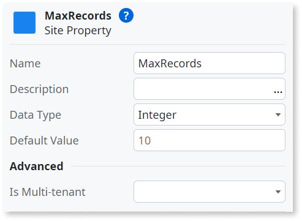
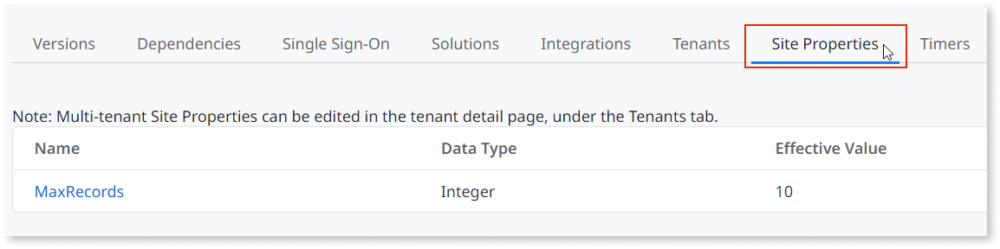

# Site Property

Global variable that has a constant value, or a value that doesn't change often.  

## How to use

In this example, there is a screen with an aggregate named **GetEmployees**. This aggregate retrieves records from an Employee entity, with a default maximum records. The maximum records is defined by a site property named MaxRecords.

1. On the **Data** tab, right-click **Site Properties** and select **Add Site Property**.

1. Set the site property's **Name** to `MaxRecords` and its **Data Type** to `Integer`. On the **Default Value** property, enter `10`.

    

1. Select the **GetEmployees** aggregate and set the **Max. Records** to `Site.MaxRecords`.

    

1. Click the **1-Click Publish** button to publish your app, and then click **Open in browser**.

1. Open a screen that uses the **GetEmployees** aggregate. Check that the retrieved records are 10 or less.

1. In **Service Studio**, click **Module Management in Service Center...**.

    

1. In **Service Center**, make sure you're on the correct module. If you're not, click **Factory** and then **Modules**, and select your module. 

1. Click **Site Properties** and check that it lists the **MaxRecords** site property.

    

1. Click **MaxRecords**, then change its **Effective Value** to  `5`. By doing this, you're changing the MaxRecords' value at runtime and the aggregate will now retrieve 5 records instead of the default 10.

    

1. Click **Apply** and then refresh your app's page. The MaxRecords displayed must adopt the new value.

## Properties

<table markdown="1">
<thead>
<tr>
<th>Name</th>
<th>Description</th>
<th>Mandatory</th>
<th>Default value</th>
<th>Observations</th>
</tr>
</thead>
<tbody>
<tr>
<td title="Name">Name</td>
<td>Identifies an element in the scope where it is defined, like a screen, action, or module</td>
<td>Yes</td>
<td></td>
<td></td>
</tr>
<tr>
<td title="Description">Description</td>
<td>Text that documents the element</td>
<td></td>
<td></td>
<td>Useful for documentation purposes. The maximum size of this property is 2000 characters.</td>
</tr>
<tr>
<td title="Data Type">Data Type</td>
<td>The data type of the site property</td>
<td>Yes</td>
<td></td>
<td></td>
</tr>
<tr>
<td title="Default Value">Default Value</td>
<td>Initial value of this element. If undefined, the default value of the data type is used.</td>
<td></td>
<td></td>
<td></td>
</tr>
<tr >
<th colspan="5">Advanced</th>
</tr>
<tr>
<td title="Is Multi-tenant">Is Multi-tenant</td>
<td>Set to Yes to enable muti-tenancy for this specific element. Overrides the multi-tenancy definitions inherited from the module.</td>
<td>Yes</td>
<td></td>
<td></td>
</tr>
</tbody>
</table>

