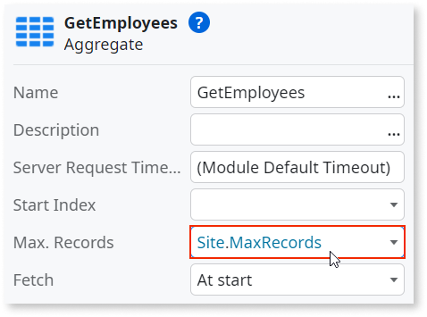

# Site property

A site property is a global variable that has a constant value, or a value that doesn't change often.

By design, Site Property values have a 2000 character limit. The *usable number of characters* of a Site Property value can be lesser than 2000 characters depending on different scenarios:

* It is set as a Secure Site Property.
* The Encoding of the value.
* The Platform's database character encoding configuration.

## How to use site properties

### Example 1

In this example, there's a screen with an aggregate named **GetEmployees**. This aggregate retrieves records from an Employee entity, with a default maximum records. The maximum records is defined by a site property named MaxRecords.

1. On the **Data** tab, right-click **Site Properties** and select **Add Site Property**.

1. Set the site property's **Name** to `MaxRecords` and its **Data Type** to `Integer`. On the **Default Value** property, enter `10`.

    

1. Select the **GetEmployees** aggregate and set the **Max. Records** to `Site.MaxRecords`.

    

1. Click the **1-Click Publish** button to publish your app, and then click **Open in browser**.

1. Open a screen that uses the **GetEmployees** aggregate. Check that the retrieved records are 10 or less.

1. In **Service Studio**, click **Module Management in Service Center...**.

    

1. In **Service Center**, make sure you're on the correct module. If you're not, click **Factory** and then **Modules**, and select your module. 

1. Click **Site Properties** and check that it lists the **MaxRecords** site property.

    

1. Click **MaxRecords**, then change its **Effective Value** to  `5`. By doing this, you're changing the MaxRecords' value at runtime and the aggregate will now retrieve 5 records instead of the default 10.

    

1. Click **Apply** and then refresh your app's page. The MaxRecords displayed must adopt the new value.

### Example 2

In this example, there's an integration with an external service, where the service credentials, such as password, must be protected.

To avail of the secret site property functionality, the following is required:
* LifeTime 11.20.1
* Platform Server 11.25.0
* Service Studio 11.54.35

1. On the **Data** tab, right-click **Site Properties** and select **Add Site Property**.

1. Set the site property's **Name** to **ServicePassword** and the **Data Type** to **String**. 

1. Set the **Is Secret** property to **Yes**.

    

1. Use the **ServicePassword** site property in your integration logic.

1. In Service Studio, click **Module Management in Service Center....**

    

1. In Service Center, ensure you are on the correct module. If you're not, go to **Factory** -> **Modules** and select your module.

1. Click **Site Properties** and check that it lists the **ServicePassword** site property.

    

1. Click **ServicePassword** and change the **Effective Value** to the service password. 

    By doing this, you enforce the password value for that site property. No other users can see the value.

    

1. Click **Apply** and then test your integration implementation.

If you change a site property from secret to non-secret or vice-versa, the effective value is cleared, and the new value must be set in Service Studio or in Service Center. 

## Properties

<table markdown="1">
<thead>
<tr>
<th>Name</th>
<th>Description</th>
<th>Mandatory</th>
<th>Default value</th>
<th>Observations</th>
</tr>
</thead>
<tbody>
<tr>
<td title="Name">Name</td>
<td>Identifies an element in the scope where it is defined, like a screen, action, or module</td>
<td>Yes</td>
<td></td>
<td></td>
</tr>
<tr>
<td title="Description">Description</td>
<td>Text that documents the element</td>
<td></td>
<td></td>
<td>Useful for documentation purposes. The maximum size of this property is 2000 characters.</td>
</tr>
<tr>
<td title="Data Type">Data Type</td>
<td>The data type of the site property</td>
<td>Yes</td>
<td></td>
<td></td>
</tr>
<tr>
<td title="Is Secret">Is Secret</td>
<td>Encrypts and protects the value</td>
<td></td>
<td>No</td>
<td>A site property with the Is Secret property enabled does not have  a default value. When a secret site property is published for the first time, its effective value is empty and must be set in Service Center.</td>
</tr>
<tr>
<td title="Default Value">Default Value</td>
<td>Initial value of this element. If undefined, the default value of the data type is used.</td>
<td></td>
<td></td>
<td>Does not apply to site properties that have the Is Secret property enabled.</td>
</tr>
<tr >
<th colspan="5">Advanced</th>
</tr>
<tr>
<td title="Is Multi-tenant">Is Multi-tenant</td>
<td>Set to Yes to enable muti-tenancy for this specific element. Overrides the multi-tenancy definitions inherited from the module.</td>
<td>Yes</td>
<td></td>
<td></td>
</tr>
</tbody>
</table>

