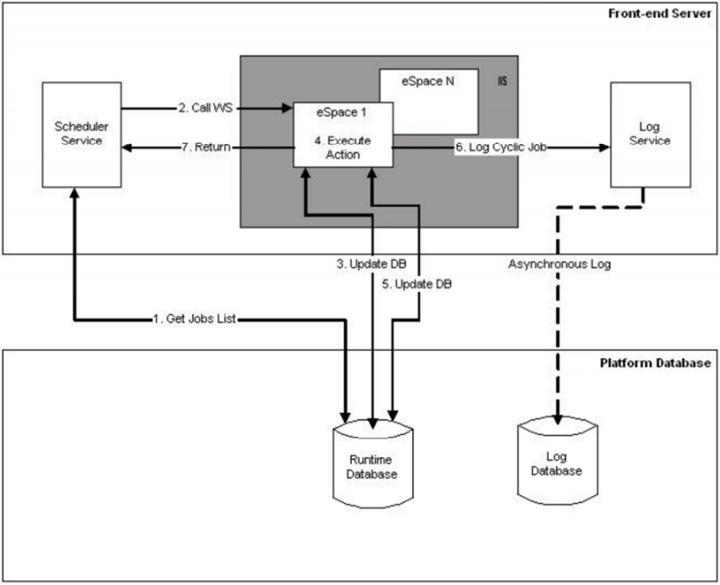
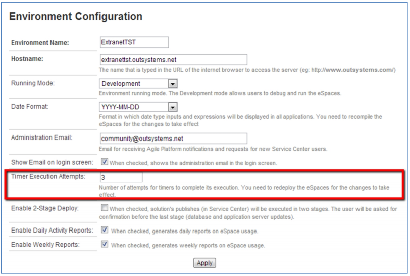
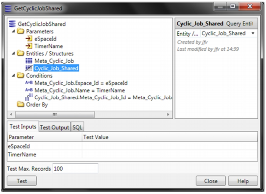
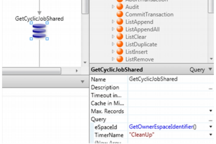
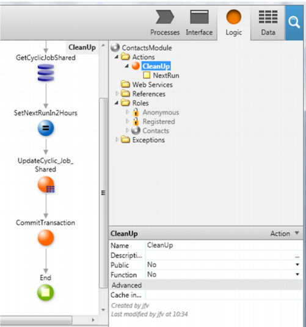
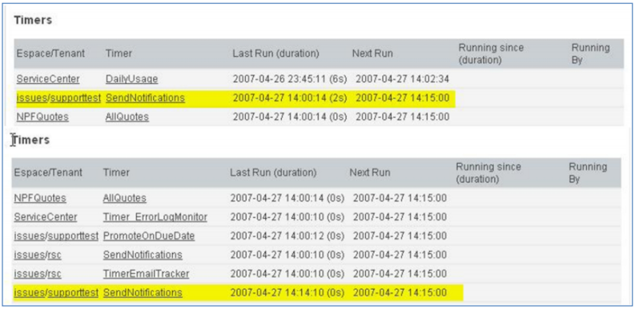
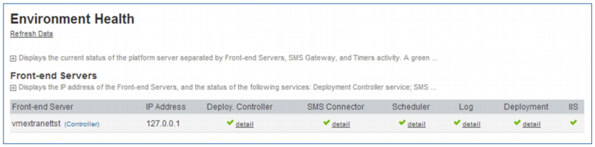
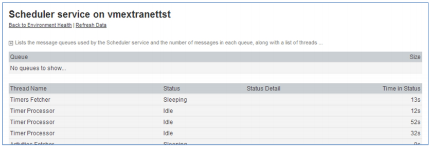
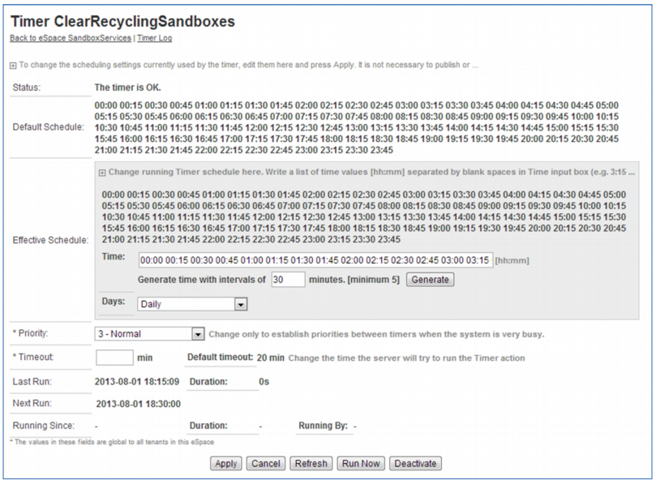
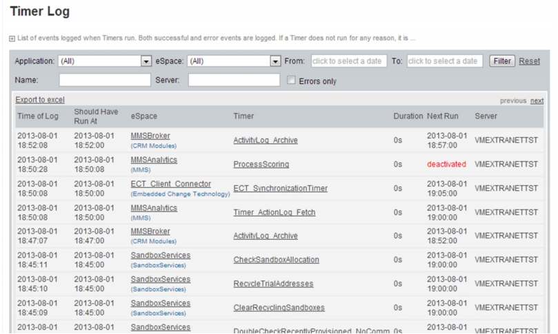

# Timer

A Timer is an OutSystems tool that allows executing application logic periodically on a scheduled time. These are also known as **batch jobs**.

Different Timers can be executed at the same time, but the same Timer never has more than one execution at a time.

Here follows some common scenarios where you can use Timers:

| **Scenario** | **Example** |
|----------|---------|
| **Scheduled Jobs**| Execute the same job every day at the same time. For example, send every day at 4 a.m. e-mails to subscribers with digest news.  Create a Timer to execute an Action that does the job of sending e-mails to subscribers every day at 4 a.m.|
| **Executing Long Running Actions** | Execute application logic that usually takes long time to finish. For example, at 2 a.m. of the 1st day of every month, the system must archive a lot of database records. It takes about 2 hours.  Create a Timer to execute an Action that archives records and set it to run at 2 a.m. of 1st day of every month and with the default timeout of 150 minutes (this value can be adjusted in Service Center).|

## Architecture

The following table lists the OutSystems elements that relate to Timers:

| **Element** | **Description** |
|---------|---------|
| **OutSystems Scheduler service**| This is the service that has the responsibility of checking for Timers to be executed. It's a multi-threaded service that allows having different Timers executing at the same time.|
| **Runtime database**| The runtime database contains all System entities for managing Timers, such as:  - The record of all existing Timers.  - The schedule for executing Timers.  - Current execution of Timers: when started, their timeout, or next execution.|
| **Log database** | When a Timer is executed, an entry is created in the Log database.|
| **Configuration Tool** | This is the tool that allows configuring the maximum number of Timers that may execute at the same time in each front-end server node.|
| **OutSystems Logs** | In Service Center you can access Timer logs for individual applications or all apps in your environment.|
| **Deployed module (Application)** | The deployed application contains the code for the Timer. It has the application logic designed in the Action executed by the Timer, and also some stub code needed to get the system database up-to-date about the state of the Timer. |

### Runtime and Log databases

This section describes the database entities that support Timers and their functionality.

#### Entity Meta_Cyclic_Job

This entity contains the definitions of Timers created in modules which are stored in records in the **ossys_Meta_Cyclic_Job** database table. These records are created and managed by OutSystems and the **Effective_Timeout** is the only attribute that you can change.

Here's the complete description of the attributes:

| **Attribute** | **Description** |
|----------|--------|
| **Id** | The primary key.|
| **Espace_Id** | The module where the Timer is defined. |
| **Name** | The Timer name, as defined in the module. |
| **Default_Schedule** | The default scheduled time for the Timer, as defined in the module.   This is a string with the time and the frequency the Timer is executed. It has a special editor in Service Studio to set its value.   This value is used to set the Schedule property in the Cyclic_Job_Shared  entity.|
| **Priority** | The Timer priority, as defined in the module. It's a value between 1 (Highest) and 4 (Lowest).   When the number of Timers being executed at the same time is greater than the maximum allowed for the Front-end Server, Timers with highest priority are executed first.|
| **Is_Active** | Indicates whether the Timer is active.|
| **SS_Key** | The Timer key in Service Studio.|
| **Timeout** | The Timer default timeout, as defined in the module. The value is in minutes.   If the Timer doesn't finish the job in this time limit, the Timer execution is aborted by the system.|
| **Effective_Timeout** | If the value is different from zero, it overrides the above Timer default timeout.   Use it to adjust a new timeout, which is done in Service Center, in the Timer's detail page. |
| **IsShared** | When True, it indicates that instances of the Timer are created in the **Cyclic_Job_Shared** entity, otherwise they're created in the **Cyclic_Job** entity. |

#### Entity Cyclic_Job

This entity contains the information about all Timers to be executed by the Scheduler Service in multi-tenant modules. You can browse this information in Service Center (see [Monitoring the execution of Timers](#monitor-timers)).

As there may be multiple Front-end Server nodes executing Timers, each with its own time, the time reference for executing Timers is always the database clock.

Records of this entity are stored in the database in the **ossys_Cyclic_Job** table. They're created and managed by OutSystems.

The **Schedule** and **Next_Run** are the only attributes of this entity that you can change. However, don’t set them when the Timer is being executed, which can be verified by checking the value in the **Is_Running_Since** attribute:

* **If set:** the Timer is running.

* **If not set:** the Timer isn't running.

Here's the complete description of the attributes:

| **Attribute** | **Description** |
|----------|------------|
| **Meta_Cyclic_Job_Id** | A reference to the  **Meta_Cyclic_Job**  entity.|
| **Tenant_Id** | The reference to the tenant where the Timer is running.|
| **Schedule** | After the Timer has finished its execution, this attribute is used to calculate the time of the next execution.   **For example:** Schedule: "02:00 10:00 18:00" (runs every day at 2 a.m., 10 a.m., and 6 p.m.). If a Timer finished on the 10-23-2012 at 18:00:50 then the Next_Run is set to 10-24-2012 at 2:00:00.  This property is initially set by the value defined in the **Default_Schedule** property of the **Meta_Cyclic_Job** entity, but it can be changed in Service Center. |
| **Last_Run** | The date and time at which the Timer started its last execution (using the database clock).|
| **Next_Run** | The date and time of the next execution (using the database clock).  The Scheduler Service executes Timers which have **Next_Run** <= current date time.|
| **Last_Duration** | The time in seconds the Timer took to finish its last execution.|
| **Is_Running_Since** | The date and time when the Schedule Service started executing the Timer (database clock time).   This attribute is also used to synchronize the several Front-end Server nodes because the Scheduler Service doesn't execute Timers with this attribute set (unless in error recovering actions).   When the execution of the Timer finishes, this attribute is cleaned.|
| **Is_Running_By** | This attribute has the name of the Front-end Server node that's executing the Timer. The  **Is_Running_Since**  attribute is also set.|
| **Number_Of_Tries** | The number of consecutive times the Timer was executed without success.|

#### Entity Cyclic_Job_Shared

This entity contains the information of Timers to be executed by the Scheduler Service in single-tenant modules. You can browse this information in Service Center (see [Monitoring the execution of Timers](#monitor-timers)).

As there may be multiple Front-end Server nodes executing Timers, each with its own time, the time reference for executing Timers is always the database clock.

Records of this entity are stored in the database in the **ossys_Cyclic_Job_Shared** table. They're created and managed by OutSystems.

The **Schedule** and **Next_Run** are the only attributes of this entity that you can change. However, don’t set them when the Timer is being executed, which can be verified by checking the value in the **Is_Running_Since** attribute:

* **If set:** the Timer is running.

* **If not set:** the Timer isn't running.

Here's the complete description of the attributes:

| **Attribute** | **Description** |
|-----------|----------|
| **Meta_Cyclic_Job_Id** | A reference to the **Meta_Cyclic_Job** entity.|
| **Schedule** | After the Timer has finished its execution, this attribute is used to calculate the time of the next execution.   **For example**: Schedule: "02:00 10:00 18:00" (runs every day at 2 a.m., 10 a.m., and 6 p.m.). If a Timer finished on the 10-23-2012 at 18:00:50 then the Next_Run is set to 10-24-2012 at 2:00:00.   This property is initially set by the value defined in the **Default_Schedule** property of the **Meta_Cyclic_Job** entity, but it can be changed in Service Center.|
| **Last_Run** | The date and time at which the Timer started its last execution.|
| **Next_Run** | The date and time of the next execution.   The Scheduler Service executes Timers which have **Next_Run** <= current date time.|
| **Last_Duration** | The time in seconds the Timer took to finish its last execution.|
| **Is_Running_Since** | The date and time when the Schedule Service started executing the Timer (database clock time).   This attribute is also used to synchronize the several Front-end Server nodes because the Scheduler Service doesn't execute Timers with this attribute set (unless in error recovering actions).   When the execution of the Timer finishes, this attribute is cleaned. |
| **Is_Running_By** | This attribute has the name of the Front-end Server node that's executing the Timer. The **Is_Running_Since** attribute is also set.|
| **Number_Of_Tries** | The number of consecutive times the Timer was executed without success.|

#### Tables oslog_Cyclic_Job_< N >

These tables store all logging information about executed Timers. You can browse it in Service Center (see [Checking the Timers log](#timers-log)).

Here's the complete description of the attributes:

| **Attribute** | **Description** |
|----------|----------|
| **Instant** | The date and time when the Timer execution started ('Time of Log' in Service Center).   This is the IIS clock date and time.|
| **Duration** | The time in seconds the Timer took to finish the execution.|
| **Cyclic_Job_Key** | The Timer key in Service Studio.|
| **Espace_Id** | The reference to the module where the Timer was created.|
| **Tenant_Id** | The reference to the tenant where the Timer was executed.|
| **Executed_By** | The name of the Front-end Server node that executed the Timer ('Server' in Service Center).|
| **Error_Id** | The reference to the [oslog_]Error_< N > entity.   If set, it means there was an error executing the application logic of the Timer and in Service Center Timers Log page displays a red link called Error in the row of the Timer.|
| **Should_Have_Run_At** | The date and time when this Timer should have been executed.   Note that if a system is very loaded, this value can be quite different than the Instant attribute. This may happen because the same module has many tenants and all have the same schedule, other Timers are taking too much time to execute, etc.   This is the database clock date and time.|
| **Next_Run** | Is a date time representing when this Timer should start again (based on schedule, as explained above).|
| **Cycle** | Log cycle number for internal use.|

### How Timers are executed

The Scheduler Service is responsible for executing all Timers. This service is multi-threaded, therefore, it allows executing different Timers at the same time. For simplicity, the steps below describe the execution of a single Timer.

The steps to execute Timers are as follows:

1. The Scheduler Service cyclically fetches the database for Timers to be executed (**Next_Run**).

1. The Scheduler Service launches a thread to execute the Timer that calls a Web Service in the module where the Timer is defined for executing it.

1. The Web Service checks first whether the Timer is already executing in any Front-end Server node. If not, the **Is_Running_Since** and **Is_Running_By** attributes of the **Cyclic_Job_Shared** entity are updated. This locks the Timer from executing in any other front-end server node.

1. The module executes the action associated with the Timer.

1. After the action execution is finished, the **Is_Running_Since** and **Is_Running_By** attributes are cleaned, which frees the Timer for a new execution. The Next_Run attribute is recalculated based on the Schedule attribute and the current date and time.

    Regarding the **Next_Run** attribute, it's updated only if it didn't change during the execution of the action. This can happen if, for example, the action updates itself that attribute.

1. A record with the information about the Timer execution is sent to the Log Service that stores it in the Log Database.

1. The Web Service returns the control to the Scheduler Service, which now becomes ready to execute another Timer (step 1.).

### Why a timeout in Timers?

As described before, the Scheduler Service executes a Timer by calling a Web Service built in the module where the Timer was created. This means that there is a Web Request involved in Timers execution and, like in any Web Request, there is a maximum time allowed for it to execute in the server. This is the reason why Timers have the 'Timeout in Minutes' property in Service Studio, which by default it's set to 20 minutes, but you may adjust it to each case.

#### The role of the timeout in unexpected errors

If the execution of a Timer terminates due to an unexpected error, the Scheduler Service recovers the Timer and synchronize the database only after the timeout time plus 20% has passed. Until then, the data about Timers in the database may be inconsistent.

It's also important to implement the logic in the Timer action so that you make sure that data is kept consistent in case of the Timer execution terminates unexpectedly.

## Retrying after an execution error

Whenever a Timer has an execution error, OutSystems may execute the Timer again for a number of retries. You can set this number of retries in Service Center, in the Environment Configuration screen, under the Administration folder. By default, it's set to 3 retries.

## Changing the schedule of a Timer dynamically

Besides setting regular and fixed executions for your Timers, it's also possible to schedule the execution of your Timers dynamically, based on the logic you want. For that, simply edit the Timer action, calculate the new date and time of execution, and update it on the entity holding the Timer execution information.

To have access to all necessary entities to set dynamic executions, proceed as follows:

1. In the module with the Timer action, add a reference to the following System entities:

    * **Meta_Cyclic_Job**
    * **Cyclic_Job_Shared**

1. Calculate the date and time of the next execution.

1. Update the **Next_Run** attribute of **Cyclic_Job_Shared** with the value calculated in step 2.

**Example:**

Consider the **CleanUp** Timer, which periodically cleans up data from the database, and that's to be executed 2 hours after ending the last execution.

Open the action of the Timer and at the end of the flow add the following logic:

1. Create a Query to get the **Cyclic_Job_Shared** record of the Timer. The Query has the module identifier (eSpaceId), the Timer name, and input parameters:

    

1. Set the query parameters with the following values:

    * **eSpaceId**: GetOwnerEspaceIdentifier()
    * **TimerName**: "CleanUp"

    

1. Calculate the next execution date and time to 2 hours from now and set it to the **Next_Run** attribute of the **Cyclic_Job_Shared** record: AddHours(CurrDateTime(),2)

1. Update the **Cyclic_Job_Shared** record in the database.

1. Commit the transaction to clear the lock over the updated record.

The action flow should end like this:

## Managing Timers in Service Center

Service Center provides a set of functionality that allows you to manage your Timers, namely:

* Monitor the execution of Timers

* Edit the Timer settings

* Force the execution of a Timer

* Deactivate/Activate a Timer

* Browse the logs of previous executions

### Monitoring the execution of Timers { #monitor-timers }

In Service Center, you may monitor the execution of your Timers in the **Environment Health** option, under **Monitoring**. The page has a Timers section with a list that shows the order by which Timers are executed.

The criteria to sort Timers in the list are based on the following:

* The Timer priority.

* The time a Timer takes to be executed, based on its previous duration. Timers with faster execution times are executed first.

* The time a Timer is waiting to be executed. As a Timer waiting time grows, it tends to ascend in the list.

The next picture shows an example of the Timers section in two moments, with 10 minutes of difference.

Taking the **Send Notifications** Timer in the example, you can see that:

* It was scheduled to be executed at 14:15:00.
* It was in fact executed at 14:14:10.

The conclusion is that the Timer was executed before what was expected. This may be due to either being explicitly awakened by the application or someone forced its execution in Service Center.

### Checking the Timers health

In Service Center, you may check the Timer threads the Scheduler Service is executing, in the **Environment Health** option, under **Monitoring**.

In the Front-end Servers section, click the **detail** link in the **Scheduler** column to display the page with the details of the service. In this case, focus on Timer-related threads.

In example above, the Scheduler Service has the following threads related with Timers:

* The **Timers Fetcher** is a thread that awakes from time to time to fetch Timer jobs to be executed and puts them in the queue to be picked. At the current time, it was sleeping.

* There are three **Timer Processor** threads that execute pick Timer jobs from the queue and execute them. The number of Timer Processor threads is configured in the Configuration Tool.

You can also conclude that:

* No Timer job was being executed, as all Timer Processor threads were in **Idle** status.

* The **Queue** has no entries, which means that there are no Timer jobs to be executed at the time.

### Editing a Timer

You can edit a Timer by clicking the Timer name in one of following places in Service Center:

* **Module:** edit the module where the Timer is defined, select the Timers tab, and a list of Timers is displayed.

* **Timers Log:** go to the Timers log page where each line in the list has the Timer name.

* **Environment Health:** go to the Environment Health page, check the Timers section where each line in the list has the Timer name.

In the example below, you can see that:

* The timer runs every 15 minutes.

* The priority is set to Normal.

* The timeout isn't set, so it's the default set in Configuration Tool (20 min).

* The last execution took place on 08-01-2013 at 18:15:09.

* The next execution is set to 08-01-2013 at 18:30:00.

#### Forcing the execution of a Timer

To force the execution of a Timer without waiting for the scheduled time of the next run, press the **Run Now** button at the bottom of the page.

Pressing the **Run Now** button for a deactivated Timer that has a schedule defined, sets the Timer to run as soon as possible and activates the Timer again.

#### Deactivating/Activating a Timer

To stop a Timer from being executed (fetched by the Scheduler Service and consume resources), press the **Deactivate** button at the bottom of the page. The Timer will no longer be fetched by the Scheduler Service. This won't stop a running timer, it will only stop further executions.

If the Timer is deactivated, the button shows **Activate** and you should press it to get the Timer back to work again.

### Checking the Timers log { #timers-log }

In Service Center, you may look into how Timers execution has been going. For that, select the **Timers** option, under **Monitoring**. In case of errors, you can click the **Error** link to see the details.

## Properties

<table markdown="1">
<thead>
<tr>
<th>Name</th>
<th>Description</th>
<th>Mandatory</th>
<th>Default value</th>
<th>Observations</th>
</tr>
</thead>
<tbody>
<tr>
<td title="Name">Name</td>
<td>Identifies an element in the scope where it is defined, like a screen, action, or module.</td>
<td>Yes</td>
<td></td>
<td></td>
</tr>
<tr>
<td title="Description">Description</td>
<td>Text that documents the element.</td>
<td></td>
<td></td>
<td>Useful for documentation purpose. The maximum size of this property is 2000 characters.</td>
</tr>
<tr>
<td title="Action">Action</td>
<td>Action that is executed when the Timer is awakened.</td>
<td>Yes</td>
<td></td>
<td></td>
</tr>
<tr>
<td title="Schedule">Schedule</td>
<td>Schedule the start time and frequency of the Timer.</td>
<td></td>
<td></td>
<td>The value of this property can only be specified using the Timer Schedule Editor. Open it by double-clicking on the property name or by clicking on "...".</td>
</tr>
<tr >
<th colspan="5">Advanced</th>
</tr>
<tr>
<td title="Timeout in Minutes">Timeout in Minutes</td>
<td>Maximum time in minutes that Platform Server waits for the timer execution to end.</td>
<td>Yes</td>
<td>20</td>
<td></td>
</tr>
<tr>
<td title="Priority">Priority</td>
<td>Defines the order by which the Timers are prioritized.</td>
<td>Yes</td>
<td>3 - Normal</td>
<td></td>
</tr>
<tr>
<td title="Is Multi-tenant">Is Multi-tenant</td>
<td>Set to Yes to run the Timer isolatedly for each tenant or 'No' to run once for data shared among tenants. If not set, it inherits the module setting.</td>
<td>Yes</td>
<td></td>
<td></td>
</tr>
</tbody>
</table>

## Runtime Properties

<table markdown="1">
<thead>
<tr>
<th>Name</th>
<th>Description</th>
<th>Read Only</th>
<th>Type</th>
<th>Observations</th>
</tr>
</thead>
<tbody>
<tr>
<td>Schedule</td>
<td>Indicates the time and the frequency that the Timer is awakened.</td>
<td></td>
<td>Text</td>
<td>When setting this runtime property, you must use one of the supported schedule formats. The schedule formats are case-sensitive. Examples: 
        <code>"16:15"</code> (awake the Timer every day at 16:15); 
        <code>"22:00 Mon Fri"</code> (awake the Timer every Monday and Friday at 22:00); 
        <code>"15:30 16"</code> (awake the Timer on the 16th day of every month at 15:30); 
        <code>"00:15 2nd Tue"</code> (awake the Timer on the 2nd Tuesday of every month at 00:15); 
        <code>"When Published"</code> (awake the Timer after each 1-Click Publish operation). 
        Be aware that no format validations are done at development time. You must be careful to use the correct format when assigning a value to the Schedule runtime property, otherwise the Timer might not run.</td>
</tr>
<tr>
<td>LastRun</td>
<td>Indicates the last calendar day and time when the Timer awoke, automatically or explicitly.</td>
<td>Yes</td>
<td>Date Time</td>
<td></td>
</tr>
<tr>
<td>NextRun</td>
<td>Indicates the next calendar day and time when the Timer is schedule to awaken.</td>
<td>Yes</td>
<td>Date Time</td>
<td></td>
</tr>
</tbody>
</table>

