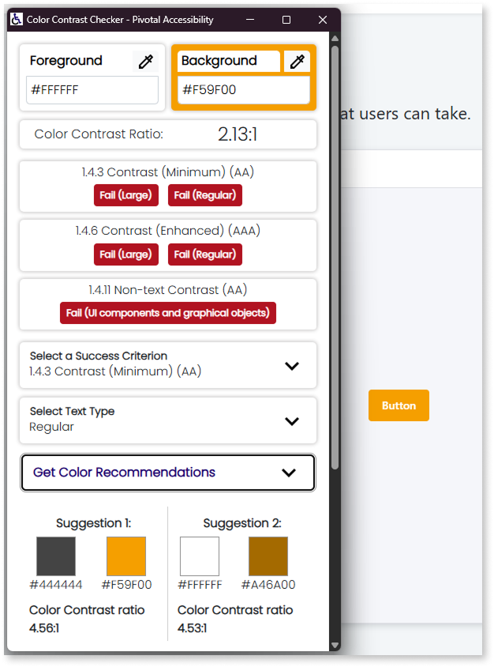

# Button

Provides a button that users can click or tap to trigger an action, submit data or navigate to another screen.

If the button belongs to a form with some input fields, the button submits the information if you set **Is Form Default** property to **Yes** in the Button Widget. This is useful when you have several buttons in your form.

## Properties

<table markdown="1">
<thead>
<tr>
<th>Name</th>
<th>Description</th>
<th>Mandatory</th>
<th>Default value</th>
<th>Observations</th>
</tr>
</thead>
<tbody>
<tr>
<td title="Name">Name</td>
<td>Identifies an element in the scope where it's defined, like a screen, action, or module.</td>
<td>Yes</td>
<td></td>
<td></td>
</tr>
<tr>
<td title="ConfirmationMessage">Confirmation Message</td>
<td>Text literal or expression to define the confirmation message displayed after clicking this widget.</td>
<td></td>
<td></td>
<td></td>
</tr>
<tr>
<td title="Enabled">Enabled</td>
<td>Boolean literal or expression that defines if the widget is editable.</td>
<td></td>
<td>True</td>
<td></td>
</tr>
<tr>
<td title="IsDefault">Is Form Default</td>
<td>Boolean to specify if the button should submit form that's enclosed in.</td>
<td></td>
<td>No</td>
<td>The entry redirects to the screen it points to.</td>
</tr>
<tr>
<td title="Visible">Visible</td>
<td>Boolean literal or expression that defines to display the widget or not.</td>
<td>Yes</td>
<td>True</td>
<td></td>
</tr>
<tr>
<td title="Style">Style Classes</td>
<td>Specifies one or more style classes to apply to the widget. Separate multiple values with spaces.</td>
<td></td>
<td>"btn"</td>
<td>The first button dragged to the screen or to the form is going to have an additional style class 'btn-primary'.</td>
</tr>
<tr >
<th colspan="5">Attributes</th>
</tr>
<tr>
<td title="Property">Property</td>
<td>Name of an attribute to add to the HTML translation for this element.</td>
<td></td>
<td></td>
<td>You can pick a property from the drop-down list or type a free text. The name of the property isn't validated by the platform.<br/><br/>Duplicated properties aren't allowed. Spaces, " or ' are also not allowed.</td>
</tr>
<tr>
<td title="Value">Value</td>
<td>Value of the attribute.</td>
<td></td>
<td></td>
<td>You can type the value directly or write expressions using the Expression Editor.<br/><br/>If the Value is empty, the corresponding HTML tag is property="property". For example, the nowrap property doesn't require a value, therefore it's property is nowrap="nowrap".</td>
</tr>
</tbody>
</table>

## Events

<table markdown="1">
<thead>
<tr>
<th>Name</th>
<th>Description</th>
<th>Mandatory</th>
<th>Observations</th>
</tr>
</thead>
<tbody>
<tr>
<td title="OnClick">On Click</td>
<td>When the user clicks the widget, you can add a screen action to run or a screen to navigate to.</td>
<td>Yes</td>
<td></td>
</tr>
<tr>
<td title="Validation">Built-in Validations</td>
<td>Set to Yes to enable built-in validations for widgets that share the same form or screen with this widget.</td>
<td></td>
<td></td>
</tr>
<tr>
<td title="Transition">Transition</td>
<td>Transition effect applied when navigating to another screen.</td>
<td></td>
<td>By default defined at module level.</td>
</tr>
<tr>
<td title="EventName">Event</td>
<td>JavaScript or custom event to handle.</td>
<td></td>
<td></td>
</tr>
<tr>
<td title="Handler">Handler</td>
<td>JavaScript event handler.</td>
<td></td>
<td></td>
</tr>
</tbody>
</table>

## Runtime properties

<table markdown="1">
<thead>
<tr>
<th>Name</th>
<th>Description</th>
<th>Read Only</th>
<th>Type</th>
<th>Observations</th>
</tr>
</thead>
<tbody>
<tr>
<td>Id</td>
<td>Identifies the widget instance at runtime (HTML 'id' attribute). You can use it in JavaScript and Extended Properties.</td>
<td>Yes</td>
<td>Text</td>
<td></td>
</tr>
</tbody>
</table>

## Accessibility – WCAG 2.2 AA compliance

By default, the **Button** UI Pattern is exposed to color combinations that might not meet the minimum contrast ratio required for WCAG 2.2 AA compliance. Certain color combinations in the **OutSystems UI** palette don’t provide sufficient contrast between the button text and background, particularly in hover or focus states.

Updating your theme variables and adjusting hover styles ensures that buttons remain legible and accessible in all interaction states.

### Identify low-contrast color combinations

<div class="info" markdown="1">

Some colors in the **OutSystems UI** palette don’t meet the minimum recommended contrast ratio **(4.5:1 for normal text or 3:1 for large text)** when used together as text and background colors. The following colors, for example, may create low-contrast combinations when applied to text, icons, or interactive elements such as buttons and links:

* orange
* yellow
* lime
* green
* transparent
* neutral-0
* neutral-1
* neutral-2
* neutral-3
* neutral-4
* neutral-5
* neutral-6

</div>

You can still use these colors for decorative or non-textual purposes, as long as they don’t affect readability or information perception.

If your application relies on these color tokens, update the related CSS variables to improve contrast across all components. When applying custom or brand colors, always validate the contrast between text and background to ensure WCAG 2.2 AA compliance.

Use a contrast checking tool such as:

* [Color Contrast Checker by Pivotal Accessibility](https://chromewebstore.google.com/detail/color-contrast-checker/gbfgefkhkofclanlcgnhlbmfgjjomock)

* [Accessible Color Picker](https://chromewebstore.google.com/detail/accessible-color-picker/bgfhbflmeekopanooidljpnmnljdihld)

* [WebAIM Contrast Checker](https://webaim.org/resources/contrastchecker/)

* [Contrast Ratio by Lea Verou](https://contrast-ratio.com/)

  

### Update CSS variables to improve contrast

Update the theme color tokens so text and background combinations meet WCAG 2.2 AA. Replace each placeholder value with your brand colors (hex or rgba) and publish.

1. In **Service Studio**, go to the **Elements** tab.

1. Select your **Theme** in **Themes**.

1. In the theme’s CSS, add or update the needed variables.

1. Replace the placeholder values with new accessible colors and **Publish** the module.

<div class="info" markdown="1">

**Disclaimer:**  
The following code block lists all root color variables for quick reference. You don’t need to include all of them in your theme — only the ones you intend to update.  

For readability, the examples use a black hex value (`#000000`), but you can replace it with any valid CSS color format, such as `rgb()`, `rgba()`, `hsl()`, or `oklch()`.

</div>

```css
:root {
    /* ── Color > Brand ───────────────────────────────────── */
    --color-primary:          [#000000 /* replace */];
    --color-secondary:        [#000000 /* replace */];
    --color-primary-hover:    [#000000 /* replace */];
    --color-primary-selected: [#000000 /* replace */];
    --color-primary-lightest: [#000000 /* replace */];

    /* ── Color > Focus ───────────────────────────────────── */
    --color-focus-outer:      [#000000 /* replace */];
    --color-focus-inner:      [#000000 /* replace */];

    /* ── Color > Extended (Reds) ─────────────────────────── */
    --color-red-lightest:     [#000000 /* replace */];
    --color-red-lighter:      [#000000 /* replace */];
    --color-red-light:        [#000000 /* replace */];
    --color-red:              [#000000 /* replace */];
    --color-red-dark:         [#000000 /* replace */];
    --color-red-darker:       [#000000 /* replace */];
    --color-red-darkest:      [#000000 /* replace */];

    /* ── Color > Extended (Oranges) ──────────────────────── */
    --color-orange-lightest:  [#000000 /* replace */];
    --color-orange-lighter:   [#000000 /* replace */];
    --color-orange-light:     [#000000 /* replace */];
    --color-orange:           [#000000 /* replace */];
    --color-orange-dark:      [#000000 /* replace */];
    --color-orange-darker:    [#000000 /* replace */];
    --color-orange-darkest:   [#000000 /* replace */];

    /* ── Color > Extended (Yellows) ──────────────────────── */
    --color-yellow-lightest:  [#000000 /* replace */];
    --color-yellow-lighter:   [#000000 /* replace */];
    --color-yellow-light:     [#000000 /* replace */];
    --color-yellow:           [#000000 /* replace */];
    --color-yellow-dark:      [#000000 /* replace */];
    --color-yellow-darker:    [#000000 /* replace */];
    --color-yellow-darkest:   [#000000 /* replace */];

    /* ── Color > Extended (Limes) ────────────────────────── */
    --color-lime-lightest:    [#000000 /* replace */];
    --color-lime-lighter:     [#000000 /* replace */];
    --color-lime-light:       [#000000 /* replace */];
    --color-lime:             [#000000 /* replace */];
    --color-lime-dark:        [#000000 /* replace */];
    --color-lime-darker:      [#000000 /* replace */];
    --color-lime-darkest:     [#000000 /* replace */];

    /* ── Color > Extended (Greens) ───────────────────────── */
    --color-green-lightest:   [#000000 /* replace */];
    --color-green-lighter:    [#000000 /* replace */];
    --color-green-light:      [#000000 /* replace */];
    --color-green:            [#000000 /* replace */];
    --color-green-dark:       [#000000 /* replace */];
    --color-green-darker:     [#000000 /* replace */];
    --color-green-darkest:    [#000000 /* replace */];

    /* ── Color > Extended (Teals) ────────────────────────── */
    --color-teal-lightest:    [#000000 /* replace */];
    --color-teal-lighter:     [#000000 /* replace */];
    --color-teal-light:       [#000000 /* replace */];
    --color-teal:             [#000000 /* replace */];
    --color-teal-dark:        [#000000 /* replace */];
    --color-teal-darker:      [#000000 /* replace */];
    --color-teal-darkest:     [#000000 /* replace */];

    /* ── Color > Extended (Cyans) ────────────────────────── */
    --color-cyan-lightest:    [#000000 /* replace */];
    --color-cyan-lighter:     [#000000 /* replace */];
    --color-cyan-light:       [#000000 /* replace */];
    --color-cyan:             [#000000 /* replace */];
    --color-cyan-dark:        [#000000 /* replace */];
    --color-cyan-darker:      [#000000 /* replace */];
    --color-cyan-darkest:     [#000000 /* replace */];

    /* ── Color > Extended (Blues) ────────────────────────── */
    --color-blue-lightest:    [#000000 /* replace */];
    --color-blue-lighter:     [#000000 /* replace */];
    --color-blue-light:       [#000000 /* replace */];
    --color-blue:             [#000000 /* replace */];
    --color-blue-dark:        [#000000 /* replace */];
    --color-blue-darker:      [#000000 /* replace */];
    --color-blue-darkest:     [#000000 /* replace */];

    /* ── Color > Extended (Indigos) ──────────────────────── */
    --color-indigo-lightest:  [#000000 /* replace */];
    --color-indigo-lighter:   [#000000 /* replace */];
    --color-indigo-light:     [#000000 /* replace */];
    --color-indigo:           [#000000 /* replace */];
    --color-indigo-dark:      [#000000 /* replace */];
    --color-indigo-darker:    [#000000 /* replace */];
    --color-indigo-darkest:   [#000000 /* replace */];

    /* ── Color > Extended (Violets) ──────────────────────── */
    --color-violet-lightest:  [#000000 /* replace */];
    --color-violet-lighter:   [#000000 /* replace */];
    --color-violet-light:     [#000000 /* replace */];
    --color-violet:           [#000000 /* replace */];
    --color-violet-dark:      [#000000 /* replace */];
    --color-violet-darker:    [#000000 /* replace */];
    --color-violet-darkest:   [#000000 /* replace */];

    /* ── Color > Extended (Grapes) ───────────────────────── */
    --color-grape-lightest:   [#000000 /* replace */];
    --color-grape-lighter:    [#000000 /* replace */];
    --color-grape-light:      [#000000 /* replace */];
    --color-grape:            [#000000 /* replace */];
    --color-grape-dark:       [#000000 /* replace */];
    --color-grape-darker:     [#000000 /* replace */];
    --color-grape-darkest:    [#000000 /* replace */];

    /* ── Color > Extended (Pinks) ────────────────────────── */
    --color-pink-lightest:    [#000000 /* replace */];
    --color-pink-lighter:     [#000000 /* replace */];
    --color-pink-light:       [#000000 /* replace */];
    --color-pink:             [#000000 /* replace */];
    --color-pink-dark:        [#000000 /* replace */];
    --color-pink-darker:      [#000000 /* replace */];
    --color-pink-darkest:     [#000000 /* replace */];

    /* ── Color > Neutral ─────────────────────────────────── */
    --color-neutral-0:        [#000000 /* replace */];
    --color-neutral-1:        [#000000 /* replace */];
    --color-neutral-2:        [#000000 /* replace */];
    --color-neutral-3:        [#000000 /* replace */];
    --color-neutral-4:        [#000000 /* replace */];
    --color-neutral-5:        [#000000 /* replace */];
    --color-neutral-6:        [#000000 /* replace */];
    --color-neutral-7:        [#000000 /* replace */];
    --color-neutral-8:        [#000000 /* replace */];
    --color-neutral-9:        [#000000 /* replace */];
    --color-neutral-10:       [#000000 /* replace */];

    /* ── Color > Semantic ────────────────────────────────── */
    --color-error-light:      [#000000 /* replace */];
    --color-error:            [#000000 /* replace */];
    --color-warning-light:    [#000000 /* replace */];
    --color-warning:          [#000000 /* replace */];
    --color-success-light:    [#000000 /* replace */];
    --color-success:          [#000000 /* replace */];
    --color-info-light:       [#000000 /* replace */];
    --color-info:             [#000000 /* replace */];
}
```

### Update theme variables to improve button contrast

Some button states — particularly **hover** and **focus** — may have insufficient visual contrast or feedback.
Adding a semi-transparent overlay and ensuring focus visibility makes buttons easier to identify and interact with.

1. In **Service Studio**, go to the **Elements** tab.

1. Select your Theme in **Themes**.

1. Add the following code to your CSS theme:

    ```css
    /* Override in the original code */
    .desktop .btn:hover {
        filter: brightness(1);
    }

    .btn {
        position: relative; /* Needed for pseudo-element positioning */
        overflow: hidden;   /* Prevent the pseudo-element from overflowing */
        z-index: 1;         /* Ensure text is above background changes */
    }

    /* Pseudo-element for hover effect */
    .btn::after {
        content: "";
        position: absolute;
        top: 0;
        left: 0;
        width: 100%;
        height: 100%;
        background-color: rgba(0, 0, 0, 0.1); /* Or any color/brightness effect */
        opacity: 0; /* Hidden by default */
        transition: opacity 0.3s ease; /* Smooth transition */
        z-index: 0; /* Behind the button text */
    }

    .btn span {
        z-index: 1;
    }

    /* Hover effect */
    .btn:hover::after {
        opacity: 1; /* Visible overlay on hover */
    }
    ```

1. Publish and test the module.

### Result

After you update the theme color variables and hover effects, the **Button** pattern maintains readable contrast in all interaction states.
These updates improve visibility and usability for all users, including those with visual or motor impairments.

Test it in your app to confirm the update.
