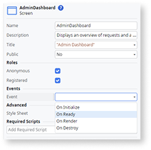
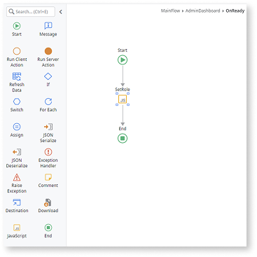
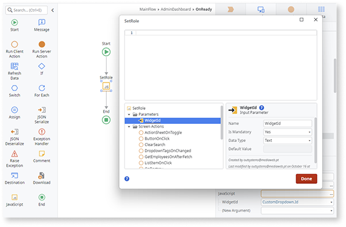
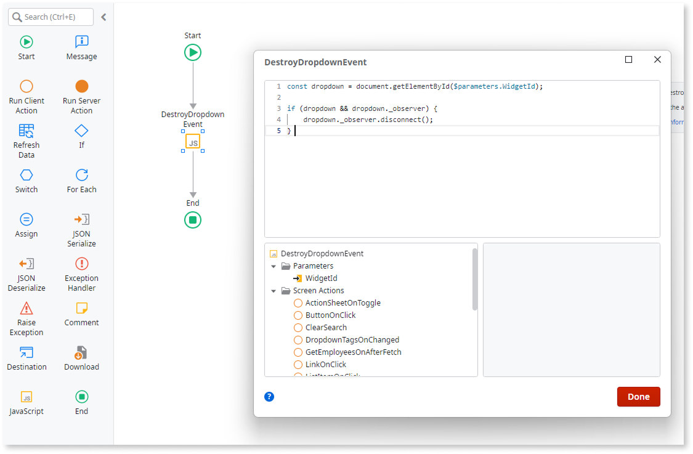

# Dropdown

Use the Dropdown Widget to create drop-down lists in your Mobile and Reactive Web Apps.

With the Dropdown Widget you can implement two types of lists:

* Simple list with text only, when you set **Options Content** to **Text Only**. These is the most common type of lists, rendered with the `<select>` HTML tag. It provides native look and feel in the devices.
* Custom list with other Widgets, when you set **Options Content** to **Custom**. Use them to build a list from, for example, images or other widgets. These lists are rendered with the `<div>` HTML tag.

## Properties

<table markdown="1">
<thead>
<tr>
<th>Name</th>
<th>Description</th>
<th>Mandatory</th>
<th>Default value</th>
<th>Observations</th>
</tr>
</thead>
<tbody>
<tr>
<td title="Name">Name</td>
<td>Identifies an element in the scope where it's defined, like a screen, action, or module.</td>
<td>Yes</td>
<td></td>
<td></td>
</tr>
<tr>
<td title="Variable">Variable</td>
<td>Holds the value entered by the user.</td>
<td>Yes</td>
<td></td>
<td></td>
</tr>
<tr>
<td title="List">List</td>
<td>Specifies the list of records to show in the dropdown.</td>
<td>Yes</td>
<td></td>
<td></td>
</tr>
<tr>
<td title="DropdownMode">Options Content</td>
<td>'Text (Default)' content provides a native experience for selecting textual values (uses the select HTML tag). 'Custom' provides richer content with non-textual widgets (for example, images) inside the dropdown (uses the div HTML tag).</td>
<td>Yes</td>
<td>Text</td>
<td></td>
</tr>
<tr>
<td title="Labels">Options Text</td>
<td>Attribute of the records in the list to use as the label.</td>
<td></td>
<td></td>
<td></td>
</tr>
<tr>
<td title="Values">Options Value</td>
<td>Attribute of the records in the list to use as the identifier of the selected value.</td>
<td>Yes</td>
<td></td>
<td></td>
</tr>
<tr>
<td title="Mandatory">Mandatory</td>
<td>Boolean literal or expression that defines the obligatoriness of the widget.</td>
<td>Yes</td>
<td>False</td>
<td></td>
</tr>
<tr>
<td title="Enabled">Enabled</td>
<td>Boolean literal or expression that defines if the widget is editable.</td>
<td></td>
<td>True</td>
<td></td>
</tr>
<tr>
<td title="EmptyValue">Empty Text</td>
<td>Text literal or expression displayed in the Dropdown list that represents an empty selection. By selecting this option, the variable defined holds a default value.</td>
<td></td>
<td></td>
<td></td>
</tr>
<tr>
<td title="Style">Style Classes</td>
<td>Specifies one or more style classes to apply to the widget. Separate multiple values with spaces.</td>
<td></td>
<td>"dropdown"</td>
<td></td>
</tr>
<tr >
<th colspan="5">Attributes</th>
</tr>
<tr>
<td title="Property">Property</td>
<td>Name of an attribute to add to the HTML translation for this element.</td>
<td></td>
<td></td>
<td>You can pick a property from the drop-down list or type a free text. The name of the property isn't validated by the platform.<br/><br/>Duplicated properties aren't allowed. Spaces, " or ' are also not allowed.</td>
</tr>
<tr>
<td title="Value">Value</td>
<td>Value of the attribute.</td>
<td></td>
<td></td>
<td>You can type the value directly or write expressions using the Expression Editor.<br/><br/>If the Value is empty, the corresponding HTML tag is property="property". For example, the nowrap property doesn't require a value, therefore its property is nowrap="nowrap".</td>
</tr>
</tbody>
</table>

## Events

<table markdown="1">
<thead>
<tr>
<th>Name</th>
<th>Description</th>
<th>Mandatory</th>
<th>Observations</th>
</tr>
</thead>
<tbody>
<tr>
<td title="OnChange">On Change</td>
<td>Screen action to execute, or a screen to navigate to when the value of the element changes.</td>
<td></td>
<td></td>
</tr>
<tr>
<td title="Transition">Transition</td>
<td>Transition effect applied when navigating to another screen.</td>
<td></td>
<td>By default defined at module level.</td>
</tr>
<tr>
<td title="EventName">Event</td>
<td>JavaScript or custom event to handle.</td>
<td></td>
<td></td>
</tr>
<tr>
<td title="Handler">Handler</td>
<td>JavaScript event handler.</td>
<td></td>
<td></td>
</tr>
</tbody>
</table>

## Runtime properties

<table markdown="1">
<thead>
<tr>
<th>Name</th>
<th>Description</th>
<th>Read Only</th>
<th>Type</th>
<th>Observations</th>
</tr>
</thead>
<tbody>
<tr>
<td>Id</td>
<td>Identifies the widget instance at runtime (HTML 'id' attribute). You can use it in JavaScript and Extended Properties.</td>
<td>Yes</td>
<td>Text</td>
<td></td>
</tr>
<tr>
<td>Valid</td>
<td>False when required inputs aren't present or the input value doesn't comply with the defined data type. You can override this property value when performing custom validations.</td>
<td></td>
<td>Boolean</td>
<td></td>
</tr>
<tr>
<td>ValidationMessage</td>
<td>Message describing the built-in validation constraints not satisfied when 'Valid' is False. You can override this property value when performing custom validations.</td>
<td></td>
<td>Text</td>
<td></td>
</tr>
</tbody>
</table>

## Special attributes

<table markdown="1">
<thead>
<tr>
<th>Name</th>
<th>Description</th>
<th>Default value</th>
<th>Observations</th>
</tr>
</thead>
<tbody>
<tr>
<td title="Name">apply-to-child</td>
<td> The Dropdown widget is a select element enclosed in a div. By default, its attributes are rendered in the div. apply-to-child is an attribute of the Dropdown that controls where other attributes are rendered. It lists the attribute names to render in the select element e.g. apply-to-child="aria-describedby,data-id" makes aria-described by and data-id attributes render in the select. Setting apply-to-child="*" renders all attributes in the select. </td>
<td>If apply-to-child is not added to the Dropdown attribute list, all attributes are rendered in the enclosing div by default. </td>
<td>This functionality only applies to Dropdowns with Options Content set to Text Only. "style" and "class" attributes are unaffected. </td>
</tr>
</tbody>
</table>

## Accessibility – WCAG 2.2 AA compliance

By default, the **Dropdown** Built-in Widget is accessible when **OptionsContent** is set to **Text Only**, because it renders a native `<select>` element that exposes correct semantics to assistive technologies.

When **OptionsContent** is set to **Custom**, the Dropdown is built with `<div>` elements instead. In this case, **it does not expose the correct ARIA semantics**, and assistive technologies may not recognize it as a combobox.

For Dropdowns that use **custom content**, add combobox semantics so screen readers recognize the control, understand its expanded state, and associate it with its option list.

<div class="info" markdown="1">

These steps apply only when the **Dropdown** Built-in Widget uses **OptionsContent = Custom**.
If you use **Text Only**, no additional ARIA configuration is required.

</div>

### Set the correct ARIA roles for custom dropdowns

1. In **Service Studio**, go to the **Interface** tab and select the **Screen/Block** that uses the **Dropdown** with custom options.

1. In the **Screen/Block** properties, under **Events**, select **OnReady** to create a client action.

    

1. In **OnReady**, add a **JavaScript** node to flow.

    

1. In the **JavaScript** node, add an input parameter named **WidgetId** (type `Text`) and set it to the **Dropdown** widget ID (for example, `CustomDropdown.Id`).

    

1. Add the following script:

    ```javascript
    const dropdown = document.getElementById($parameters.WidgetId);
    if (!dropdown) return;

    const trigger = dropdown.querySelector('.dropdown-display');
    if (!trigger) return;

    // Generate ID for the listbox
    const listId = `${$parameters.WidgetId}_listbox`;

    // Base combobox semantics
    trigger.setAttribute('role', 'combobox');
    trigger.setAttribute('aria-haspopup', 'listbox');
    trigger.setAttribute('aria-controls', listId);

    // Ensure trigger is focusable if not a native interactive element
    if (!trigger.hasAttribute('tabindex') && 
        !['BUTTON', 'A', 'INPUT', 'SELECT'].includes(trigger.tagName)) {
        trigger.setAttribute('tabindex', '0');
    }

    function enhanceListbox() {
        const list = dropdown.querySelector('.dropdown-list');
        if (!list) return;

        list.id = listId;
        list.setAttribute('role', 'listbox');

        const options = list.querySelectorAll('.dropdown-popup-row');
        options.forEach(option => {
            option.setAttribute('role', 'option');
            option.setAttribute('aria-selected', option.classList.contains('dropdown-popup-row-selected') ? 'true' : 'false');
        });
    }

    // Set correct initial aria-expanded state
    const isInitiallyExpanded = dropdown.classList.contains('dropdown-expanded');
    trigger.setAttribute('aria-expanded', String(isInitiallyExpanded));

    // Call enhanceListbox on init
    enhanceListbox();

    const dropdownObserver = new MutationObserver((mutations) => {
        mutations.forEach((mutation) => {
            if (mutation.type === 'attributes' && mutation.attributeName === 'class') {
                const isExpanded = dropdown.classList.contains('dropdown-expanded');

                trigger.setAttribute('aria-expanded', String(isExpanded));

                // Re-run enhanceListbox on expand to handle dynamic options
                if (isExpanded) enhanceListbox();
            }
        });
    });

    // Start observing
    dropdownObserver.observe(dropdown, {
        attributes: true,
        attributeFilter: ['class']
    });

    // Store for cleanup in OnDestroy
    dropdown._observer = dropdownObserver;
    ```

    <div class="info" markdown="1">

    **Important:**  
    Because the Dropdown list (`.dropdown-list`) is only created in the DOM **after the user opens the Dropdown**, assistive technologies may not always detect the relationship defined by `aria-controls` or `aria-owns` at initial render.  
    These attributes are applied correctly once the list exists, but the association cannot be guaranteed before the first interaction. As a result, this may still trigger warnings when validating with automated tools or screen readers.

    This behavior is a limitation of the underlying Dropdown pattern when using **OptionsContent = Custom**.

    </div>

1. In the **Screen/Block** properties, under **Events**, select **OnDestroy** to create a client action.

1. In **OnDestroy**, add a **JavaScript** node.

1. Add the same **WidgetId** input parameter (type `Text`) and set it to the **Dropdown** widget ID (for example, `CustomDropdown.Id`).

1. Add the following script to disconnect the observer and avoid memory leaks:

    ```javascript
    const dropdown = document.getElementById($parameters.WidgetId);

    if (dropdown && dropdown._observer) {
        dropdown._observer.disconnect();
        dropdown._observer = null;
    }  
    ```

    

1. Publish the module.

### Result

After completing these steps, Dropdowns that use **custom content** expose proper **combobox** semantics:

* Screen readers announce the control as a **combobox** and can determine whether it is expanded or collapsed.

* The popup list is exposed as a **listbox** with **option** items, associated to the combobox via `aria-controls`/`aria-owns`.

Test the Dropdown in your app (especially with a screen reader) to confirm that the role, state, and relationships are applied and announced correctly.
