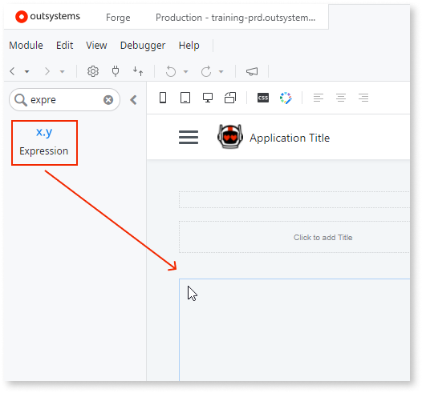

# Expression

The expression widget displays text or the result of an expression at runtime. It's similar to the **print** command in other programming languages. To use the expression widget:

1. In the widget toolbar, search for **expression** and drag the widget to a screen, block or placeholder. The expression editor opens.

    

1. Enter an expression in the expression editor and click **Close**.

    

    You can use one of these examples as the expression:

    * `"Hello, world!"`
    * `"1 + 2 = " + (1 + 2)`
    * `"The square root of 3 is " + Sqrt(3)`
    * `"Today is " + CurrDate() + "!"`
    * `ToUpper("this is text in uppercase")`

1. Publish the app and open the screen.

    Here is what you get if you use one of the examples in the previous step:

    * **Hello, world!**
    * **1 + 2 = 3**
    * **The square root of 3 is 1.73205080756887729352744634151**
    * **Today is 2020-10-08!!**
    * **THIS IS TEXT IN UPPERCASE**

## Properties

<table markdown="1">
<thead>
<tr>
<th>Name</th>
<th>Description</th>
<th>Mandatory</th>
<th>Default value</th>
<th>Observations</th>
</tr>
</thead>
<tbody>
<tr>
<td title="Name">Name</td>
<td>Identifies an element in the scope where it's defined, like a screen, action, or module.</td>
<td>Yes</td>
<td></td>
<td></td>
</tr>
<tr>
<td title="Value">Value</td>
<td>Combination of values, operands, operators and variables or the result of a function, computed at runtime.</td>
<td>Yes</td>
<td></td>
<td></td>
</tr>
<tr>
<td title="Example">Example</td>
<td>Text displayed in the Preview and Design modes.</td>
<td></td>
<td></td>
<td></td>
</tr>
<tr>
<td title="Style">Style Classes</td>
<td>Specifies one or more style classes to apply to the widget. Separate multiple values with spaces.</td>
<td></td>
<td></td>
<td></td>
</tr>
<tr >
<th colspan="5">Attributes</th>
</tr>
<tr>
<td title="Property">Property</td>
<td>Name of an attribute to add to the HTML translation for this element.</td>
<td></td>
<td></td>
<td>You can pick a property from the drop-down list or type a free text. The name of the property isn't validated by the platform.  Duplicated properties aren't allowed. Spaces, " or ' are also not allowed.</td>
</tr>
<tr>
<td title="Value">Value</td>
<td>Value of the attribute.</td>
<td></td>
<td></td>
<td>You can type the value directly or write expressions using the Expression Editor.  If the Value is empty, the corresponding HTML tag is property="property". For example, the nowrap property doesn't require a value, therefore its value is nowrap="nowrap".</td>
</tr>
</tbody>
</table>

## Events

<table markdown="1">
<thead>
<tr>
<th>Name</th>
<th>Description</th>
<th>Mandatory</th>
<th>Observations</th>
</tr>
</thead>
<tbody>
<tr>
<td title="EventName">Event</td>
<td>JavaScript or custom event to handle.</td>
<td></td>
<td></td>
</tr>
<tr>
<td title="Handler">Handler</td>
<td>JavaScript event handler.</td>
<td></td>
<td></td>
</tr>
</tbody>
</table>

## Runtime properties

<table markdown="1">
<thead>
<tr>
<th>Name</th>
<th>Description</th>
<th>Read Only</th>
<th>Type</th>
<th>Observations</th>
</tr>
</thead>
<tbody>
<tr>
<td>Id</td>
<td>Identifies the widget instance at runtime (HTML 'id' attribute). You can use it in JavaScript and Extended Properties.</td>
<td>Yes</td>
<td>Text</td>
<td></td>
</tr>
</tbody>
</table>
