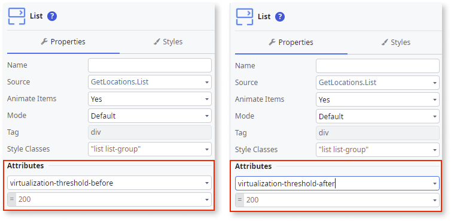
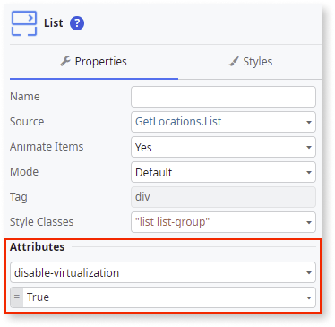
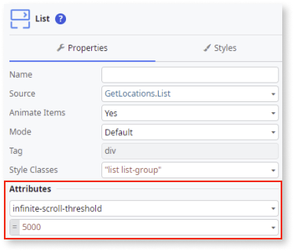
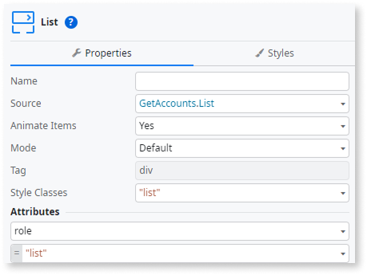
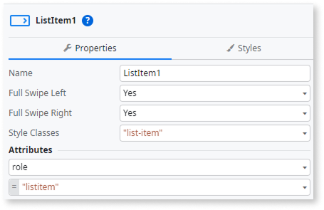
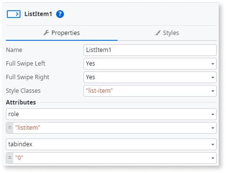

# List widget

<div class="info" markdown="1">

Applies to Mobile Apps and Reactive Web Apps only

</div>

Use the List widget to display a simple list, for example a list of Expressions, or to display more complex items by adding a [List Item widget](servicestudio-plugin-nrwidgets-listitem.md). The List widget requires a source to populate the items.

## List virtualization {#list-virtualization}

The List widget uses virtualization to render elements that are visible on the screen. Virtualization optimizes performance when rendering lists with a large number of list items, as only the visible items are added to the DOM. Controlling the list items in the DOM reduces the memory footprint of OutSystems applications, which is important for older devices with less resources. Having fewer list items in the DOM improves the initial screen rendering as well as the scrolling experience.

## Viewport threshold

To further enhance the scrolling experience, it’s possible to configure the viewport threshold to render extra elements (at the top or at the bottom of the list in the DOM), so when the user is scrolling, those elements are ready to be displayed on screen. Having elements rendered before they are visible on screen improves the scrolling experience. The extra elements are not visible because they are outside of the list’s viewport window. You can configure the viewport window thresholds by setting the ``virtualization-threshold-before`` or ``virtualization-threshold-after`` value (in pixels) in the **Attributes** of the List.



``Virtualization-threshold-before`` renders the elements before the first visible element, even if they are not visible. ``virtualization-threshold-after`` renders the elements after the last visible element, even if they are not visible.

You can also deactivate the virtualization by setting the List attribute value to ``disable-virtualization=True``.



## Scroll threshold

When the List reaches the scroll threshold value, the list triggers the OnScrollEnding event. You can configure this event to load more data into the list which allows the user to keep scrolling continuously. The scroll threshold default value is 2000 pixels. To change the scroll ending threshold, set the ``infinite-scroll-threshold`` in the **Attributes** of the List.



## Known issues

You should avoid using list virtualization in two cases:

* When your list items have complex blocks with built-in aggregates.
* when you're using custom or third-party JavaScript that interacts with the list items.

Virtualization adds and removes elements from the DOM. The aggregates of a block run automatically when they are added to the DOM. So scrolling a List whose items contain blocks with aggregates will constantly trigger their execution. This may result in a significant amount of server requests that can hinder server performance.

To prevent this issue, you can either disable the list virtualization or fetch all the data on the screen and pass it as parameters to the blocks. If you encounter any other UI/UX issues when using the List widget (for example, scrolling or list item visibility), a possible workaround is disabling list virtualization. For more details on how to disable list virtualization, see the [List virtualization](#list-virtualization).

## Properties

| Name | Description | Mandatory | Default value | Observations |
| --- | --- | --- | --- | --- |
| Name | Identifies an element in the scope where it is defined, like a screen, action, or module. | Yes | | |
| Source | Specifies a list with records to populate the widget. | Yes | | |
| Animate Items | Set to Yes to Animate Items on append, insert or remove. | Yes | Yes | |
| Mode | Set to Custom to define a custom HTML tag to be used by the widget in runtime. Default mode sets tag as div. | Yes | Default | Setting the Mode property to Custom provides you with flexibility in styling and layout, giving you more control over how each item is presented. It allows you to choose the rendering mode that best suits your needs and presentation preferences for the list |
| Tag | Wrapper HTML tag to be used by this widget in runtime. | Yes | div | Only available when Mode is set to Custom. |
| Style Classes | Specifies one or more style classes to apply to the widget. Separate multiple values with spaces. | | "list list-group" | |

### Attributes

| Name | Description | Mandatory | Observations |
| --- | --- | --- | --- |
| Property | Name of an attribute to add to the HTML translation for this element. | No | You can pick a property from the drop-down list or type a free text. The name of the property won't be validated by the platform.<br/><br/>Duplicated properties are not allowed. Spaces, " or ' are also not allowed. |
| Value | Value of the attribute. | No | You can type the value directly or write expressions using the Expression Editor.<br/><br/>If the Value is empty, the corresponding HTML tag is created as property="property". For example, the nowrap property does not require a value, therefore nowrap="nowrap" is added. |

### Events

| Name | Description | Mandatory | Observations |
| --- | --- | --- | --- |
| On Scroll Ending | Screen action to be executed or a screen to navigate to when the user scrolling is nearing the end of the loaded list. | No | |
| Transition | Transition effect applied when navigating to another screen. | No | By default defined at module level. |
| Event | JavaScript or custom event to be handled. | No | |
| Handler | JavaScript event handler. | No | |

## Runtime properties

| Name | Description | Read Only | Type |
| --- | --- | --- | --- |
| Id | Identifies the widget instance at runtime (HTML 'id' attribute). You can use it in JavaScript and Extended Properties. | Yes | Text |

## Accessibility – WCAG 2.2 AA compliance

By default, the **List** Built-in Widget might not expose the correct semantic roles for assistive technologies. Adding the appropriate ARIA roles helps screen readers announce the list structure correctly. If the List is interactive, you can also add keyboard support so users can focus items and activate them using Enter or Space.

### Add list and listitem roles

1. In **Service Studio**, go to the **Interface** tab, and select the **Screen/Block** where you use the **List**.

1. In the **Widget Tree**, select the **List**.

1. In **List Properties**, under **Attributes**, add `role="list"`.

   

1. In the **Widget Tree**, select the **List Item** inside that **List**.

1. In **List Item Properties**, under **Attributes**, add `role="listitem"`.

   

1. Publish the module.

### Enable keyboard navigation

Add focus and key handling only when list items are interactive.

<div class="info" markdown="1">

Add `tabindex="0"` to the **List Item** only when the whole item is interactive (for example, when it triggers an action or opens details). Don't add it when the item already contains focusable widgets such as **Button** or **Link**; that creates redundant tab stops. For display-only lists, no additional attributes are required.

</div>

1. In **Service Studio**, go to the **Interface** tab, and select the **Screen/Block** where you use the **List**.

1. In the **Widget Tree**, select the **List Item** inside that **List**.

1. In **List Item Properties**, under **Attributes**, add `tabindex="0"`.

    

1. In the same **Screen**, under **Events**, add a client action to **OnReady** event.

1. Add a **JavaScript** node and paste the following JavaScript:

    ```javascript
    var listContainer = document.getElementById($parameters.ListWidgetId);

    if(!listContainer) return;

    function handleListKeyPress(event) {
        if (event.key === 'Enter' || event.key === ' ') {
            var targetItem = event.target.closest('.list-item');
            
            if (targetItem && listContainer.contains(targetItem)) {
                event.preventDefault();
                targetItem.click(); 
            }
        }
    }

    listContainer._a11yKeyHandler = handleListKeyPress;
    listContainer.addEventListener('keydown', handleListKeyPress);
    ```

<div class="info" markdown="1">

Remove the keyboard handler on OnDestroy to prevent memory leaks.

</div>

1. In the same Screen, under **Events**, add a client action to **OnDestroy** event.

1. Add the following JavaScript:

    ```javascript
    var listContainer = document.getElementById($parameters.ListWidgetId);

    if(!listContainer) return;

    var handlerToRemove = listContainer._a11yKeyHandler;

    if (handlerToRemove) {
        listContainer.removeEventListener('keydown', handlerToRemove);
        delete listContainer._a11yKeyHandler;
    }
    ```

1. Publish the module.

### Result

After completing these steps:

* Screen readers announce the container as a **list** and each entry as a **list item**, improving navigation and structural clarity.  
* Each interactive list item can receive keyboard focus and can be activated using Enter or Space.

Test the pattern in your app to confirm the update and verify that focus and reading order behave as expected.
