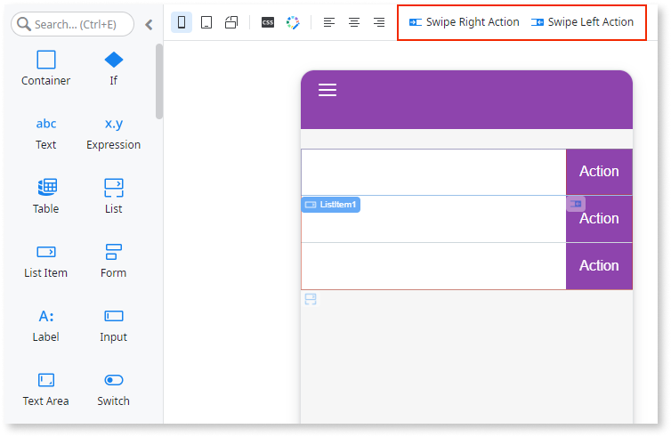

# List Action

Applies to Mobile Apps and Reactive Web Apps only

Defines the behavior when swiping the correspondent [List Item](servicestudio-plugin-nrwidgets-listitem.md), which can be executing a screen action or navigating to another screen.

To insert a new List Action, select the List Item and then click on the toolbar button according to the desired swipe direction for your List Action &#8212; "Swipe Right Action" or "Swipe Left Action":

## Properties

<table markdown="1">
<thead>
<tr>
<th>Name</th>
<th>Description</th>
<th>Mandatory</th>
<th>Default value</th>
<th>Observations</th>
</tr>
</thead>
<tbody>
<tr>
<td title="Name">Name</td>
<td>Identifies an element in the scope where it is defined, like a screen, action, or module.</td>
<td>Yes</td>
<td></td>
<td></td>
</tr>
<tr>
<td title="Visible">Visible</td>
<td>Boolean literal or expression that defines if the widget is displayed.</td>
<td>Yes</td>
<td>True</td>
<td></td>
</tr>
<tr>
<td title="Style">Style Classes</td>
<td>Specifies one or more style classes to apply to the widget. Separate multiple values with spaces.</td>
<td></td>
<td>"list-item-action"</td>
<td>The first list action added to the Right Actions/Left Actions list item placeholder will have an additional style class 'list-item-action-primary'; subsequent list actions will have an additional style class 'list-item-action-default'.</td>
</tr>
<tr >
<th colspan="5">Attributes</th>
</tr>
<tr>
<td title="Property">Property</td>
<td>Name of an attribute to add to the HTML translation for this element.</td>
<td></td>
<td></td>
<td>You can pick a property from the drop-down list or type a free text. The name of the property will not be validated by the platform.  Duplicated properties are not allowed. Spaces, " or ' are also not allowed.</td>
</tr>
<tr>
<td title="Value">Value</td>
<td>Value of the attribute.</td>
<td></td>
<td></td>
<td>You can type the value directly or write expressions using the Expression Editor.  If the Value is empty, the corresponding HTML tag is created as property="property". For example, the nowrap property does not require a value, therefore nowrap="nowrap" is added.</td>
</tr>
</tbody>
</table>

## Events

<table markdown="1">
<thead>
<tr>
<th>Name</th>
<th>Description</th>
<th>Mandatory</th>
<th>Observations</th>
</tr>
</thead>
<tbody>
<tr>
<td title="OnClick">On Click</td>
<td>Screen action to be executed or a screen to navigate to when the widget is clicked.</td>
<td>Yes</td>
<td></td>
</tr>
<tr>
<td title="Transition">Transition</td>
<td>Transition effect applied when navigating to another screen.</td>
<td></td>
<td>By default defined at module level.</td>
</tr>
<tr>
<td title="EventName">Event</td>
<td>JavaScript or custom event to be handled.</td>
<td></td>
<td></td>
</tr>
<tr>
<td title="Handler">Handler</td>
<td>JavaScript event handler.</td>
<td></td>
<td></td>
</tr>
</tbody>
</table>

## Runtime Properties

<table markdown="1">
<thead>
<tr>
<th>Name</th>
<th>Description</th>
<th>Read Only</th>
<th>Type</th>
<th>Observations</th>
</tr>
</thead>
<tbody>
<tr>
<td>Id</td>
<td>Identifies the widget instance at runtime (HTML 'id' attribute). You can use it in JavaScript and Extended Properties.</td>
<td>Yes</td>
<td>Text</td>
<td></td>
</tr>
</tbody>
</table>

