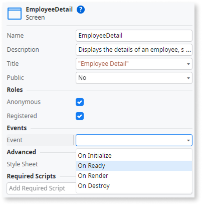
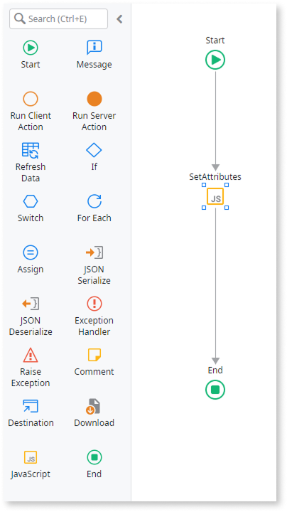
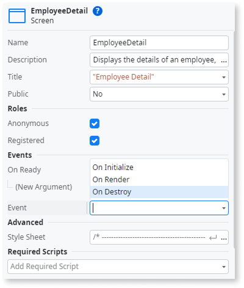

# Popover menu

A container that opens when the user taps an element or a region. You can use it to provide contextual information or options.

## Properties

<table markdown="1">
<thead>
<tr>
<th>Name</th>
<th>Description</th>
<th>Mandatory</th>
<th>Default value</th>
<th>Observations</th>
</tr>
</thead>
<tbody>
<tr>
<td title="Name">Name</td>
<td>Identifies an element in the scope where it is defined, like a screen, action, or module.</td>
<td>Yes</td>
<td></td>
<td></td>
</tr>
<tr>
<td title="PopoverWidth">Popover Width</td>
<td>Width of the popover box in pixels (px).</td>
<td></td>
<td></td>
<td></td>
</tr>
<tr>
<td title="Style">Style Classes</td>
<td>Specifies one or more style classes to apply to the widget. Separate multiple values with spaces.</td>
<td></td>
<td>"popover"</td>
<td></td>
</tr>
<tr >
<th colspan="5">Attributes</th>
</tr>
<tr>
<td title="Property">Property</td>
<td>Name of an attribute to add to the HTML translation for this element.</td>
<td></td>
<td></td>
<td>You can pick a property from the drop-down list or type a free text. The name of the property will not be validated by the platform.<br/><br/>Duplicated properties are not allowed. Spaces, " or ' are also not allowed.</td>
</tr>
<tr>
<td title="Value">Value</td>
<td>Value of the attribute.</td>
<td></td>
<td></td>
<td>You can type the value directly or write expressions using the Expression Editor.<br/><br/>If the Value is empty, the corresponding HTML tag is created as property="property". For example, the nowrap property does not require a value, therefore nowrap="nowrap" is added.</td>
</tr>
</tbody>
</table>

## Events

<table markdown="1">
<thead>
<tr>
<th>Name</th>
<th>Description</th>
<th>Mandatory</th>
<th>Observations</th>
</tr>
</thead>
<tbody>
<tr>
<td title="EventName">Event</td>
<td>JavaScript or custom event to be handled.</td>
<td></td>
<td></td>
</tr>
<tr>
<td title="Handler">Handler</td>
<td>JavaScript event handler.</td>
<td></td>
<td></td>
</tr>
</tbody>
</table>

## Runtime properties

<table markdown="1">
<thead>
<tr>
<th>Name</th>
<th>Description</th>
<th>Read Only</th>
<th>Type</th>
<th>Observations</th>
</tr>
</thead>
<tbody>
<tr>
<td>Id</td>
<td>Identifies the widget instance at runtime (HTML 'id' attribute). You can use it in JavaScript and Extended Properties.</td>
<td>Yes</td>
<td>Text</td>
<td></td>
</tr>
</tbody>
</table>

## Accessibility – WCAG 2.2 AA compliance {#accessibility}

By default, the **Popover** Built-in Widget may not expose the correct ARIA roles and relationships to assistive technologies. In this procedure, you update the trigger and popover panel so screen readers can identify the control, understand whether it’s expanded, and associate it with the correct content.

### Add the ARIA roles and attributes

1. In **Service Studio**, go to the **Interface** tab.  

1. Select the **Screen/Block** that uses the **Popover**.  

1. In **Screen/Block** properties, select **OnReady** to create a client action.  

    

1. In **OnReady**, drag a **JavaScript** node to the flow.  

    

1. Add an input parameter **WidgetId** (**Text**) and set it to the **Popover** widget ID (for example, `Popover.Id`).  

1. Add the following script to the **JavaScript** node:

    ```javascript
    const popover = document.getElementById($parameters.WidgetId);
    if (!popover) return;

    const trigger = popover.querySelector(".popover-top");
    if (!trigger) return;

    // Accessibility attributes on trigger
    trigger.setAttribute("role", "button");
    trigger.setAttribute("aria-haspopup", "dialog");
    trigger.setAttribute("aria-expanded", popover.classList.contains("popover-expanded") ? "true" : "false");

    // Sync aria-expanded with class changes on popover
    popover._observer = new MutationObserver((mutations) => {
        mutations.forEach((mutation) => {
            if (mutation.type === "attributes" && mutation.attributeName === "class") {
                const isExpanded = popover.classList.contains("popover-expanded");
                trigger.setAttribute("aria-expanded", String(isExpanded));

                // Set up panel role and aria-controls only once
                const popoverSecond = document.querySelectorAll(".popover")[1];
                const panel = popoverSecond.querySelector(".popover-bottom");
                if (panel && !panel.hasAttribute("role")) {
                    panel.setAttribute("role", "dialog");
                    panel.setAttribute("id", "popoverBottom");
                    trigger.setAttribute("aria-controls", panel.id);
                }
            }
        });
    });

    popover._observer.observe(popover, {
        attributes: true,
        attributeFilter: ["class"]
    });
    ```

    <div class="info" markdown="1">
    Next, add cleanup logic so the observer doesn’t remain active after the screen or block is destroyed.
    </div>

1. In **Screen/Block** properties, select **OnDestroy** to create a client action.  

    

1. Add an input parameter **WidgetId** (_Text_) and set it to the **Popover** widget ID (for example, `Popover.Id`).  

1. In the **OnDestroy** action, add a **JavaScript** node with:

    ```javascript
    const popover = document.getElementById($parameters.WidgetId);

    if (popover && popover._observer) {
        popover._observer.disconnect();
    } 
    ```

1. Publish the module.

### Result

After completing these steps, the **Popover** trigger exposes the correct ARIA semantics, including `aria-expanded`, `aria-haspopup`, and `aria-controls`. The **Popover** panel is exposed as a dialog, which gives assistive technologies the correct relationship between the trigger and the content.

Test the pattern in your app to confirm that both the trigger and panel behave correctly for assistive technology users.
