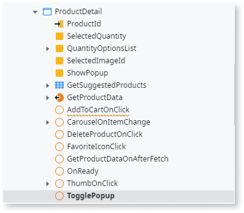
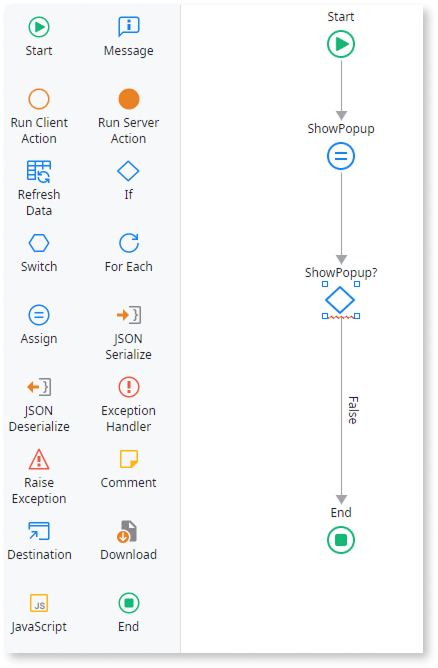
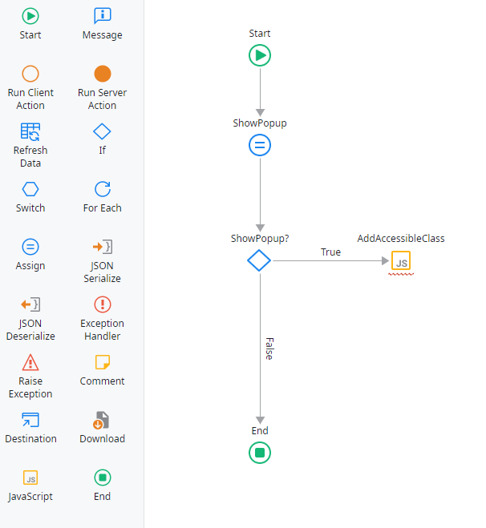
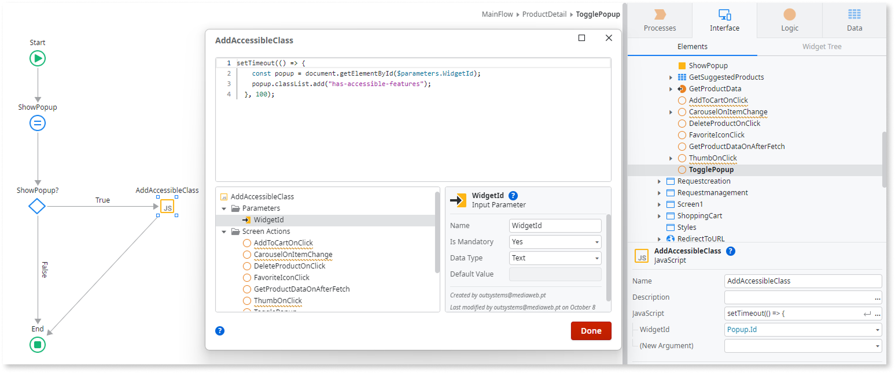
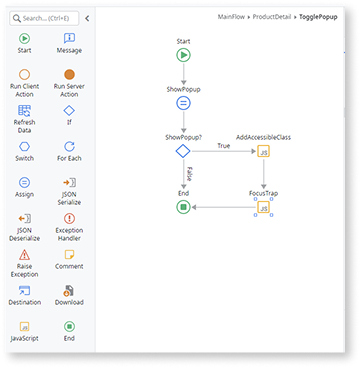
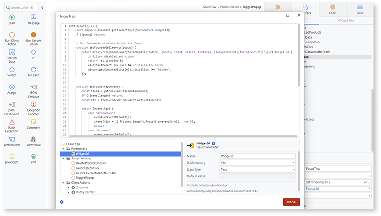
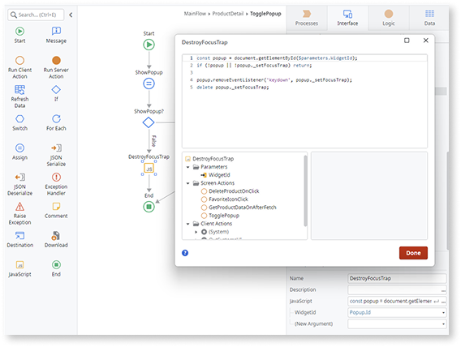
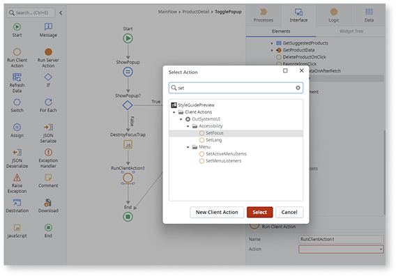
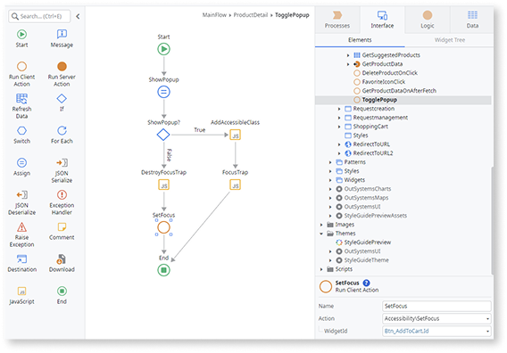
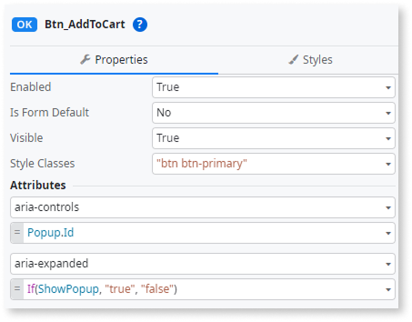

# Popup

<div class="info" markdown="1">

Applies to Mobile Apps and Reactive Web Apps only

</div>

A floating container/window above other screen content. Popup is a modal container, and therefore must be closed before the user can interact with the main screen again.

## Properties

<table markdown="1">
<thead>
<tr>
<th>Name</th>
<th>Description</th>
<th>Mandatory</th>
<th>Default value</th>
<th>Observations</th>
</tr>
</thead>
<tbody>
<tr>
<td title="Name">Name</td>
<td>Identifies an element in the scope where it is defined, like a screen, action, or module.</td>
<td>Yes</td>
<td></td>
<td></td>
</tr>
<tr>
<td title="ShowPopup">Show Popup</td>
<td>Boolean literal or expression to determine if the popup is displayed.</td>
<td>Yes</td>
<td></td>
<td></td>
</tr>
<tr>
<td title="Style">Style Classes</td>
<td>Specifies one or more style classes to apply to the widget. Separate multiple values with spaces.</td>
<td></td>
<td>"popup-dialog"</td>
<td></td>
</tr>
<tr >
<th colspan="5">Attributes</th>
</tr>
<tr>
<td title="Property">Property</td>
<td>Name of an attribute to add to the HTML translation for this element.</td>
<td></td>
<td></td>
<td>You can pick a property from the drop-down list or type a free text. The name of the property will not be validated by the platform.<br/><br/>Duplicated properties are not allowed. Spaces, " or ' are also not allowed.</td>
</tr>
<tr>
<td title="Value">Value</td>
<td>Value of the attribute.</td>
<td></td>
<td></td>
<td>You can type the value directly or write expressions using the Expression Editor.<br/><br/>If the Value is empty, the corresponding HTML tag is created as property="property". For example, the nowrap property does not require a value, therefore nowrap="nowrap" is added.</td>
</tr>
</tbody>
</table>

## Events

<table markdown="1">
<thead>
<tr>
<th>Name</th>
<th>Description</th>
<th>Mandatory</th>
<th>Observations</th>
</tr>
</thead>
<tbody>
<tr>
<td title="EventName">Event</td>
<td>JavaScript or custom event to be handled.</td>
<td></td>
<td></td>
</tr>
<tr>
<td title="Handler">Handler</td>
<td>JavaScript event handler.</td>
<td></td>
<td></td>
</tr>
</tbody>
</table>

## Runtime properties

<table markdown="1">
<thead>
<tr>
<th>Name</th>
<th>Description</th>
<th>Read Only</th>
<th>Type</th>
<th>Observations</th>
</tr>
</thead>
<tbody>
<tr>
<td>Id</td>
<td>Identifies the widget instance at runtime (HTML 'id' attribute). You can use it in JavaScript and Extended Properties.</td>
<td>Yes</td>
<td>Text</td>
<td></td>
</tr>
</tbody>
</table>

## Accessibility – WCAG 2.2 AA compliance {#accessibility}

By default, the **Popup** Built-in Widget may not fully manage focus, keyboard navigation, or ARIA attributes as required by WCAG 2.2 AA.  
Update it so that focus remains inside the Popup while it’s open, supports visible focus on its interactive elements, returns to the trigger when the Popup closes, and exposes the correct ARIA relationship between the trigger and the Popup.  
These changes ensure predictable, accessible interactions for all users.

### Set visible focus

1. In **Service Studio**, go to the **Interface** tab, and select the **Screen/Block** where you use the Popup.

1. In **Elements**, select the action that opens or closes the Popup.

    

1. In the action flow, drag an **If** node to validate if the variable that controls the Popup is `True`.  

    

1. In the **True** branch of the **If**, drag a **JavaScript** node to the flow.  

    

1. In the **JavaScript** node, add an input parameter named **WidgetId** (type **Text**), and set it to the **Popup** block or widget ID (for example, `Popup.Id`).  
   Ensure that the **Popup** widget has a **Name** defined in the screen; otherwise, assign one before continuing.

    

1. Add the following code to the **Javascript** node:

  ```javascript
  setTimeout(() => {
    const popup = document.getElementById($parameters.WidgetId);
    if (!popup) return;
    
    popup.classList.add("has-accessible-features");
  }, 100);
  ```

1. Publish the module.

### Add a focus trap

1. In **Service Studio**, go to the **Interface** tab, and select the **Screen/Block** where you use the **Popup**.

1. In **Elements**, select the action that opens the **Popup**.

1. In the **True** branch, drag another **JavaScript** node after the last one.

    

1. Add an input parameter named **WidgetId** (type **Text**) and set it to the Popup widget ID (for example, `Popup.Id`).
    Ensure that the **Popup** widget has a **Name** defined in the screen; otherwise, assign one before continuing.

    

1. Add the following script:

    ```javascript
    setTimeout(() => {
        const popup = document.getElementById($parameters.WidgetId);
        if (!popup) return;
        
        // Get focusable elements inside the Popup
        function getFocusableElements(popup) {
            return Array.from(popup.querySelectorAll('button, [href], input, select, textarea, [tabindex]:not([tabindex="-1"])')).filter(el => {
                // filter disabled and hidden
                return !el.disabled &&
                el.offsetParent !== null && // visibility check
                window.getComputedStyle(el).visibility !== 'hidden';
            });
        }

        function setFocusTrap(event) {
            const items = getFocusableElements(popup);
            if (!items.length) return;
            const idx = items.indexOf(document.activeElement);

            switch (event.key) {
                case 'ArrowDown':
                    event.preventDefault();
                    items[(idx + 1) % items.length].focus({ preventScroll: true });
                    break;
                case 'ArrowUp':
                    event.preventDefault();
                    items[(idx - 1 + items.length) % items.length].focus({ preventScroll: true });
                    break;
                case 'Escape':
                    event.preventDefault();
                    if (typeof $actions !== 'undefined' && typeof $actions.TogglePopup === 'function') {
                        $actions.TogglePopup(); // Make sure this represents the Client Action that closes the Popup
                    }
                    break;
                case 'Tab':
                    event.preventDefault();
                    const next = event.shiftKey
                    ? (idx - 1 + items.length) % items.length
                    : (idx + 1) % items.length;
                    items[next].focus({ preventScroll: true });
                    break;
            }
        }
    
        popup.addEventListener('keydown', setFocusTrap);
        popup._setFocusTrap = setFocusTrap;
    }, 100);
    ```

1. In the **False** branch of the **If** (where the Popup is closed), drag a **JavaScript** node to the flow.

1. In the **JavaScript** node, add an input parameter named **WidgetId** (type **Text**), and set it to the **Popup** widget ID (for example, `Popup.Id`).
   Ensure that the **Popup** widget has a **Name** defined in the screen; otherwise, assign one before continuing.

1. Add the following code to the **JavaScript** node:

    ```javascript
    const popup = document.getElementById($parameters.WidgetId);
    if (!popup || !popup._setFocusTrap) return;

    popup.removeEventListener('keydown', popup._setFocusTrap);
    delete popup._setFocusTrap;
    ```

    

1. Publish the module.

### Return focus to the trigger

1. In **Service Studio**, go to the **Interface** tab, and select the **Screen/Block** where you use the **Popup**.

1. In **Elements**, select the action that opens the **Popup**.

1. In the **False** branch of the **If**, after the node created to destroy the focus trap, add a **Run Client Action** node.

1. Search for and select **SetFocus()**.

    

1. Set **WidgetId** to the **Popup trigger** ID (for example, `Button.Id`).
    Ensure that the **Button** widget has a **Name** defined in the screen; otherwise, assign one before continuing.

    

1. Publish the module.

### Set ARIA on trigger button

1. Go to the **Interface** tab, and select the **Screen/Block** where you use the **Popup**.

1. In the **Widget Tree**, select the button that triggers the **Popup**.

1. In the button Properties, under **Attributes**, :

    ```text
    aria-controls=Popup.id
    aria-expanded=If(ShowPopup, "true", "false")
    ```

    

### Result

* Focus remains inside the **Popup** while it’s open, and keyboard users can move between interactive elements using arrow keys and `Tab`.  
* When the **Popup** closes, focus returns to the original trigger.  
* The trigger exposes the correct ARIA relationship to the Popup via `aria-controls` and `aria-expanded`, helping assistive technologies understand which control opens which content and whether it’s currently visible.

These updates ensure consistent keyboard navigation, predictable focus behavior, and improved support for screen reader users.

Test the pattern in your app to confirm the update.
